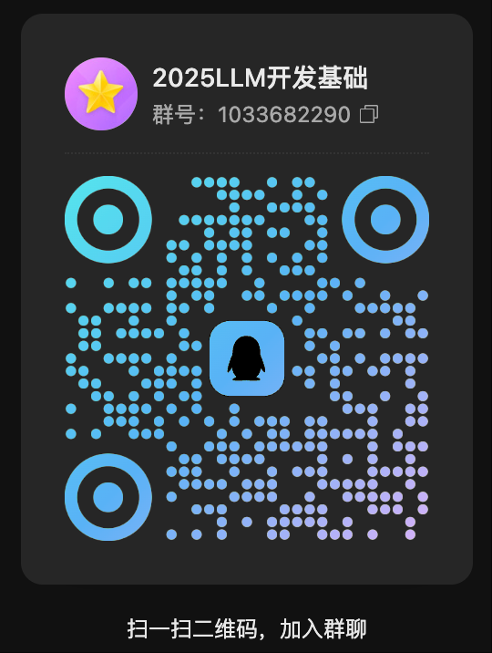

<style>
img[alt~="center"] {
  display: block;
  margin: 0 auto;
}
a[href='red'] {
    color: red;
    pointer-events: none;
    cursor: default;
    text-decoration: none;
}
</style>


# **大语言模型基础：从零到一实现之路**

第1讲: 课程简介

<!-- https://marp.app/ -->

---

# 课程团队信息

主讲: 徐经纬
办公室: 计算机学院1022
邮箱: jingweix@nju.edu.cn

课程联合创始人: 黄云鹏

助教团队: 赵世驹, 梁明宇, 卜韬, 王乾刚, 徐鼎坤

课程主页: https://njudeepengine.github.io/llm-course-lecture/
作业主页: https://njudeepengine.github.io/LLM-Blog/

---

# 课程基本信息



- QQ群: 1033682290
- 分数组成
  * 从零到一之路：5次编程作业 80%
  * **启动：大作业 20%

* 注: 作业过程可能对GPU资源有一定要求（感谢AMD的鼎力支持）

---

# 课程大纲: (理想的)LLM应用架构图


---

# 课程大纲: (实际的)授课脉络


---

# 深度学习基础

* 何为深度学习模型
  * PyTorch基础
* 相关概念光速讲解
  * 比如: 反向传播(A0 Onboarding)

---

# 语言模型核心基础

* 一切源自于如何建模自然语言: 统计模型
  * Bigram/N-gram Language Model
* 模型如何认识单词: 问就是编码
  * one-hot编码, word2vec, tokenization
* 模型如何理解语言: Attention is All You Need

---

# LLM经典架构解析

* 从零到一构建之路：以LlaMA model为基础参照
  * 了解和实现基础组件
    * 残差(residual), layernorm, attention, softmax, positional embedding, ... 
  * 基于你们的组件，一起搭LLM积木
    * decoder-only LLM

<div style="display:contents;" data-marpit-fragment>
考虑好了，全是狠活...
</div>

---

# 学习过程中你还会了解到...

* 通过构建LLM的过程了解
  * LLM如何在计算机中被创建，代码和模型参数的关系
  * 运行设备之间的关系：CPU，GPU
  * 浮点数精度二三事: fp32, fp16, bf16, fp8, 混合精度...
  * 高阶技术
    * FlashAttention基本原理
    * 分布式运行: 分布式并行化(数据/张量/流水线/序列并行)
    
---

# 学习过程中你还会了解到...

* LLM预训练和微调训练
  * 训练概念介绍
  * 数据集和数据加载过程构建
  * 微调流程构建(含对齐(Alignment))
    * SFT: SFT, PEFT, LoRA
    * RL*: RLHF, PPO, DPO
* 如何推理模型
  * KV-cache, 解码策略(Decoding)

---

# LLM应用技术讲解

应用技术
* 检索增强生成(RAG)
* LLMs as Agents
  * MCP
  
---

# 综上所述，这门课是...

**大预言模型理论和实践基础结合的课程**

<div style="display:contents;" data-marpit-fragment>

**a.k.a. 有着5分PA实验量级的2分选修课，<span style="color:red;">慎选</span>**
</div>

* 理论体现在从原理上知道大预言模型无微不至的细节
* 实践体现在无处不在的手搓代码和**痛苦debug**的过程
* 你会了解和学习:
  * PyTorch
  * Transformers and PEFT (from Huggingface)
  * 以及其他流行开源框架


---


# 例如: 以下代码是如何执行的？


```python
model.from_pretrained("meta-llama/Meta-Llama-3.1-8B-Instruct")
```

---


---

# 人工智能是


人工智能=人工+智能

训练过程
人工：大力出奇迹
智能：构建分布

推理过程
条件概率 $\mathrm{p}(y|x)$


---

# 什么是自然语言处理？


* 自然语言
  * 人类使用的语言，如汉语、英语、西班牙语、代码等 -> 文本符号
* 自然语言处理的定义
  * “自然语言处理（NLP）是语言学、计算机科学和人工智能的跨学科子领域，关注计算机和人类语言之间的交互，特别是如何编程使计算机能够处理和分析大量的自然语言数据。其目标是使计算机能够“理解”文档的内容，包括其中的语言背景细微差别。然后，这项技术可以准确提取文档中包含的信息和见解，以及对文档本身进行分类和组织。” *From WikiPedia, ChatGPT翻译*
<span style="color:red;">自然语言理解，自然语言生成</span>


---

# 自然语言处理任务

* 请填空: 今天我来到了___
* 今天的天气____
* 自然语言处理的任务本质上是一个“填词游戏”
  * 目标：如何填的准、说得好
  * 手段：条件概率$\mathrm{p}(y|x)$
  * 填的准≠人类知道机器按照人类理解世界的方式理解世界


---

# 语言模型


基本法: 链式法则

句子由任意长度的字符串组成

- 句子a = 今天我来到了仙I-102。
- 句子b = 今天仙I-102我来到了。
* 用概率衡量句子的“好”: $\mathrm{p}(a) > \mathrm{p}(b)$
*自然语言处理(NLP)模型：估计出的(相对准确的)概率分布

---

# 语言模型

基本法: 链式法则

* 理想: 直接估计出的(相对准确的)句子概率分布
* 现实: 参考人类小孩学说话，一个字一个字的说
  * 怎么学? 链式法则

<div style="display:contents;" data-marpit-fragment>

$\mathrm{p}$(今天我上智能应用开发。) = $\mathrm{p}$(今) $\mathrm{p}$(天|今) $\mathrm{p}$(我|今天) $\mathrm{p}$(上|今天我)...
$\mathrm{p}$(。|今天我上智能应用开发)

</div>

<div style="display:contents;" data-marpit-fragment>

<span style="color:red;">这就是经典的N-gram model</span>

</div>

---

# LLM的前寒武纪时期


* 2017年6月之前
  * RNN系列
* 2017年-2022年
  * Attention
  * Transformer界的剑宗气宗之争
    * Encoder-decoder派: BERT
    * Decoder-only派: GPT系列
      * Generative Pre-trained Transformer (GPT)

---


# Transformer界的剑宗气宗之争

文字接龙(GPT) v.s. 完形填空(BERT)

<style>
img[alt~="top-right"] {
  display: block;
  margin: 0 auto;
}
</style>

<style>
img[alt~="bottom-right"] {
  position: absolute;
  top: 400px;
  right: 0px;
}
</style>

<!--  -->

<p align="center">
  
  
</p>

<!--    -->

---

# LLM的寒武纪大爆发

- OpenAI发布ChatGPT
  * GPT系列: GPT-3.5, GPT-4, GPT-4o, GPT-5...
* 其他公司
  * 国外: LlaMA家族(暂时废了), Gemini, Mixtral, Claude, Grok...
  * 国内: Deepseek, qwen, 文心一言, GLM(智谱清言), Moonshot(月之暗面), abab(MiniMax), ...

---


<!-- <p align="center">
  
</p> -->
---


<!-- <p align="center">
  
</p> -->
---

# LLM的研究/开发少不了开源社区的支撑

* 深度学习框架: PyTorch
* 模型社区: Huggingface
* 其他: LlaMA-factory, deepspeed, magatron, triton, llama.cpp, llama2.c, llm.c, ...

* 开发语言: Python, CUDA, C++, ...

---

# LLM的运行实机演示

准备:

* Python 3.10+
* 设备: 最好有N卡, 实在没有也没关系, 内存大一点也行
  * ROCm, 此处特别鸣谢: AMD
* 虚拟环境: [conda](https://docs.conda.io/projects/conda/en/latest/user-guide/install/)
* 环境配置: PyTorch, Transformers, tokenizers, triton(CUDA环境), ...
  * 绝大部分可通过pip或conda安装

<!--  -->


---

# 下周内容预告

从矩阵/张量运算的视角理解模型的底层运行逻辑
* 前向传播(Forward)
* 反向传播(Backward)
* PyTorch计算图
* A0作业发布