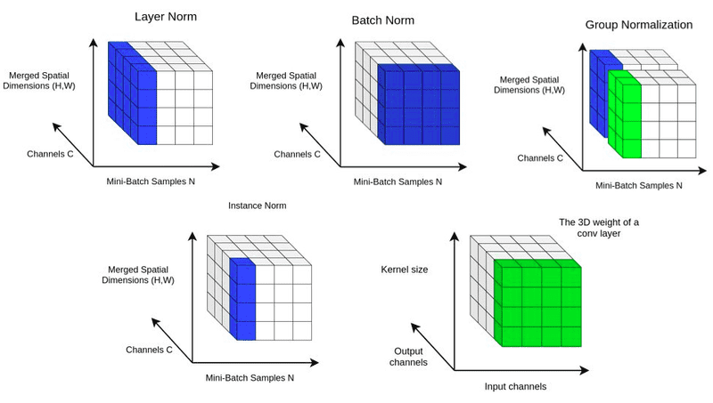
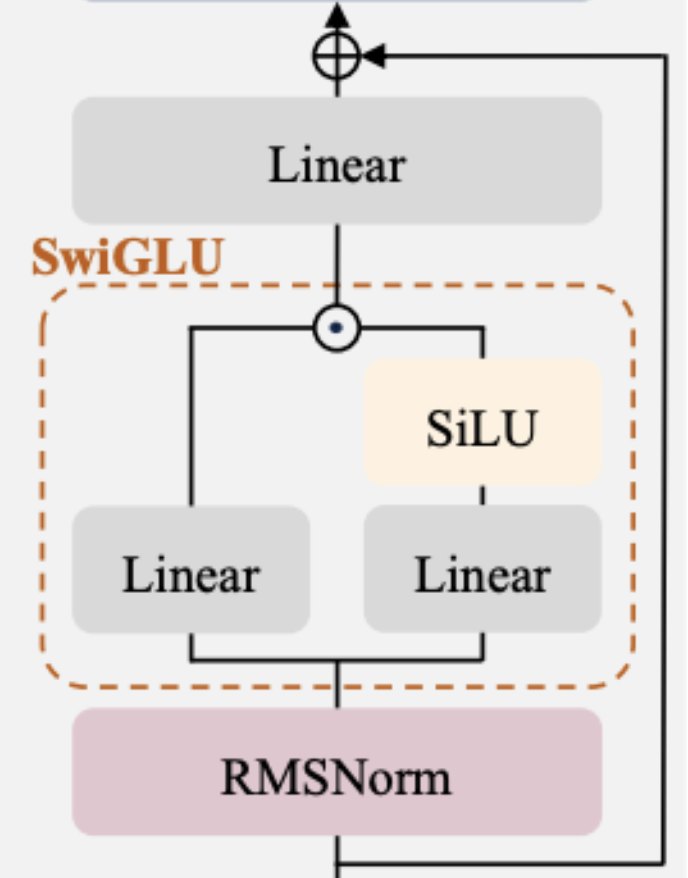
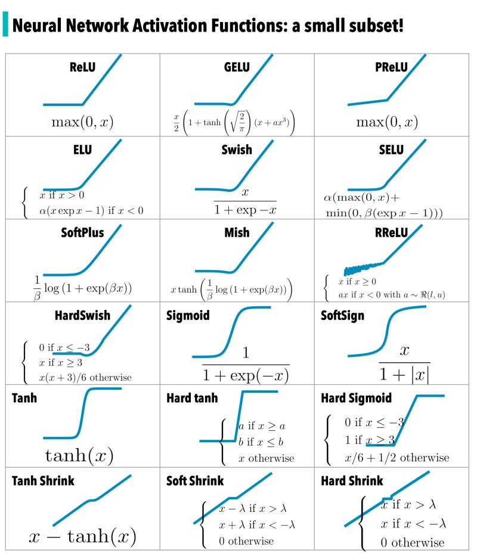
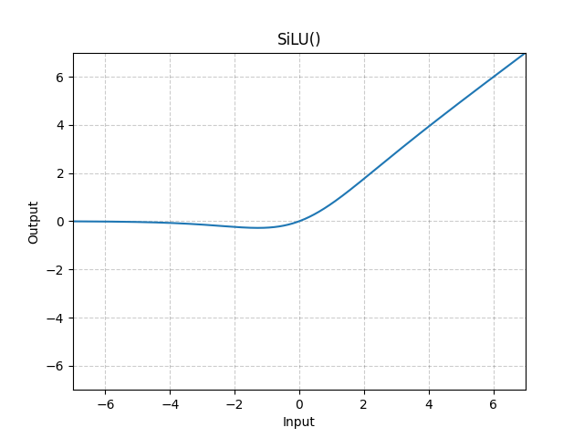

<style>
img[alt~="center"] {
  display: block;
  margin: 0 auto;
}
a[href='red'] {
    color: red;
    pointer-events: none;
    cursor: default;
    text-decoration: none;
}
</style>

<style>
img[alt~="right"] {
  display: block;
  margin:auto;
}
a[href='red'] {
    color: red;
    pointer-events: none;
    cursor: default;
    text-decoration: none;
}
</style>


# **LLM智能应用开发**

第5讲: 大语言模型解析 II
基于HF LlaMA实现的讲解

RMSNorm and FFN

<!-- https://marp.app/ -->

---

# LLM结构的学习路径

* LLM结构解析(开源LlaMA)
* 自定义数据集构造
* 自定义损失函数和模型训练/微调

---

# Transformer经典结构

<!--  -->


* Encoder-decoder结构
* 输入部分
  * Input embedding
  * Positional embedding
* **Transformer部分**
  * **Attention module**
  * **Feed forward network**

---

# HF LlaMA模型结构

```python
LlamaForCausalLM(
  (model): LlamaModel(
    ...
    (layers): ModuleList(
      (0-15): 16 x LlamaDecoderLayer(
        (self_attn): LlamaAttention
        (mlp): LlamaMLP
        (input_layernorm): LlamaRMSNorm
        (post_attention_layernorm): LlamaRMSNorm
    )
    ...
  )
  (lm_head): Linear(in_features=2048, out_features=128256, bias=False)
)
```


---

# LlamaDecoderLayer内部结构

```python
(self_attn): LlamaAttention(
  (q_proj): Linear(in_features=2048, out_features=2048, bias=False)
  (k_proj): Linear(in_features=2048, out_features=512, bias=False)
  (v_proj): Linear(in_features=2048, out_features=512, bias=False)
  (o_proj): Linear(in_features=2048, out_features=2048, bias=False)
  (rotary_emb): LlamaRotaryEmbedding()
)
(mlp): LlamaMLP(
  (gate_proj): Linear(in_features=2048, out_features=8192, bias=False)
  (up_proj): Linear(in_features=2048, out_features=8192, bias=False)
  (down_proj): Linear(in_features=8192, out_features=2048, bias=False)
  (act_fn): SiLU()
)
(input_layernorm): LlamaRMSNorm((2048,), eps=1e-05)
(post_attention_layernorm): LlamaRMSNorm((2048,), eps=1e-05)
```

---

# LlamaDecoderLayer内部结构

* Normalization模块
  * LlamaRMSNorm
* 两个主要模块
  * LlamaAttention
  * LlamaMLP


---

# Normalization

```python
(input_layernorm): LlamaRMSNorm
```

* Normalization，中文又称“归一化”，“标准化”,... 
* 作用：调整数据的分布(scaling)，亦可称“缩放”
*  数据包括：输入、输出、中间层表示，...

<div style="display:contents;" data-marpit-fragment>

最经典的Normalization

Standard score: $\frac{X-\mu}{\sigma}$, Minmax feature scaling: $\frac{X-X_{\min}}{X_\max-X_{\min}}$

</div>

---

# Normalization示例

<div style="display:contents;" data-marpit-fragment>


一维的输入，归一化后的输出


</div>

---

# Normalization在机器学习中的应用

“药效”：加速训练收敛，让输入更“规整”，降低过拟合(overfitting)，增强泛化(generalization)


---


# Normalization v.s. Regularization

* 目标不同：
  * Normalization=调整数据
    * 比如: $X'=X-\frac{X_\min}{X_\max-X_\min}$
  * Regularization=调整预测/损失函数
    * 比如: $\text{loss}=\min\sum_{i=1}^N L(f(x_i), y_i)+\lambda R(\theta_f)$


---


# 大语言模型引入Normalization

Normalization：“调整数据分布”

* 数据长什么样子？都是tensor！维度很多！
  * 原始输入: vocab embedding
    * tensor shape: <batch_size, sequence_length, hidden_dim>
  * 深度学习模型中间层表示(hidden states/representations)
      * tensor shape: <batch_size, sequence_length, hidden_dim>

---

# Normalization案例


<div style="display:contents;" data-marpit-fragment>



</div>

---

# Normalization的设计思路

* tensor shape: <batch_size, sequence_length, hidden_dim>
* 选择最合适的Normalization维度
  * batch：X=[batch_size,sequence_length, hidden_dim]
  * sequence： X=[sequence_length, hidden_dim]
  * hidden: <bs, seq, hidden> => <N, hidden>, X=[hidden_dim]
    * 又称LayerNrom

<div style="display:contents;" data-marpit-fragment>

当前流行的LayerNorm：[RMSNorm](https://arxiv.org/pdf/1910.07467)

</div>

---

# LayerNorm

* 针对每个token在hidden_dim维度上做标准化，避免依赖batch/序列长度
* 计算流程：
  * $\mu=\frac{1}{H}\sum_{i=1}^{H}x_i$
  * $\sigma^2=\frac{1}{H}\sum_{i=1}^{H}(x_i-\mu)^2$
  * $\hat{x}_i=\frac{x_i-\mu}{\sqrt{\sigma^2+\epsilon}}$
  * $y_i=\gamma_i\hat{x}_i+\beta_i$
* 可学习参数$\gamma,\beta$恢复尺度与偏移，保持表达能力
* 优势：序列自回归场景中激活分布更稳定，梯度更易传播

---

# RMSNorm

* torch 2.8，提供了RMSNorm类的实现[torch.nn.RMSNorm](https://pytorch.org/docs/stable/generated/torch.nn.RMSNorm.html#torch.nn.RMSNorm)
* 原理: "regularizes the summed inputs to a neuron in one layer according to root mean square (RMS)"
  * $y = \text{RMSNorm}(x)=\frac{x}{\text{RMS}[x]}*\gamma$
  * $\text{RMS}(x)=\sqrt{\frac{\sum_{i=1}^N x_i^2}{N}+\epsilon}$

<div style="display:contents;" data-marpit-fragment>

如何利用torch算子自行实现RMSNorm？

</div>

---

# 手搓RMSNorm

$y = \text{RMSNorm}(x)=\frac{x}{\text{RMS}[x]}*\gamma$， $\text{RMS}(x)=\sqrt{\frac{\sum_{i=1}^N x_i^2}{N}+\epsilon}$

* 输入和输出的shape: <batch_size, sequence_length, hidden_dim>
* 涉及的计算
  * 平方，求和，开根
  * torch提供: tensor.pow, tensor.mean, torch.rsqrt

---

# 编码实现RMSNorm


手搓
```python
input = input.to(torch.float32)
variance = input.pow(2).mean(-1, keepdim=True)
hidden_states = input * torch.rsqrt(variance + variance_epsilon)
```

直接调用
```python
layerNorm = nn.RMSNorm([4])
hidden_states = layerNorm(input)
```


---

# RoPE实现

RoPE的2D实现


RoPE的n维实现


---

# RoPE公式

* 基础频率：$\theta_i = \text{base}^{-2i/d}$，常用$\text{base}=10000$
* 位置角度：$\theta_{n,i} = n\,\theta_i$，其中$n$为token位置，$i$为维度对索引
* 旋转变换：
  * $x'_{2i} = x_{2i}\cos\theta_{m,i} - x_{2i+1}\sin\theta_{m,i}$
  * $x'_{2i+1} = x_{2i}\sin\theta_{m,i} + x_{2i+1}\cos\theta_{m,i}$
* 可写成$2\times2$旋转矩阵：$\mathbf{x}'_{i} = R(\theta_{m,i})\,\mathbf{x}_{i}$，保持范数不变


---

# RoPE实现

* 目标：实现RoPE(对应的$R_{\Theta, m}^d$)
  * 准备一堆$\theta_{n,i}$，以及对应的cos和sin数值

* 构建RoPE矩阵: $R_{\Theta, n}^d$流程
  * 批量算cos，再批量算sin
  * 涉及torch算子
    * torch.arrange, torch.sin, torch.cos, torch.outer

---

# RoPE高效实现


---

# RoPE高效实现


```python
def rotate_half(x):
    """Rotates half the hidden dims of the input."""
    x1 = x[..., : x.shape[-1] // 2]
    x2 = x[..., x.shape[-1] // 2 :]
    return torch.cat((-x2, x1), dim=-1)
```
```python
def apply_rotary_pos_emb:
    cos = cos.unsqueeze(unsqueeze_dim)
    sin = sin.unsqueeze(unsqueeze_dim)
    q_embed = (q * cos) + (rotate_half(q) * sin)
    k_embed = (k * cos) + (rotate_half(k) * sin)

```


---


# 前馈神经网络(FFN)





---

# FFN实现，LlamaMLP

```python
(mlp): LlamaMLP(
  (gate_proj): Linear(in_features=2048, out_features=8192, bias=False)
  (up_proj): Linear(in_features=2048, out_features=8192, bias=False)
  (down_proj): Linear(in_features=8192, out_features=2048, bias=False)
  (act_fn): SiLU()
)
```

* 组件：三个nn.Linear层，一个SiLU激活函数
  * SiLU: torch.nn.functional.silu(x)
  * Linear: torch.nn.Linear(in_features, out_features)


---

# FFN流程

* 输入tensor: <batch_size, sequence_length, hidden_dim>
* 第一步：
  * 通过gate_proj获得gate tensor，经过SiLU激活得到gate tensor
  * 通过up_proj获得up tensor
* 第二步：元素乘(elementwise multiply): gate tensor 和 up tensor
* 第三步: 通过down_proj获得down tensor

---

# 激活函数(引入非线性)


* 通过引入非线性函数(nonlinear function)可增加模型非线性的能力，在模型中中，也称之为激活函数
  * 线性层: $x=f(x)=xW^\top+b$
  * 激活:   $x=activation(x)$
* activation类型
  * ReLU, Sigmoid, SwiGLU, ...

---

# 经典激活函数

* Sigmoid：$\sigma(x)=\frac{1}{1+e^{-x}}$，输出压缩到$(0,1)$，常用于概率建模
* Tanh：$\tanh(x)=\frac{e^{x}-e^{-x}}{e^{x}+e^{-x}}$，零均值输出缓解偏置，会出现梯度消失
* ReLU：$\operatorname{ReLU}(x)=\max(0,x)$，计算高效
* Leaky ReLU：$\max(\alpha x, x)$ with $\alpha\approx 0.01$，为负半轴保留小梯度
<!-- * SiLU：$x\cdot\sigma(x)$，兼具平滑和门控性质，常作为SwiGLU中的激活 -->

---

# 激活函数(引入非线性)


---

# 激活函数(引入非线性)




---


# SwiGLU模块

* SiLU-Gated Linear Unit：$\operatorname{SwiGLU}(x, W_g, W_u) = \operatorname{SiLU}(W_g x) \odot (W_u x)$
* SiLU函数：$\operatorname{SiLU}(z) = z \cdot \sigma(z)$，兼具平滑和自门控特性
* 使用两个独立线性映射$W_g, W_u$，并行计算门控和候选通路
* 优势：相比 ReLU/GeLU 在 LLM FFN 中更稳定，提升表示能力但参数开销小
* LLaMA 中 gate_proj/up_proj 对应 $W_g/W_u$，down_proj负责维度回投

<div style="display:contents;" data-marpit-fragment>

摘抄自transformers/src/models/modeling_llama.py
```python
down_proj = self.down_proj(self.act_fn(self.gate_proj(x)) * self.up_proj(x)
```

</div>


---

# SwiGLU实现



```python
down_proj = self.down_proj(self.act_fn(self.gate_proj(x)) * self.up_proj(x))
```
