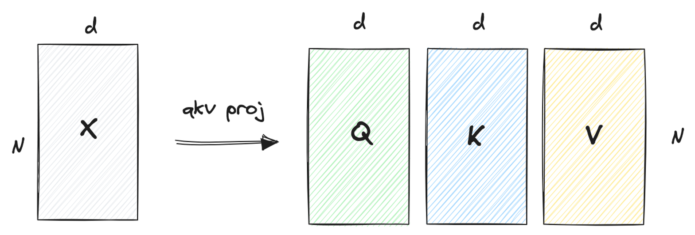
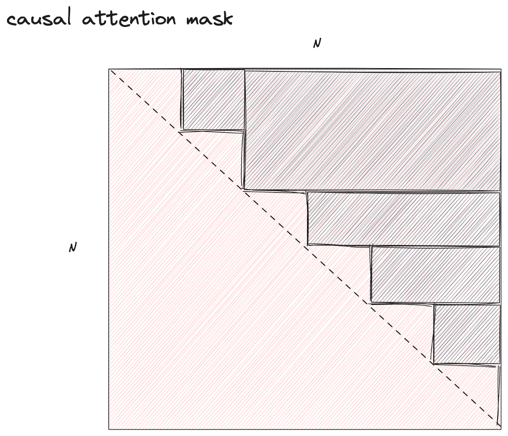
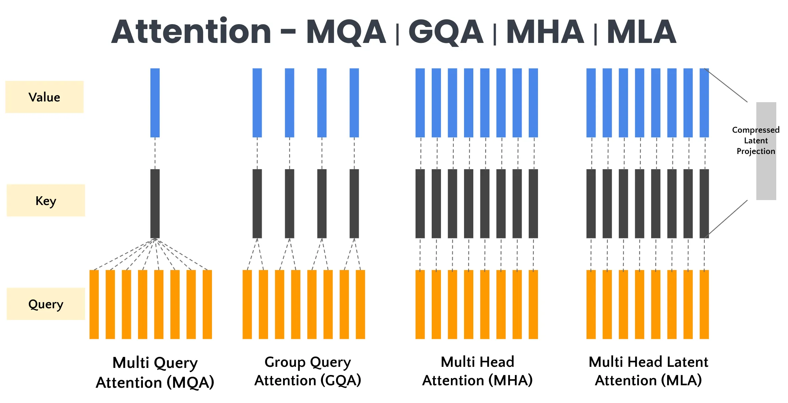
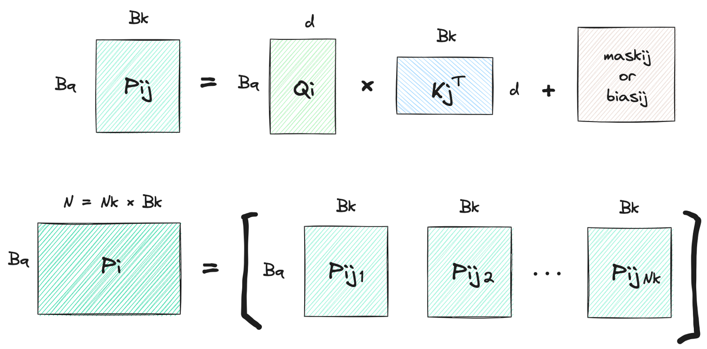

<style>
img[alt~="center"] {
  display: block;
  margin: 0 auto;
}
a[href='red'] {
    color: red;
    pointer-events: none;
    cursor: default;
    text-decoration: none;
}
</style>

<style>
img[alt~="right"] {
  display: block;
  margin:auto;
}
a[href='red'] {
    color: red;
    pointer-events: none;
    cursor: default;
    text-decoration: none;
}
</style>


# **LLM智能应用开发**

第6讲: 大语言模型解析 III
基于HF LlaMA实现的讲解

Attention Mechanism I
<!-- https://marp.app/ -->

---

## LLM结构的学习路径

* LLM结构解析(开源LlaMA)
* 自定义数据集构造
* 自定义损失函数和模型训练/微调

---

## Transformer经典结构

<!--  -->


* Encoder-decoder结构
* 输入部分
  * Input embedding
  * Positional embedding
* Transformer部分
  * Feed forward network
  * **Attention module**
  

---

## HF LlaMA模型结构

```python
LlamaForCausalLM(
  (model): LlamaModel(
    ...
    (layers): ModuleList(
      (0-15): 16 x LlamaDecoderLayer(
        (self_attn): LlamaAttention
        (mlp): LlamaMLP
        (input_layernorm): LlamaRMSNorm
        (post_attention_layernorm): LlamaRMSNorm
    )
    ...
  )
  (lm_head): Linear(in_features=2048, out_features=128256, bias=False)
)
```


---

## LlamaDecoderLayer内部结构

Transformer架构的核心: attention(注意力机制)

```python
(self_attn): LlamaAttention(
  (q_proj): Linear(in_features=2048, out_features=2048, bias=False)
  (k_proj): Linear(in_features=2048, out_features=512, bias=False)
  (v_proj): Linear(in_features=2048, out_features=512, bias=False)
  (o_proj): Linear(in_features=2048, out_features=2048, bias=False)
  (rotary_emb): LlamaRotaryEmbedding()
)
```

---

## Attention内部结构

* 静: 结构视角(init function...)
  * 4个Linear层
    * q_proj、k_proj、v_proj、o_proj
* 动: 推理视角(Forward，bp靠Autograd自动求导)
  * $\text{head}=\text{Attention}(Q,K,V)=\text{softmax}(\frac{QK^T}{\sqrt{d_k}})V$
  * $multihead(Q,K,V)=\text{concat}(head_1,...,head_h)W_o$
---

## Attention模块的输入

问题：QKV是输入吗？

* 非也，输入是上一层的hidden states

<div style="display:contents;" data-marpit-fragment>

```python
class LlamaAttention(nn.Module):
...
def forward(hidden_states)
  ...
  query_states = self.q_proj(hidden_states)
  key_states = self.k_proj(hidden_states)
  value_states = self.v_proj(hidden_states)
```

</div>


* 思考：hidden states的shape是怎样的？


---

## 标准Attention的第一步: 获得$Q,K,V$

* 给定hidden states(后续简写为$X$)，通过前向传播(执行forward)得到$Q,K,V$
  * $X$的shape: [batch_size, seq_len, hidden_size]
  * $Q=\text{q\_proj}(X)$: $Q=XW_Q$, 
    * $W_Q$的shape: [hidden_size, hidden_size]
  * $K=\text{k\_proj}(X)$: $Q=XW_K$
    * $W_K$的shape: [hidden_size, hidden_size]
  * $V=\text{v\_proj}(X)$: $Q=XW_V$
    * $W_V$的shape: [hidden_size, hidden_size]


---


## 标准Attention的第一步: 获得$Q,K,V$

* 为方便理解方法，脑补通过tensor.view改变shape
  * [batch_size, seq_len, hidden_size] -> [N, d]
    * N = batch_size * seq_len, d = hidden_size
<div style="display:contents;" data-marpit-fragment>



</div>

---

## 标准Attention的第二步: 计算$QK^T$

* 给定$Q,K$，计算$QK^\top$，此处考虑mask

* $P=\text{mask}(\frac{QK^\top}{\sqrt{d_k}}+bias)$

<div style="display:contents;" data-marpit-fragment>


</div>

---

## 标准Attention的第三步: 计算Attention

* 给定$P$，计算$A=\text{softmax}(P)$
  * row-wise softmax: $A_i = \text{softmax}(P_i)=\text{diag}(l)^{-1}S$
  * $l=\text{row\_sum}(S)$, $S=\text{exp}(P-m)$, $m=\text{row\_max}(P)$

<div style="display:contents;" data-marpit-fragment>


</div>

---

## 标准Attention的第四步: 计算输出$O$

* 给定$A$和$V$，计算$O$
  * $O=AV$
  

<div style="display:contents;" data-marpit-fragment>


</div>

---

## 标准Attention回顾

* 给定$Q,K,V$ (来自$X$)
  * $P=\text{mask}(\frac{QK^\top}{\sqrt{d_k}}+bias)$
  * $m=\text{row\_max}(P)$
  * $S=\text{exp}(P-m)$
  * $l=\text{row\_sum}(S)$
  * $A=\text{softmax}(P)=diag(l)^{-1}S$
  * $O=AV$

---

## Attention中mask的作用


* 回顾$P=\text{mask}(\frac{QK^\top}{\sqrt{d_k}}+bias)$
* \<PAD\>: 一种表示“padding”的特殊token，用来避免对句子中的某些token的影响
* 为了避免padding对attention的影响，在计算$P$时，我们可以将padding的部分设置为一个很大的数，如$-\infty$


---

## Attention中mask的作用




---

## 对应的实现

移步notebook

---


## MuliHeadAttention

* 标准Attention只生成一个输出A，考虑多种角度，期望得到不同的A
  * 靠多个头实现，什么头？？
  * $Q,K,V$进行拆分，拆成多个头
  * 拆分$Q,K,V$为多头：[batch_size, seq_len, num_heads, head_dim]
  * 些许改造Attention计算过程

<div style="display:contents;" data-marpit-fragment>

$MultiHead(Q,K,V)=Concat(head_1,head_2,...,head_h)W_O$
其中，$head_i=Attention(Q_i,K_i,V_i)$

</div>

---

## MultiHeadAttention

* 给定$Q,K,V$ (shape [bs, seq, hs]),shape简化为$N\times d$
* 多个heads
  * $Q=[Q_1,Q_2,...,Q_h]$
  * $K=[K_1,K_2,...,K_h]$
  * $V=[V_1,V_2,...,V_h]$
* shape的变换(tensor.view实现): [N, d] -> [N, num_heads, head_dim]
  * 其中, d = hidden_size = num_heads * head_dim
  * 实现中，[bs, seq, hs] -> [bs, seq, nh, hd]
    * 再transpose为[bs, nh, seq, hd]


---

## Attention variations

* 有了多头，多Query，多Key-value，多Query和Key-value的组合
* 考虑到多Query和Key-value的组合



---

## Grouped Query Attention (GQA)

* 介于多头注意力与多Query方案之间：$g$个Query组共享同一组$K,V$
* 设注意力头数为$h$，分组数为$g$，则每组包含$\frac{h}{g}$个Query头
* $Q$仍保持独立的`q_proj`，$K,V$投影矩阵缩减为$g\times d_k$，KV缓存体积缩小$\frac{h}{g}$倍
* Hugging Face配置：`num_heads = h`，`num_key_value_heads = g`

---

## GQA带来的改进与取舍

* **推理显存**：每个token的KV缓存从$h\times d_k$降为$g\times d_k$，长上下文推理显存压力显著降低
* **吞吐表现**：减少`k_proj`/`v_proj`的矩阵乘与显存访问，提升批量推理吞吐
* **模型实践**：Llama-2/3、Gemma、Mistral等开源模型默认启用GQA (`num_key_value_heads=g`)
* **表达能力**：合理选择$g$（常见$g=h/2$或$h/4$）可兼顾速度与精度，分组过大可能削弱头部多样性

---

## 对应的实现

移步notebook

---


## Attention计算开销

* $QK^\top$的计算过程是$O(N^2)$的复杂度，那么多头的情况下，$QK^\top$的计算复杂度是$O(hN^2)$
* 实际上，可依赖GPU并行执行提升速度
  * 分块的并行计算(sm计算单元)
* 如何加速Attention计算？
  * BlockedAttention
  * FlashAttention
  

---

## BlockedAttention第一步: 获得$Q,K,V$

* 给定$Q,K,V$ (shape [batch_size, seq_len, hidden_size]),shape简化为$N\times d$


<div style="display:contents;" data-marpit-fragment>


</div>


<div style="display:contents;" data-marpit-fragment>


</div>


---


## BlockedAttention第二步: 计算$P_{i}$

* 给定$Q_i$,  $K_{j_1},K_{j_2},...,K_{j_{N_k}}$
  * $Q_i$的shape: $B_q\times d$, $K_{j_1},K_{j_2},...,K_{j_{N_k}}$的shape: $B_k\times d$


<div style="display:contents;" data-marpit-fragment>


</div>


<div style="display:contents;" data-marpit-fragment>


</div>


---

## BlockedAttention第二步: 计算$P_{i}$

* 给定$Q_i$,  $K_{j_1},K_{j_2},...,K_{j_{N_k}}$
  * $Q_i$的shape: $B_q\times d$, $K_{j_1},K_{j_2},...,K_{j_{N_k}}$的shape: $B_k\times d$
<div style="display:contents;" data-marpit-fragment>



</div>

---

## BlockedAttention第三步: 计算Attention

给定$P_{ij_1}, P_{ij_2}, ..., P_{ij_{N_k}}$，计算$S_i$
<div style="display:contents;" data-marpit-fragment>


</div>

---

## BlockedAttention第三步: 计算Attention

给定$P_{ij_1}, P_{ij_2}, ..., P_{ij_{N_k}}$，计算$S_i$
<div style="display:contents;" data-marpit-fragment>


</div>


---


## BlockedAttention第三步: 计算Attention

给定$S_{ij_1}, S_{ij_2}, ..., S_{ij_{N_k}}$，计算$A_i$
<div style="display:contents;" data-marpit-fragment>


</div>

---

## BlockedAttention的数值稳定性

* 实现时不能对每个块单独归一化后直接拼接，否则等效于多个softmax
* 需要维护全局的行最大值$m_i$与行和$l_i$，新块的贡献使用$e^{P_{block}-m_i}$缩放后累加
* 这是FlashAttention等实现中的通用做法，可避免溢出并保证与标准Attention一致

---

## BlockedAttention第四步: 计算$O=AV$

给定$A_{ij_1}, A_{ij_2}, ..., A_{ij_{N_k}}$，计算$O_i$
<div style="display:contents;" data-marpit-fragment>


</div>

---

## BlockedAttention回顾


