

# **LLM智能应用开发**

第7讲: 大语言模型解析 IV
基于HF LlaMA实现的讲解

Attention Mechanism II:
FlashAttention
<!-- https://marp.app/ -->

---

# LLM结构的学习路径

* LLM结构解析(开源LlaMA)
* 自定义数据集构造
* 自定义损失函数和模型训练/微调

---

# Transformer经典结构

<!--  -->

* Encoder-decoder结构
* 输入部分
  * Input embedding
  * Positional embedding
* Transformer部分
  * Feed forward network
  * Attention module
    * **FlashAttention**
  

---

# HF 相关参考链接

* [GitHub 仓库](https://github.com/Dao-AILab/flash-attention)（仓库中包含 V1、V2 的论文）
* [HuggingFace](https://huggingface.co/docs/transformers/main/en/perf_infer_gpu_one)
* [From Online Softmax to FlashAttention](https://courses.cs.washington.edu/courses/cse599m/23sp/notes/flashattn.pdf)
* [FlashAttention V1 的推导细节](https://www.zhihu.com/question/611236756/answer/3132304304)
* [FlashAttention V1、V2 差异总结](https://zhuanlan.zhihu.com/p/665170554)

---

## FlashAttention

* **Installation**
* GPU Basics
* FlashAttention V1
* FlashAttention V2
* Other

---

## Note
* 一定要先浏览一遍 GitHub 仓库中的 Installation and features
* 安装过程中会使用 ninja 做编译，一定要注意设置 MAX_JOBS 环境变量，防止机器内存被快速用完编译过程比较慢，这是正常的
* FlashAttention-2 目前仅支持 Ampere、Ada、Hopper 架构的 GPU
* FlashAttention-3 仅支持Hopper架构的GPU
* FlashAttention 仅支持 fp16 和 bf16 两种数据类型
* 注：必要时不要从pip安装，请从源码安装

---

## FlashAttention
* Installation
* **GPU Basics**
* FlashAttention V1
* FlashAttention V2
* Other

---

## GPU Architecture
* 从抽象的角度看，GPU 的组件包括：Streaming Multiprocessors、on-chip L2 cache、high-bandwidth DRAM
* 其中计算指令通过 SM 执行，数据和代码会从 DRAM 缓存到 cache
  * 以 A100 为例，包含 108 个 SM、40MB 的 L2 cache、80G 的 DRAM

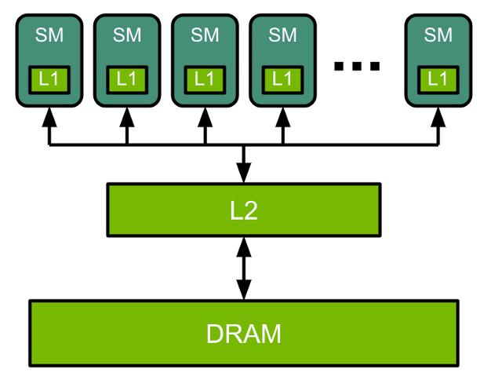

---

## Streaming Multiprocessors（SM）
* Streaming Multiprocessors（SM）：GPU 内部的数据处理单元，每个 SM 有自己的执行流，可以类比为多核 CPU 中的一个核，只是 GPU 的一个核能运行多个线程
* 一个 SM 的构成：
  * 多个 CUDA Core，用于做数学运算
  * 若干 special function units，用于特殊的计算场景
  * 几个 warp scheduler

---

## Streaming Multiprocessors（SM）

* 此外，一个 SM 还拥有：
  * 一个 read-only constant cache
  * 一个统一的 data cache 和 shared memory，大小根据具体的设备而不同，大概是一百多到两百多 KB，shared memory 的大小可配置，配置完后剩余的存储空间就作为 L1 cache

---

## Thread Hierarchy
* 多个线程被组织成一个 block，在执行过程中，同一个 block 内的线程会被放在一个 SM 上执行，因此同一个 block 中的线程会共享 L1，一个 block 中最多包含 1024 个线程
* 多个 block 会被组织成一个 grid，一个 grid 中包含多少 block 由具体的数据规模决定

---

## Thread Hierarchy

* 一方面来说，我们可以让一次计算尽可能使用多个 block 来提高并行度；另一方面，我们也可以让一个 SM 并发执行多个计算任务的 block
* 从硬件执行的角度来说，SM 会把一个 block 中的线程再分成 32 个为一组，称为 warp，一个 warp 上的线程会执行完全一样的指令，所以效率最高的情况是 warp 中的线程执行路径完全相同；而当出现分支的情况下，可能会导致部分线程提前执行完指令，进而导致当前的 GPU core 空闲

---

## 什么是 Tile
* Tile 是把大矩阵切成适合硬件缓存的子矩阵块，保持二维结构，通常形状固定
* 每个 tile 所需的数据能够装入 shared memory 或 register，减少重复访问 global memory
* 切 tile 可以让不同 block 独立工作，提高并行度，并避免单个 block 的线程或寄存器需求超出硬件上限

---

## MatMul on GPU（示例）
* 以 32×32 矩阵乘法为例，我们把输出矩阵拆成 16×16 的 tile，并让一个 block 专门负责一个 tile 的计算
* 该 block 中的线程会先从 global memory 读入对应的 $A$、$B$ 子块到 shared memory，再把乘加的中间结果保存在各自的 register 中
* SM 会把 block 划分成多个 warp，例如把 16×16 tile 拆成 4 个 warp，每个 warp 处理 tile 内若干行或列，确保 warp 内线程执行路径一致
* 完成 tile 计算后，线程再把 register 中的结果回写到 global memory，把 block、warp、shared memory 等概念串联起来

---

## Memory Hierarchy

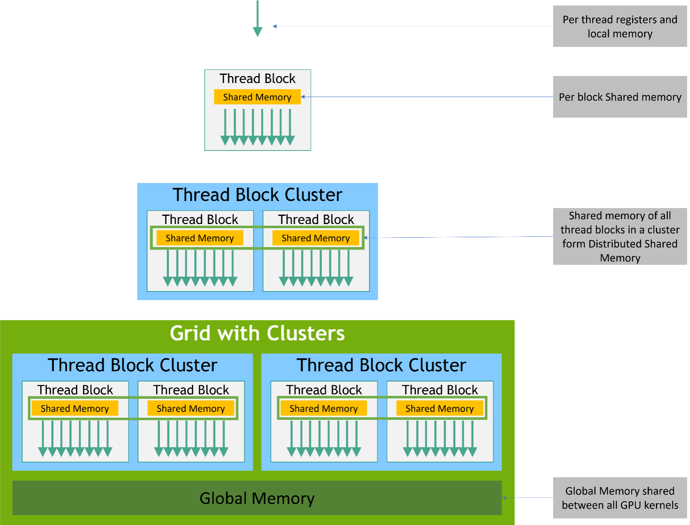

---

## Memory Hierarchy

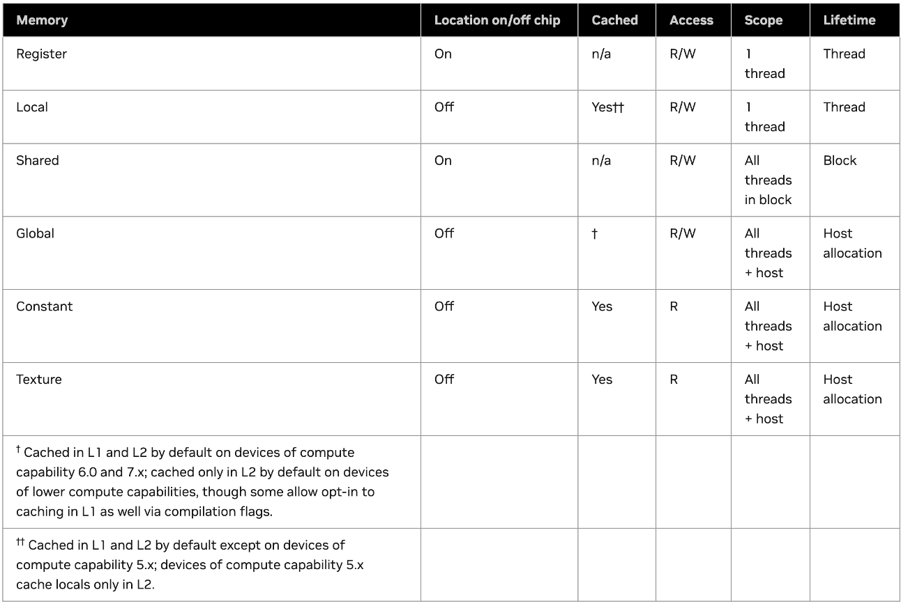

---

## Memory Hierarchy

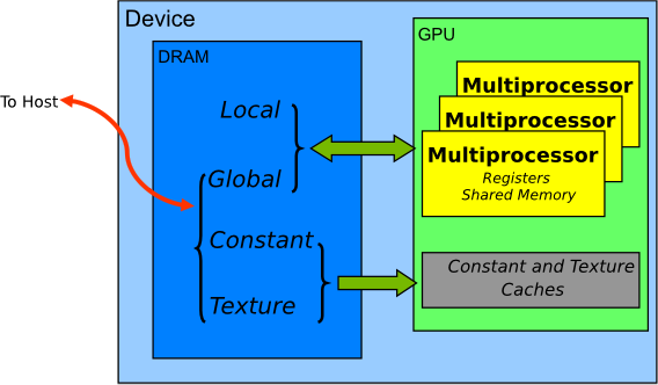

---

## Memory补充说明

* on-chip memory：包括 register 和 shared memory，所有的 on-chip memory 都是 SRAM
* off-chip memory：包括 global、local、constants、texture memory，所有的 off-chip memory 都是 DRAM
* Global Memory 中访问的数据总是会被缓存到 L2 中，当满足一些更严格的条件时会进一步被缓存到 L1 中
* GPU DRAM 的大小 = off-chip memory 的大小 = "显存"

---

## Memory补充说明
* High Bandwidth Memory（HBM）：可以认为指的就是 DRAM
* L1 cache 和 shared memory 共享一块 on-chip memory，所以我们可以认为这两者的访问速度相同
  * cache 是程序员无法控制的，但 shared memory 可以

---

## 从 GPU 基础到 FlashAttention
* FlashAttention 的核心目标是把 Q/K/V 的计算尽量留在 register 与 shared memory，减少对 global memory（HBM）的往返
* 线程/warp 的组织方式决定了一个 tile 在 GPU 上的执行效率，因此我们需要关注 warp 内的同步与分支
* 后续的 FlashAttention 章节会结合 tiling、online softmax 等技巧，展示如何把刚才的 GPU 基础概念映射到 attention 的计算

---

## FlashAttention
* Installation
* GPU Basics
* **FlashAttention V1**
* FlashAttention V2
* Other

---

## Basic Info
* 效果：FlashAttention 可以加速 Attention Layer 在训练和推理过程中的计算速度，并且保证计算结果准确
* 动机: Transformer 架构的计算时间开销大，此开销和访存代价有关
* 原理：减少存储访问开销，这与绝大数减少计算时间复杂度方法的原理是不一样的

---

## 标准 Self Attention

* 在这个过程中，一共包含了 8 次需要访问 HBM 的操作
  * 第 1 行：读 Q、K，写 S
  * 第 2 行：读 S，写 P
  * 第 3 行：读 P、V，写 O
* HBM 访问成本： $𝑶(𝑁𝑑+𝑁^2)$，$𝑁$ 表示seq_len， $𝑑$ 表示 head_dim

---

## 优化维度

* 一种思路是：减少每一步中实际访问 HBM（global memory）的次数
* 或者：调整算法步骤，减少整体流程上访问 HBM 的次数

---

# 从 block 出发思考问题
* 以矩阵乘法 𝑪=𝑨×𝑩 为例，在实际的计算过程中，线程会被组织成 block，再交由 SM 执行
* 以 𝑪 为 32\*32 的矩阵，block 为 16\*16 为例，一种朴素的实现方法：

* C 中每个位置的计算需要访问 global memory 2\*32 次，总共 2\*32\*32\*32 次

---

## Tiling 技术
* 在朴素的实现方法中，我们并没有考虑利用 shared memory，而 Tiling 技术通过利用 shared memory 减少 global memory 的访问

* $𝑨_{𝟎,𝟎}×𝑩_{𝟎,𝟎}+𝑨_{𝟎,𝟏}×𝑩_{𝟏,𝟎}=𝑪_{𝟎,𝟎}$
* $𝑨_{𝟎,𝟎}$ 和 $𝑩_{𝟎,𝟎}$ 可以同时存储在 shared memory 上， $𝑪_{𝟎,𝟎}$ 中的每个元素的值存储在 register 上

---

## Tiling 技术 (cont'd)
* 第一轮迭代存储角度图示：

---

## Tiling 技术 (cont'd)
* 第二轮迭代存储角度图示：
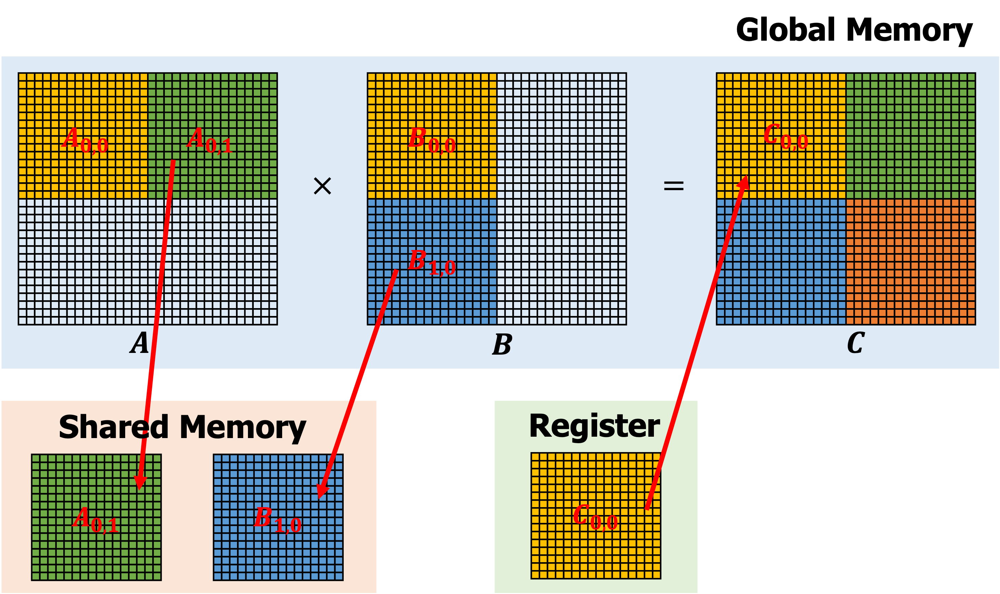

---

# Tiling 技术 (cont'd)
* 总计算量保持不变
* 但是总的 global memory 的访问次数大大降低，我们算出 C 矩阵四分之一的结果时，访问了 16\*16\*4 次 global memory，那么总共将访问 16\*16\*4\*4 次，一共 4096 次；而之前 naive 的方法访问了 65536 次，减少为了原来的 1/16
* 调整 block 的大小还可以进一步改变 global memory 的访问次数

---

# Unfortunately
* Tiling 技术虽然可用于矩阵乘法，但不能直接用于 Attention 的计算
  * 在 Attention Layer 的计算中，存在一次 row-wise softmax 操作

* 在仅计算出 $𝑪_{𝟎,𝟎}$ 的情况下，无法计算 softmax 的值，因为 softmax 的值还依赖于 $𝑪_{𝟎,𝟏}$

---

# Unfortunately

* 因此 Tiling 技术仅仅减少了标准 Attention 算法中矩阵乘法的实际 global memory 访问次数，但是并没有从整体上改变标准 Attention 算法的流程

---

# Safe Softmax
Softmax 的公式：

为了防止指数爆炸问题，在实际计算的时候会采用 Safe Softmax：

一般来说，上述公式中 $𝑚=\max_{𝑗=1}^𝑁 (𝑥_𝑗)$，从而保证指数项<=0

---

## Softmax 的数学本质

* $\text{softmax}(x_i)=\dfrac{e^{x_i}}{\sum_j e^{x_j}}$ 将任意实数向量归一为“概率分布”
* 常见用途
  * 注意力机制中的权重计算（如 $P=\text{softmax}(QK^\top/\sqrt{d})$）
  * 分类模型输出层，把 logits 转换为类别概率

---

## Softmax 的数值风险

* 直接计算 $\sum_j e^{x_j}$ 容易溢出/下溢
  * $x_i=100 \Rightarrow e^{x_i}\approx 2.7\times 10^{43}$，float16/32 无法表示
  * $x_i=-100 \Rightarrow e^{x_i}\approx 3.7\times 10^{-44}$，接近 0 导致梯度消失
* 溢出会产生 `inf`，下溢会得到 0，最终 softmax 可能变成 `NaN`

---

## LogSumExp (LSE) 与稳定形式

* 定义：$\operatorname{LSE}(x)=\log\left(\sum_j e^{x_j}\right)$，即在 log 域求和
* 稳定化：令 $m=\max_j x_j$，写作 $\operatorname{LSE}(x)=m+\log\left(\sum_j e^{x_j-m}\right)$
  * 所有 $x_j-m\le 0$，指数项不会爆炸

---

## LSE 在 Softmax 中的作用

* **归一化因子**：$\text{softmax}(x_i)=\exp\!\left(x_i-\operatorname{LSE}(x)\right)$，LSE 就是分母的 log 形式
* **数值稳定性**：通过引入 $m$，保证指数项 $\le 1$，避免溢出同时保持精度
* **梯度友好**：$\dfrac{\partial}{\partial x_i}\operatorname{LSE}(x)=\text{softmax}(x_i)$，反向传播中梯度直接可得
* FlashAttention 的 online softmax 正是维护 $m$ 和 $\sum e^{x_j-m}$ 的增量，块级也能稳定计算 LSE

---

## 一种迭代式的 Safe Softmax 的算法（V1）

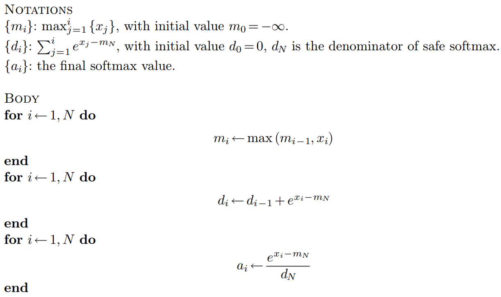

---

## Online Softmax（V2）
* 优化思路：消除 $𝑑_𝑖$ 对 $𝑚_𝑁$ 的依赖

---

## Online Softmax（V2） 

V2版本算法
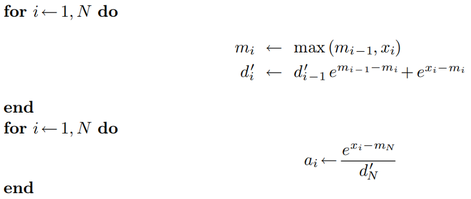

---

## Again, Unfortunately
* 以上优化对于 softmax 操作来说已经到头了，我们不可能在一次循环中把 softmax 的结果计算出来
  * 原因：向量中的每个元素都是独立的，不可能在没有遍历到后续元素的情况下，确定当前元素最终的 softmax 值

## But
* Attention Layer 的最终目的并不是为了计算 softmax，而是 softmax 以后的还需要乘以矩阵 V，**得到最终的输出**

---

## 一种 2-pass 的 Self Attention 的算法（V1）
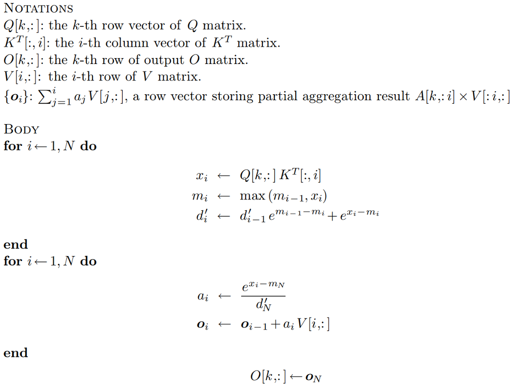

---

## 改良版的 1-pass 算法（V2）
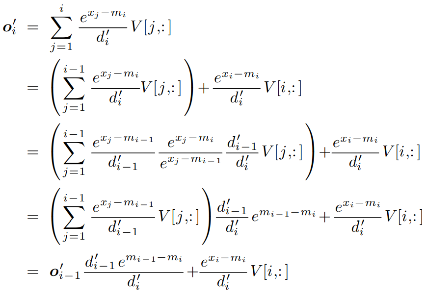

---

## 改良版的 1-pass 算法（V2）（cont'd）

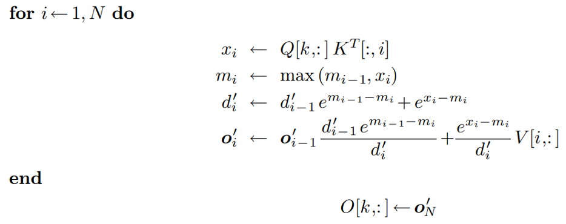
* 虽然 softmax 无法用 1-pass 的方式解决，但是 Self Attention 的计算可以用1-pass的方式解决
  * 以上1-pass Self Attention 算法可看作 FlashAttention V1 的原型

---

## FlashAttention V1
* FlashAttention 在实现时，还考虑到了 Tiling 技术
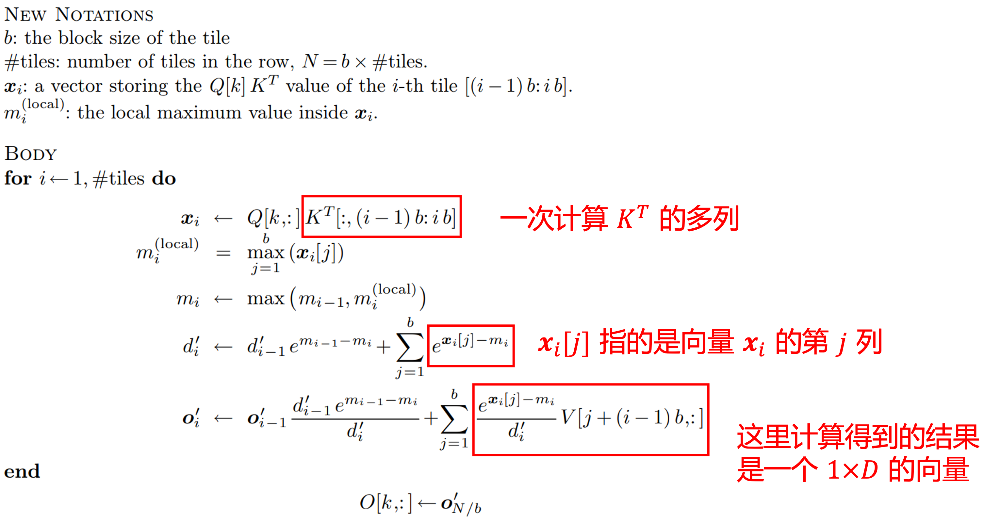

---

## FlashAttention V1
如下图所示，蓝色的部分表示当前存储在 shared memory 中的部分

FlashAttention 的实现是不唯一的，事实上，很多实现都没有完全采用原始论文中的方法，会有一定程度的调整

---

# FlashAttention
* Installation
* GPU Basics
* FlashAttention V1
* **FlashAttention V2**
* Other

---

# 改进一：调整内外循环
* FlashAttention V1 中采用了一个非直觉的外层循环矩阵 𝐾,𝑉，内层循环矩阵 𝑄,𝑂 的方式，这会导致矩阵 𝑂 被额外加载
* 事实上，在 FlashAttention V2 出来之前，很多 FlashAttention 的实现就修改了这个循环顺序

---

# 改进二：减少了非矩阵乘法的运算次数
* 现代 GPU 对矩阵乘法有专门的硬件优化，矩阵乘法flop是非矩阵乘法flop的16倍左右
  * 具体实现上，FlashAttention V1 每轮迭代都有一个 rescale 操作：

* 在 V2 中，不再在每轮迭代中都除以$𝑑_𝑖^′$，而是等循环体结束以后，对计算得到的 $𝒐_𝑁^′$ 统一除以 $𝑑_𝑁^′$

---

# 改进三：Warp Level 并行度
假设一个 block 实际上会被 SM 划分成 4 个 warp，在 V1 版本中，矩阵 𝐾,𝑉 的 block 会被划分成 4 个 warp，每个 warp 计算 $𝑸_𝑖 𝑲_𝑗^𝑇$ 后会得到一个 $𝐵_𝑟×\frac{𝐵_𝑐}{4}$ 的矩阵，需要 4 个 warp 全部计算完以后，把四个矩阵排成一行（下图中 V1 版本红色的四个矩阵），才能计算 $𝑸_𝑖 𝑲_𝑗^𝑇$ 真正的值，这个过程中存在 warp 之间的通信

---

# 改进三：Warp Level 并行度（cont'd）
在 V2 版本中，矩阵 𝑄 的 block 会被划分成 4 个 warp，这种情况下每个 warp 计算出来的结果就是一个 $\frac{𝐵_𝑟}{4}×𝐵_𝑐$ 的矩阵，这个矩阵已经包含了 $𝑸_𝑖 𝑲_𝑗^𝑇$ 中完整的 $\frac{𝐵_𝑟}{4}$ 行，所以整个计算就只需要在 warp 内部进行，不需要进行 warp 之间的通信

---

# FlashAttention
* Installation
* GPU Basics
* FlashAttention V1
* FlashAttention V2
* **Other**

---

# FlashAttention 使用途径
* 使用官方库 flash_attn，可以通过 pip 直接安装，这种方法如果需要做一些逻辑上的修改（例如加 mask），学习和 Debug 的成本较高
* 使用 Triton Language 中的实现，实际性能也很好
* LeetCUDA: https://github.com/xlite-dev/LeetCUDA