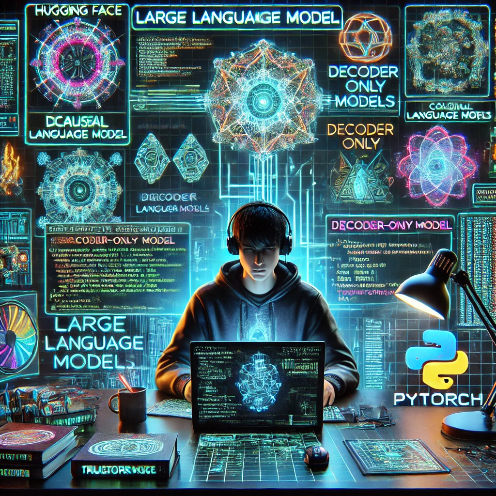

<!--  -->

<!-- - [课程概览](lecture1.html) -->

<!-- #  大语言模型应用开发 -->

# **大语言模型基础：从零到一实现之路**

徐经纬

  [课程目录](#2)

<!-- <!--  -->
---

课程目录
  1. [课程简介](2025/lecture1.html)
  2. [ 特征空间的变换1: 前反向运行视角理解深度学习模型](2025/lecture2.html)
  3. [ 特征空间的变换2: 前反向运行视角理解深度学习模型](2025/lecture3.html)
  4. [ 大语言模型解析 I: Input/Positional Embedding](2025/lecture4.html)
