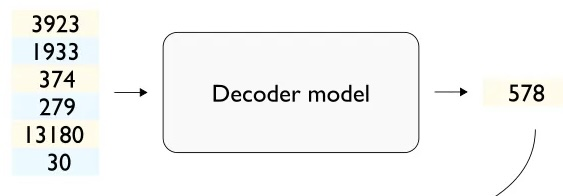
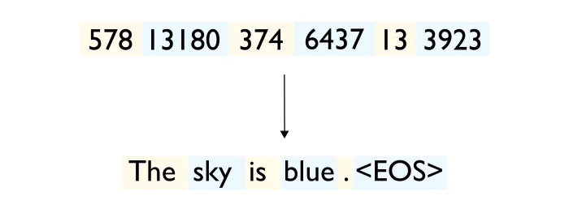

# **LLM智能应用开发**

第11讲: 大语言模型解析 VIII

基于HF LlaMA实现的讲解

<!-- https://marp.app/ -->

---

# LLM结构的学习路径

* LLM结构解析(开源LlaMA)
* 自定义数据集构造
* 自定义损失函数和模型训练/微调
* **让我们再次动起来：LLM推理过程**

---

# LLM推理过程二三事

* LLM二阶段推理
* KV-caching机制

---

#  LLM的输入输出

---

#  LLM推理过程中实际涉及的步骤

* LLM的一次推理输出logits，并非token
* 要得到token，还需通过Decoding strategy对logits进行解码

---

#  LLM推理过程中实际涉及的步骤

* LlaMAModel获得最后一层DecoderLayer的输出
* LM_head获得logits
* Decoding strategy解码logits得到token

* 常用的Decoding strategy有：
  * Greedy decoding
  * Sampling
  * Beam search

---

# LLM的解码(decoding)策略

* 如果我们把logits(通过softmax转换为token的概率分布)作为输入，通常有如下解码策略：
  * 贪婪解码(Greedy Decoding)：每次直接选择概率最高的token，简单高效，但并非全局最优
  * 采样(Sampling)：按一定的采样策略选择一个单词，增加生成过程的多样性，但可能会导致生成的文本不连贯
  * Beam Search：通过维护一个长度为k的候选序列集，每一步(单token推理)从每个候选序列的概率分布中选择概率最高的k个token，再考虑序列概率，保留最高的k个候选序列

---

# 采样策略

* 一切从随机出发，叠加控制
  * 随机采样
  * Top-k采样
  * Top-p采样(核采样，Nucleus sampling)
  * Top-k+Top-p采样

---

# 采样策略: top-k采样

输入：南京大学计算机学院的课程有
概率分布: {算法:0.4, 操作系统:0.3, 计算机:0.2, 数据:0.05, ...}
* top-k采样，每次从概率最高的k个单词中进行随机采样
* 例如k=2，有可能生成的输出有
  * 南京大学计算机学院的课程有算法
  * 南京大学计算机学院的课程有操作系统
* 贪婪解码本质是一种top-k采样(k=1)

---

# 采样策略: top-p采样

* top-p采样，源自[The Curious Case of Neural Text Degeneration](https://arxiv.org/pdf/1904.09751)
* 核心思路，重构采样集合
  * 给定token分布$P(x\mid x_{x_{1:i-1}})$，top-p集合$V^{(p)}\subset V$，使得$P(x\mid x_{x_{1:i-1}}\geq p)$
  * 和top-k很像，区别在于在什么位置对分布进行截断

---

# HF关于采样策略的实现

* 参考:[top_k_top_p_filtering](https://github.com/huggingface/transformers/blob/c4d4e8bdbd25d9463d41de6398940329c89b7fb6/src/transformers/generation_utils.py#L903) (老版本)
* 参考:
  * src/transformers/generation/logits_process.py
    * TopPLogitsWarper
    * TopKLogitsWarper
  * src/transformers/generation/utils.py
    * _get_logits_processor
      * 先topk，再topp

---

# LLM推理之两大阶段

* 基于LLM自回归生成(autoregressive generation)的特点
  * 逐token生成，生成的token依赖于前面的token
  * 一次只能生成一个token，无法同时生成多个token
* LLM生成过程分为两个阶段
  * Prefill phase
  * Decoding phase

---

# LLM推理第一阶段: Prefill

输入token序列，输出下一个token

---

# LLM推理第二阶段: Decoding

---

# LLM推理第二阶段: Decoding

---

# LLM完成推理后，解码

将生成的token序列解码成文本

---

# LLM二阶段推理解析

* 将LLM当作函数，输入是token序列，输出是下一个token
* LLM通过自回归(autoregressive generation)不断生成"下一个token"
* 脑补下当LLM接收到输入的token序列后如何进行下一个token的推理

---

# LLM推理过程会产生一些中间变量

第一个"下一个token"生成: 输入token序列"经过"(调用forward方法)N层Decoder layer后，的到结果
细看其中一层Decoder layer,frward方法会返回若干中间输出，被称之为激活(activation)

---

# Prefill phase

* 第一个"下一个token"生成过程被称之为Prefill阶段
* 为何特殊对待？
  * 计算开销大
* 简单推导一下一次LLM的推理过程的计算开销

---

# 计算开销

* 符号约定
  * b: batch size
  * s: sequence length
  * h: hidden size/dimension
  * nh: number of heads
  * hd: head dimension

---

# 计算开销

* 给定矩阵$A\in R^{1\times n}$和矩阵$B\in R^{n\times 1}$，计算$AB$需要$n$次乘法操作和$n$次加法操作，总计算开销为$2n$ (FLOPs)
  * FLOPs: floating point operations
* 给定矩阵$A\in R^{m\times n}$和矩阵$B\in R^{n\times p}$，计算$AB$中的一个元素需要$n$次乘法操作和$n$次加法操作，一共有$mp$个元素，总计算开销为$2mnp$ 

---

# Self-attn模块

* 第一步计算: $Q=xW_q$, $K=xW_k$, $V=xW_v$
  * 输入x的shape: $(b,s,h)$，weight的shape: $(h,h)$
  * Shape视角下的计算过程: $(b,s,h)(h,h)\rightarrow(b,s,h)$
    * 如果在此进行多头拆分(reshape/view/einops)，shape变为$(b,s,nh,hd)$，其中$h=bh*hd$
  * 计算开销: $3\times 2bsh^2\rightarrow 6bsh^2$

---

# Self-attn模块

* 第二步计算: $x_{\text{out}}=\text{softmax}(\frac{QK^T}{\sqrt{h}})VW_o+x$
  * $QK^T$计算: $(b,nh,s,hd)(b,nh,hd,s)\rightarrow (b,nh,s,s)$
    * 计算开销: $2bs^2h$
  * $\text{softmax}(\frac{QK^T}{\sqrt{h}})V$计算: $(b,nh,s,s)(b,bh,s,hd)\rightarrow(b,nh,s,hd)$
    * 计算开销: $2bs^2h$
* 第三步$W_o$计算: $(b,s,h)(h,h)\rightarrow(b,s,h)$
  * 计算开销: $2bsh^2$
* Self-attn模块总计算开销: $8bsh^2+4bs^2h$
---

# MLP模块

$$x=f_\text{activation}(x_{\text{out}}W_{\text{up}})W_{\text{down}}+x_{\text{out}}$$
* 第一步计算，假设上采样到4倍
  * Shape变化:$(b,s,h)(h,4h)\rightarrow(b,s,4h)$
  * 计算开销: $8bsh^2$
* 第二步计算，假设下采样回1倍
  * Shape变化:$(b,s,4h)(4h,h)\rightarrow(b,s,h)$
  * 计算开销: $8bsh^2$
* MLP模块总计算开销: $16bsh^2$

---

# Decoder layer模块计算开销

* Self-attn模块计算开销: $8bsh^2+4bs^2h$
* MLP模块计算开销: $16bsh^2$
* Decoder layer模块计算开销: $24bsh^2+4bs^2h$

* 以上为一次推理的计算开销，开销为sequence的平方级别

---

# Decoding phase

* 当第一个"下一个token"生成完毕后，LLM开始"自回归推理"生成
* 第二个"下一个token"
  * 输入x的shape: $(b,s+1,h)$，继续以上推理过程
* 第三个"下一个token"
  * 输入x的shape: $(b,s+2,h)$，继续以上推理过程
* 第n个"下一个token"
  * 输入x的shape: $(b,s+n-1,h)$，继续以上推理过程
* 自回归推理过程的计算开销
* 每次自回归推理过程，都需要平方级别的开销？
  * 且包含了计算开销和内存开销

---

# 回顾Self-attn中$QK^T$的计算过程

* 第一个"下一个token"
  * $QK^T$计算: $(b,nh,s,hd)(b,nh,hd,s)\rightarrow (b,nh,s,s)$
* 第二个"下一个token"
  * $QK^T$计算: $(b,nh,s+1,hd)(b,nh,hd,s+1)\rightarrow (b,nh,s+1,s+1)$
* 考虑自回归特性，$(s,s)$和$(s+1,s+1)$为下三角阵
  * $(s+1,s+1)$的前$s$行就是$(s,s)$
* 考虑复用$(s,s)$？

---

# LLM自回归过程中的复用

* 要复用什么，还得从需求出发
* 需求: 生成"下一个token" 
* Decoder layers之后的lm_head计算
  * shape视角: $(b,s,h)(h,V)\rightarrow (b,s,V)$
* 生成第二个"下一个token"
  * shape视角: $(b,s+1,h)(h,V)\rightarrow (b,s+1,V)$
  * 第二个"下一个token"的logits在$(b,s+1,V)$中第二个维度index $s+1$处，该logits只受$(b,s+1,h)$中第二个维度index $s+1$处的值影响

---

# LLM自回归过程中的复用

* 真正要复用的是用于计算$(b,s+1,h)$中第二维度index $s+1$的数值
  * shape的视角: $(b,s+1,h)\rightarrow (b,1,V)$
* 整个self-attn计算过程中，只有$QK^T$中的$K$和$\text{softmax}(\frac{QK^T}{\sqrt(h)})V$中的$V$需要复用
  * 为K和V构建缓存: 即KVCache

---

# Self-attn例

