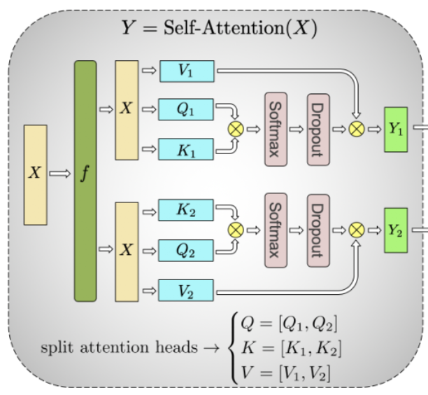
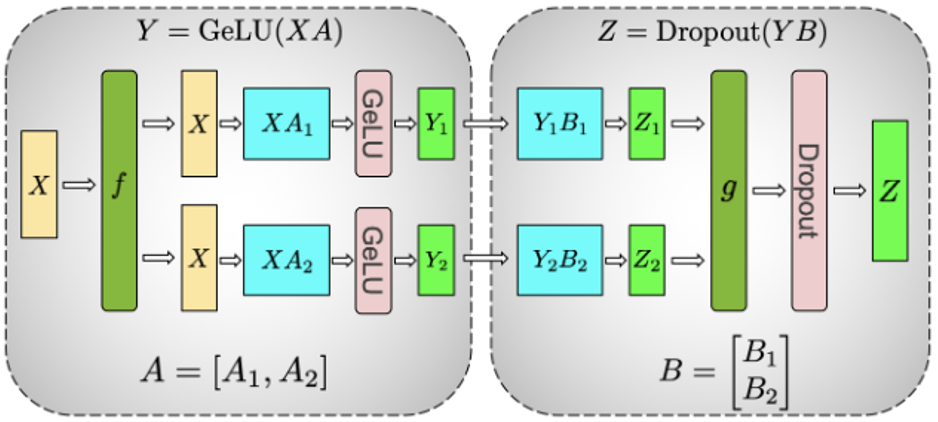

# **LLM智能应用开发**

第14讲: LLM进阶
Megatron 中的并行化技术介绍

<!-- https://marp.app/ -->

---

# 背景介绍
随着计算能力的提升和数据集规模的扩大，模型的参数数量也呈指数级增长。然而，训练大型语言模型仍存在以下的挑战：

+ 计算资源需求庞大
+ 显存限制
+ 通信瓶颈

面对这些挑战，简单地依赖硬件升级已经无法满足需求。因此，高效的并行化策略成了解决问题的关键。

---

# Megatron

Megatron 作为 NVIDIA 提出的高性能大规模模型训练框架，巧妙地结合了多种并行化技术：

+ 张量并行（Tensor Parallelism）
+ 数据并行（Data Parallelism）
+ 流水线并行（Pipeline Parallelism）
+ 序列并行（Sequence Parallelism）

通过这些并行化策略的组合，Megatron 成功地应对了训练大型大语言模型的诸多挑战，为研究和应用带来了新的可能性。

---

# Overall: TP + DP

+ 张量并行（Tensor Parallelism）：将模型中的大型权重张量沿特定维度切分，在不同 GPU 上分别计算，最后汇总；
+ 数据并行（Data Parallelism）：将数据集划分成多个子集，每个子集交给一个模型副本进行计算，最后同步参数。

---

# TP in Megatron

在 Transformer Layer 中，最重要的计算就是 MLP 和 Attention

为了实现张量并行，需要分别对这两个模块作并行化处理

---

# TP on MLP

MLP 通过两步矩阵计算，将 $hidden\_state$ 先升维再降维:

+ $[\dots, 𝐻]∗[𝐻, 4𝐻]=[\dots, 4𝐻]$
+ $[\dots, 4𝐻]∗[4𝐻, 𝐻]=[\dots, 𝐻]$

需要作并行化处理的正是权重矩阵 $𝐴:[𝐻, 4𝐻]$, $𝐵:[4𝐻, 𝐻]$

---

# TP on MLP

+ 对矩阵 $𝐴$ 及后续 $𝐺𝑒𝐿𝑈$ 作切分：
  将 $𝐴$ 沿着列方向切分为 $𝐴=[𝐴_1,𝐴_2]$，于是有：$[𝑌_1,𝑌_2 ]=[𝐺𝑒𝐿𝑈(𝑋𝐴_1 ), 𝐺𝑒𝐿𝑈(𝑋𝐴_2 )]$

+ 对矩阵 $𝐵$ 作切分：
  由于前一步的切分导致中间结果 $𝑌$ 也被沿着列方向切开，因此在这一步中需要将 $𝐵$ 沿行方向切开，即 $𝐵=[𝐵_1;𝐵_2]$，于是有：$YB=[𝑌_1,𝑌_2 ][𝐵_1;𝐵_2]=[𝑌_1 𝐵_1+𝑌_2 𝐵_2]$

---

# TP on MLP

+ 需要在输入时复制 $𝑋$ ，并在输出前合并 $𝑌𝐵$ 的计算结果
+ 分别引入了两个共轭的操作 $𝑓$ 和 $𝑔$；
  + $𝑓$ 在前向传播时复制 $𝑋$，在反向传播时通过 `all-reduce` 合并计算结果；
  + $𝑔$ 与之相反。

* Nvidia NCCL Collective Operations

---

# All-reduce

---

# Broadcast

---
# TP on Attention

对 Self-Attention 部分的并行化设计利用了 Multihead Attention 本身的并行性，从列方向切分权重矩阵，并保持了与每个头的对应:

+ 在每个头中，仍然保持了原本的计算逻辑，即：$O=𝐷𝑟𝑜𝑝𝑜𝑢𝑡(𝑆𝑜𝑓𝑡𝑚𝑎𝑥(\frac{𝑄𝐾^𝑇}{\sqrt{𝑑}}))𝑉$ 
+ 并行化后的中间结果为 $𝑌=[𝑌_1, 𝑌_2 ]$；

---

# TP on Attention

Dropout 的部分和之前 MLP 部分基本一致，将权重矩阵 $𝐵$ 沿行方向切开，因此同样需要在 Dropout 之前将 $𝑌_1 𝐵_1,𝑌_2 𝐵_2$ 合并；

总体来看，对 Attention 部分的并行化操作仍然需要在首尾分别添加 $𝑓$, $𝑔$ 。

---

# Default pipeline in GPipe

流水线并行（Pipeline Parallelism）：[GPipe](https://arxiv.org/pdf/1811.06965)将模型划分为多个连续的阶段，每个阶段包含若干的层，再把这些阶段分配到不同的 GPU 上，使得各个 GPU 能在时间上错开地处理不同的数据。

---

# Default pipeline in GPipe

* 存在问题
  * Bubble time size：流水线会在一个批次全部计算完成后统一更新权重，灰色区域就是 GPU 需要等待的时间，比例约为 $\frac{𝑝 − 1}{𝑚}$
  * Memory：反向传播完成前需保存所有微批次在前向中的激活值

---

# 1F1B in PipeDream-Flush

[PipeDream-Flush](https://arxiv.org/pdf/2006.09503) 把一个迭代分成三个阶段:

* 预热前向传播阶段：每个 worker 会做前向计算，并且向其下游发送激活，一直到最后一个 stage 被激发。该调度将执行中的微批次数量限制在流水线深度之内，而不是一个批次中的微批次数量；
* 稳定 1F1B 阶段：进入稳定状态之后，每个 worker 都进行1F1B 操作。
* 冷却反向传播阶段：此阶段会把执行中的的微批次执行完毕，只执行反向计算和向反向计算下游发送梯度。
  
---

# 1F1B in PipeDream-Flush

---

# 1F1B in PipeDream-Flush

尽管 PipeDream-Flush 与 GPipe 的 bubble time size 相同，但是由于 PipeDream-Flush 限制了执行中的微批次数量，因此相较于 GPipe，更加节省显存：

* Bubble time size: $\frac{𝑝 − 1}{𝑚}$；
* PipeDream-Flush 中最大执行微批次数量 $𝑝$；
* GPipe 中最大执行微批次数量 $𝑚$；

---

# PP in Megatron

在 PipeDream-Flush 的基础上，Megatron 进一步将每个微批次划分为多个阶段，使得每个 GPU 上保存多个不同的连续阶段，例如：

+ 原本 GPU1 上保存 layer 1-4；GPU2 上保存 layer 5-8；等等；
+ 现在 GPU1 上保存 layer 1,2,9,10；GPU2 上保存 layer 3,4,11,12；等等。

---

# PP in Megatron

+ 通过划分更细粒度的阶段，将 bubble time size 降低到了 $\frac{1}{𝑣} \times \frac{𝑝 − 1}{𝑚}$；
+ 需要付出更多的通信代价。

---

# Communication Optimizations

+ 以 MLP 部分的 TP 为例：在 $𝑔$ 之前的 $𝑍_1,𝑍_2$ 分布在两个 GPU 上，经过 $𝑔$ 合并之后，每个 GPU 上的输出 $𝑍$ 是相同的，由此导致相邻的两个流水线阶段发送和接收的数据是重复的；
+ 因此，可以将输出 $𝑍$ 划分为多个相同大小的部分，每个 GPU 只将自己保存的部分发送给对应的 GPU，再在下一个阶段中合并，得到完整的数据。

---

# Communication Optimizations

<!--  -->

---

# Activations Memory Problem

随着大模型参数量的不断增大，模型训练过程中激活值占用的显存也显著增加，已成为优化训练性能时不可忽视的关键因素。

---

# Related Work

相关工作提出了一些方法来解决激活值占用过多显存的问题，包括：

+ Offload：将模型划分为多个模块，计算时在显卡和主机之间卸载、加载；
  + 缺点：计算效率很低；
+ TP + PP：一定程度上缓解了问题，但是仍有部分激活值未能并行化切分；
+ Sequence Parallelism：将长序列输入划分并在多个 GPU 上并行处理，虽然可以缓解激活值占用显存的问题，但会导致模型的其他参数需要复制到所有模型副本中，因此不适用于大型模型的训练。

---

# Analysis

+ Transformer Layer 中最重要的部分是 MLP 和 Attention，还包括两层 LayerNorm；

+ MLP Block：
  + 两个线性层 $[ℎ, 4ℎ]$, $[4ℎ, ℎ]$  分别需要存储输入大小为 $2𝑠𝑏ℎ$, $8𝑠𝑏ℎ$；
  + GeLU 需要需要存储输入大小为 $8𝑠𝑏ℎ$；
  + Dropout 需要存储 mask 大小为 $𝑠𝑏ℎ$；
+ 总计需要存储 $19𝑠𝑏ℎ$ 。

---

# Analysis

+ Attention Block：包括 Self-Attention，一层线性层和 Dropout；
+ Self-Attention：
  + $𝑄,𝐾,𝑉$：只需存储共同输入大小 $2𝑠𝑏ℎ$；
  + $𝑄𝐾^𝑇$：需要存储 $𝑄,𝐾$ 共 $4𝑠𝑏ℎ$；
  + Softmax：需要存储输出大小为 $2𝑎𝑠^2 𝑏$；
  + Softmax Dropout：需要存储 mask 大小为 $𝑎𝑠^2 𝑏$；

---

# Analysis

+ Self-Attention：
  + Attention Over Values：需要存储 Dropout 输出和 $𝑉$ 总共大小 $2𝑎𝑠^2 𝑏+2𝑠𝑏ℎ$；
  + 线性层：需要存储输入大小为 $2𝑠𝑏ℎ$；
  + Dropout：需要存储 mask 大小为 $𝑠𝑏ℎ$；
+ 总计需要存储 $11𝑠𝑏ℎ+5𝑎𝑠^2 𝑏$。

---

# Analysis

+ LayerNorm：每个 LayerNorm 需要存储输入大小 $2𝑠𝑏ℎ$，因此 Transformer Layer 中需要存储 $4𝑠𝑏ℎ$；

综合 MLP，Attention 和 LayerNorm，总计需要存储 $𝑠𝑏ℎ(34+5 𝑎𝑠/ℎ)$。

---

# With TP

+ 在对 Attention 和 MLP 进行 t 路张量并行后，部分激活值（每个 Block 内部）被并行化切分，此时需要存储激活值：$s𝑏ℎ(10+24/𝑡+5 𝑎𝑠/ℎ𝑡)$
+ 未被并行化的激活值：Attention，MLP，Dropout 和 LayerNorm 的输入。

---

# TP + SP

+ 基于 LayerNorm 和 Dropout 是与序列顺序无关的，因此对这两部分采用序列并行，从 $𝑠𝑒𝑞𝑢𝑒𝑛𝑐𝑒$ 维度切分，从而减少了激活值占用的显存；
+ 由此带来新的共轭通信操作 $𝑔$, $\bar{𝑔}$：

---

# TP + SP

$𝑔$ 在前向传播时作 `all-gather`，反向传播时作 `reduce-scatter`； $\bar{𝑔}$ 与之相反。

---

# all-gather

---

# reduce-scatter

---

# TP + SP 

+ 通过结合序列并行（SP），Megatron 成功并行化所有激活值，此时要存储的激活值大小为：$𝑠𝑏ℎ(\frac{10}{𝑡}+\frac{24}{𝑡}+\frac{5 𝑎𝑠}{ℎ𝑡})=  \frac{𝑠𝑏ℎ}{𝑡} (34+\frac{5 𝑎𝑠}{ℎ})$
+ 相较于初始的激活值大小 $s𝑏ℎ(34+\frac{5 𝑎𝑠}{ℎ})$，经过 TP + SP 的并行化优化，需要存储的激活值大小减少到了 $\frac{1}{𝑡}$ 。

---

# Summary of TP + SP

通过将序列并行（SP）和张量并行（TP）相结合，Megatron 成功地减少了大型模型训练中激活值所占用的显存；该方法可以与选择性激活重计算（Selective Activation Recomputation）等技术结合，进一步降低显存需求。实验结果表明，Megatron 能够将显存占用减少超过 5 倍，并将由于重计算带来的计算开销降低 90% 。

---

# Conclusion

Megatron 采用了多种并行策略：

+ 张量并行（TP）+ 数据并行（DP）
+ 流水线并行（PP）
+ 序列并行（SP）+ 张量并行（TP）
  
在对 Transformer 结构进行细微修改的基础上，结合针对服务器架构的优化，Megatron 在提升 GPU 利用率、降低显存占用和提高训练效率方面取得了显著成果。