<style>
img[alt~="center"] {
  display: block;
  margin: 0 auto;
}
a[href='red'] {
    color: red;
    pointer-events: none;
    cursor: default;
    text-decoration: none;
}
</style>

<style>
img[alt~="right"] {
  display: block;
  margin:auto;
}
a[href='red'] {
    color: red;
    pointer-events: none;
    cursor: default;
    text-decoration: none;
}
</style>


# **大语言模型技术光速简介**


---

# 课程大纲: LLM技术架构图


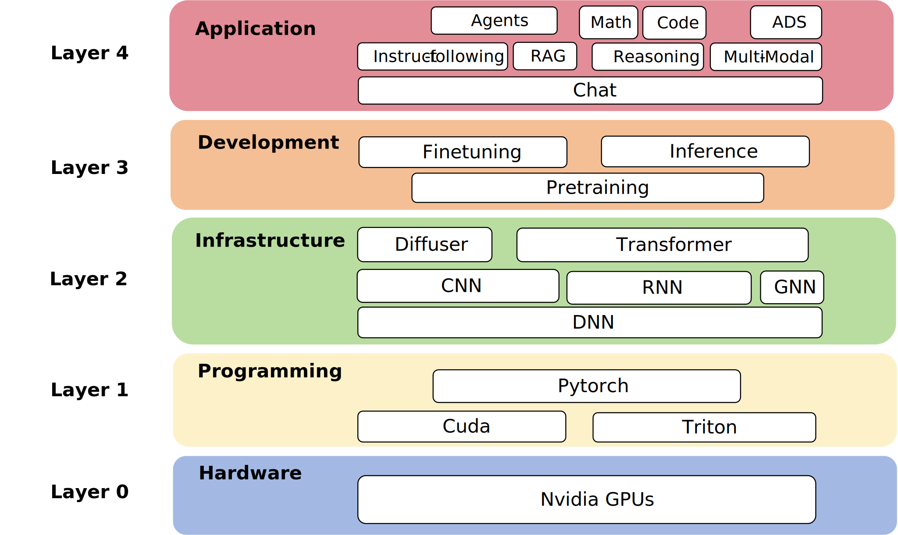

---

# 课程大纲: 授课脉络


---

# 深度学习基础

* 何为深度(机器)学习模型
* 如何开发一个模型
  * 数据、模型、训练算法
  * PyTorch基础*
* 相关概念光速入门
  * 机器学习概念、反向传播

---

# 语言模型核心基础

* 一切源自于如何建模自然语言: 统计模型
  * Bigram/N-gram Language Model
* 模型如何认识单词: 问就是编码
  * one-hot编码, word2vec, tokenization
* 模型如何理解语言: Attention is All You Need
  * attention, softmax, positional embedding, ... 

---

# LLM经典架构解析

* 了解基础组件
  * Transformer, 残差(residual), layernorm
* 一起搭LLM积木
  * Encoder-decoder, decoder only
* 代码案例: 典型LLM架构代码解析
  * LlaMA家族

---

# LLM经典架构解析(续集)

“虚的讲完了，让我们实际一点”
* LLM如何在计算机中被创建
* 运行设备：CPU，GPU，TPU...
* 精度: fp32, fp16, bf16, 混合精度...
  
---

# LLM训练和推理

* LLM预训练和微调训练
  * 训练概念介绍
  * 数据集和数据加载过程构建
  * 微调流程构建(含对齐(Alignment))
   * SFT: SFT, PEFT, LoRA
    * RL*: RLHF, PPO, DPO
* 如何推理模型
  * KV-cache

---

# LLM应用

应用技术
* 检索增强生成(RAG)
  
应用场景
* 聊天, 多模态, 数学, 代码生成

---

# 理论基础和实践相结合的学习方式

* 实践体现在无处不在的手撸代码过程
* 你会了解和学习:
  * PyTorch
  * Transformers and PEFT (from Huggingface)
  * 以及其他流行开源框架

<div style="display:contents;" data-marpit-fragment>
例如: 以下代码是如何执行的？

```python
model.from_pretrained("meta-llama/Meta-Llama-3.1-8B-Instruct")
```

</div>

---


---

# 人工智能是


人工智能=人工+智能

训练过程
人工：大力出奇迹
智能：构建分布

推理过程
条件概率 $\mathrm{p}(y|x)$

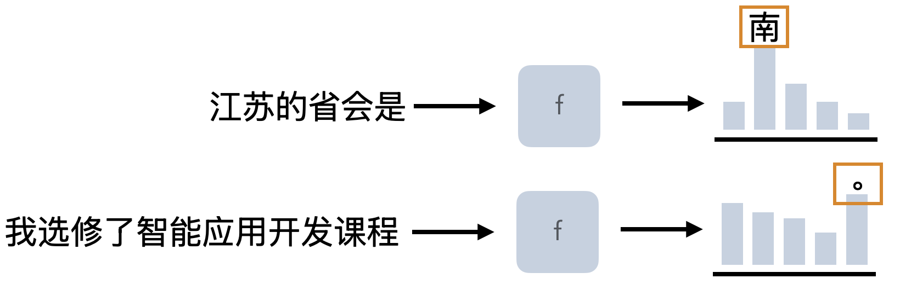

---

# 什么是自然语言处理？


* 自然语言
  * 人类使用的语言，如汉语、英语、西班牙语、代码等 -> 文本符号
* 自然语言处理的定义
 * “自然语言处理（NLP）是语言学、计算机科学和人工智能的跨学科子领域，关注计算机和人类语言之间的交互，特别是如何编程使计算机能够处理和分析大量的自然语言数据。其目标是使计算机能够“理解”文档的内容，包括其中的语言背景细微差别。然后，这项技术可以准确提取文档中包含的信息和见解，以及对文档本身进行分类和组织。” *From WikiPedia, ChatGPT翻译*
 * <span style="color:red;">自然语言理解，自然语言生成</span>


---

# 自然语言处理任务

* 请填空: 今天我来到了___
* 今天的天气____
* 自然语言处理的任务本质上是一个“填词游戏”
  * 目标：如何填的准、说得好
  * 手段：条件概率$\mathrm{p}(y|x)$
  * 填的准≠人类知道机器按照人类理解世界的方式理解世界


---

# 语言模型

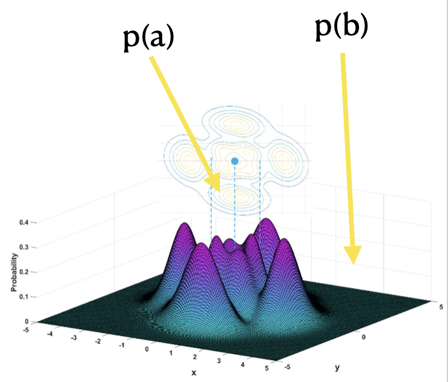

基本法: 链式法则

句子由任意长度的字符串组成

- 句子a = 今天我来到了仙II-212。
- 句子b = 今天仙II-212我来到了。
* 用概率衡量句子的“好”: $\mathrm{p}(a) > \mathrm{p}(b)$
*自然语言处理(NLP)模型：估计出的(相对准确的)概率分布

---

# 语言模型

基本法: 链式法则

* 理想: 直接估计出的(相对准确的)句子概率分布
* 现实: 参考人类小孩学说话，一个字一个字的说
  * 怎么学? 链式法则

<div style="display:contents;" data-marpit-fragment>

$\mathrm{p}$(今天我上智能应用开发。) = $\mathrm{p}$(今) $\mathrm{p}$(天|今) $\mathrm{p}$(我|今天) $\mathrm{p}$(上|今天我)...
$\mathrm{p}$(。|今天我上智能应用开发)

</div>

<div style="display:contents;" data-marpit-fragment>

<span style="color:red;">这就是经典的N-gram model</span>

</div>

---

# LLM的前寒武纪时期

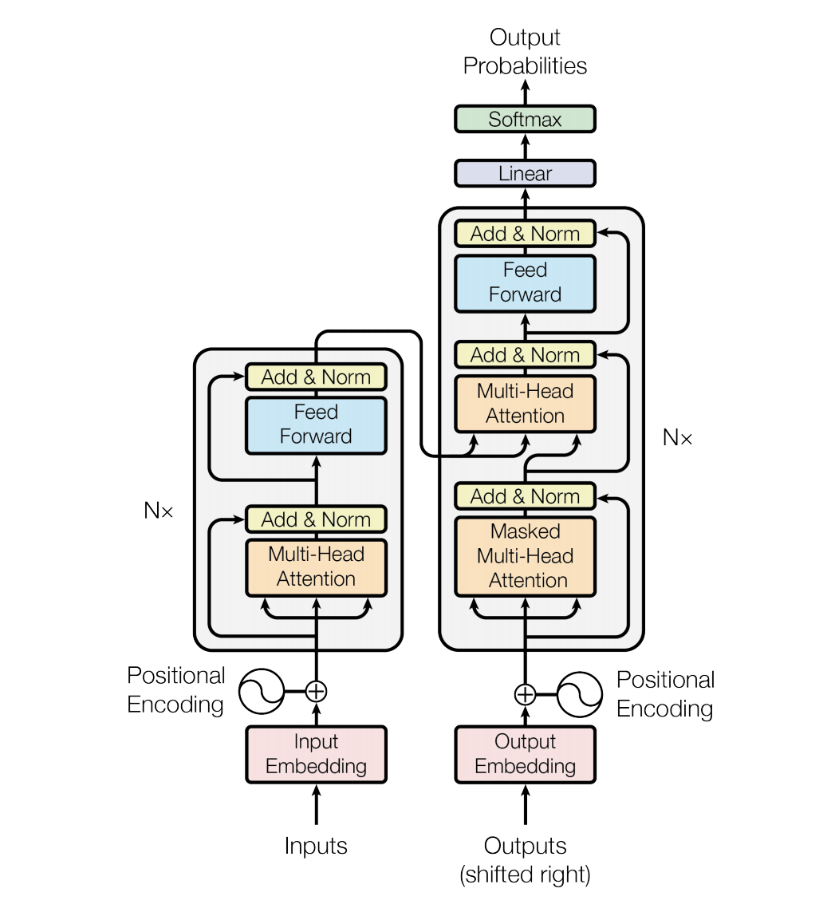

* 2017年6月之前
  * RNN系列
* 2017年-2022年
  * Attention
  * Transformer界的剑宗气宗之争
    * Encoder-decoder派: BERT
    * Decoder-only派: GPT系列

---


# Transformer界的剑宗气宗之争

文字接龙(GPT) v.s. 完形填空(BERT)

<style>
img[alt~="top-right"] {
  display: block;
  margin: 0 auto;
}
</style>

<style>
img[alt~="bottom-right"] {
  position: absolute;
  top: 400px;
  right: 0px;
}
</style>

<!-- 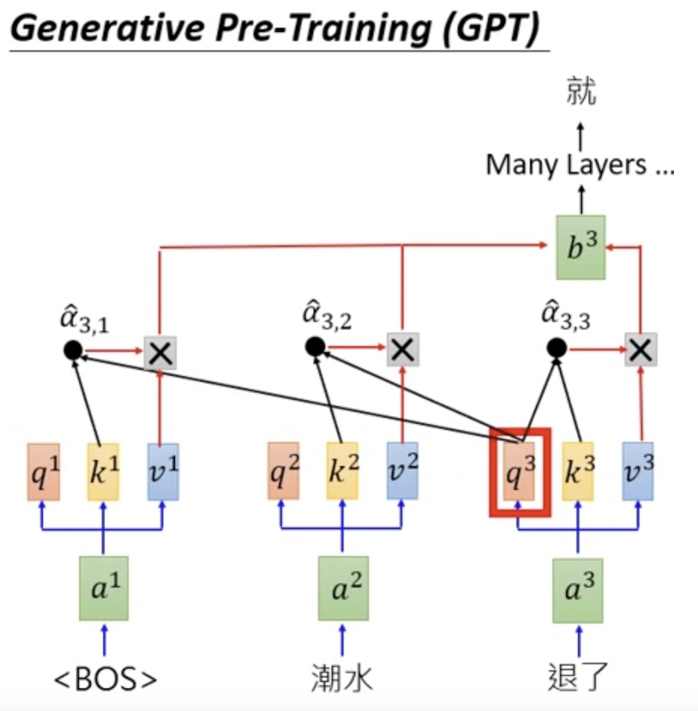 -->

<p align="center">
  
  
</p>

<!--    -->

---

# LLM的寒武纪大爆发

- OpenAI发布ChatGPT
  * GPT系列: GPT-3.5, GPT-4, GPT-4 Turbo, GPT4o...
* 其他公司
  * 国外: LlaMA家族, Gemini, Mistral, Mixtral, Claude, ...
  * 国内: Deepseek, 文心一言, GLM(智谱清言), Moonshot(月之暗面), 通义千问, abab(MiniMax), ...

---


<!-- <p align="center">
  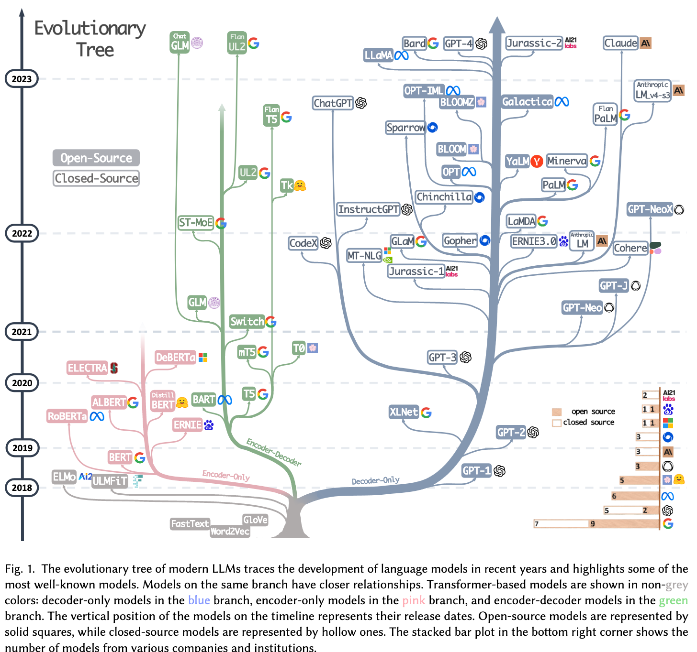
</p> -->
---

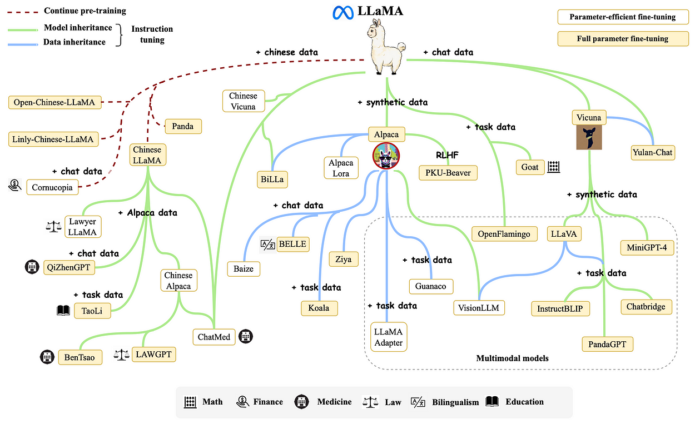
<!-- <p align="center">
  
</p> -->
---

# 开发LLM少不了开源社区的支撑

* 深度学习框架: PyTorch
* 模型社区: Huggingface
* 其他: LlaMA-factory, deepspeed, magatron, triton, llama.cpp, llama2.c, llm.c, ...

* 开发语言: Python, CUDA, C++, ...

---

# Talk is cheap. Show me the code.

准备:

* Python 3.8+
* 设备: 最好有N卡，实在没有也没关系，内存大一点
* 虚拟环境: [conda](https://docs.conda.io/projects/conda/en/latest/user-guide/install/)
* 环境配置: PyTorch, Transformers, PEFT, triton, ...
  * 绝大部分可通过pip或conda安装

---

# 第2讲: 深度学习基础 I

<!-- https://marp.app/ -->

---

# 深度学习的核心(叠甲:之一)

* 理解“世界”

<div style="display:contents;" data-marpit-fragment>
这是何物


</div>

---

# 这是何物第二关


<p align="center">
  
  
</p>

---

# 理解世界的方式

* 如何理解世界: 通过外延观察=>自动构建内涵
  
* 内涵: 一个概念的内涵是指它的“内容”或“定义”，即该概念所包含的性质、特征或条件
  * “人”: 有理性、社会性和自我意识的生物
* 外延: 一个概念的外延是指它所指代的所有对象的集合，或者说它所涵盖的实际事物的范围
  * “人”: 是所有的人类个体，如亚里士多德、牛顿、爱因斯坦

---

# 学习的核心

如何理解世界: 通过外延观察=>自动构建内涵
$y=f(x)=Wx+b$

* 理解世界的过程
  * 设定任务目标
  * 收集外延: 数据集
  * 构建内涵: 学习特征

---

# 深度学习的特点

* 表示学习(representation learning)


---

# 深度学习模型


---

# 深度学习模型

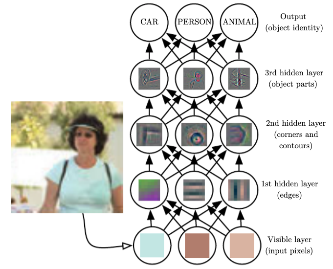

结构
* 前n-1层(堆叠)
  * 输入: 特征表示
  * 输出: 特征表示
* 第n层
  * 输入: 特征表示
  * 输出: 任务目标

---

# 深度学习模型的一层

$y=f(x)=xW^T+b$
* $x$和$y$: 特征表示
  * $x$: 当前层输入/前一层输出
  * $y$: 当前层输出/后一层输入
* $W,b$: 当前层参数
    * 表示空间的变换

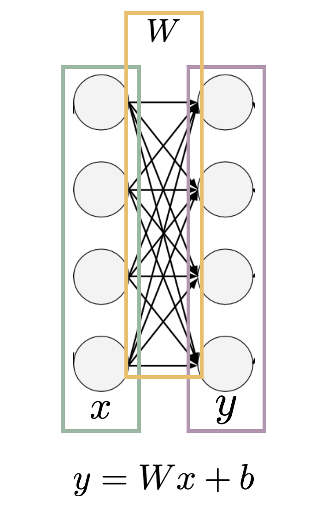

---

# PyTorch手搓y=xW^T+b

* 矩阵乘法 (Matrix multiplication)
  * @
  * torch.matmul, tensor.matmul
* 元素乘法 (element-wise multiplication)
  * \*
  * torch.mul, tensor.mul


---

# 编码时间

矩阵乘
```python
y = x@w
y = x.matmul(w)
y = torch.matmul(x, w)
```
元素乘
```python
y = x*w
y = x.mul(w)
y = torch.mul(x, w)
```

---

# 最基础/核心的"积木"

线性层 (torch.nn.Linear): $y=xW^T+b$

* torch.nn.Linear(in_features, out_features, bias=True, device=None, dtype=None)
  * in_features: size of each input sample
  * out_features: size of each output sample

* PyTorch中的输入/输出: 都是tensor
  * input: $(∗,H_{in})$
  * output: $(∗,H_{out})$
  


---

# "积木"nn.Linear的要素


```
self.in_features = in_features
self.out_features = out_features
self.weight = Parameter(torch.empty((out_features, in_features), **factory_kwargs))
```
* weight: W
  * 规约了输入输出的尺寸
  
---

# "积木"nn.Linear的要素

```python
def forward(self, input: Tensor) -> Tensor:
        return F.linear(input, self.weight, self.bias)
```

* 计算方法forward: 定义输入到输出的计算过程
  * nn.Linear的forward: 实现$y=xW^T+b$


---

# nn.Linear的使用

Torch docs中的官方示例
```python
m = nn.Linear(20, 30)
input = torch.randn(128, 20)
output = m(input)
print(output.size())
```

---

# 新手村之积木堆叠

```python
m1 = nn.Linear(20, 30)
m2 = nn.Linear(30, 40)
x = torch.randn(128, 20)
y1 = m1(x)
y2 = m2(y1)
```
* 基于nn.Linear实现以下函数组合
  * $y_1 = xW_1^T+b$且$y_2 = y_1W_2^T+b$
  
---

# 这样的输入行么？

```python
x = torch.randn(128, 4096, 30, 20)
y = m1(x)
y = m2(y)
```
---

# 多种多样的积木

* 线性层(Linear layer), 卷积层(Convolutional layer), 池化层(Pooling layer), 各类正则化(XNorm layer)
* 自定义layer
  * Attention layer, Decoder Layer, ...

---

# 模型结构

* 模型结构二要素: 结构定义, forward方法
  * 结构定义:

<div style="display:contents;" data-marpit-fragment>

```python
class LeNet(nn.Module):
    def __init__(self):
        super().__init__()
        self.conv1 = nn.Conv2d(1, 6, 5)
        self.conv2 = nn.Conv2d(6, 16, 5)
        self.fc1 = nn.Linear(16*4*4, 120)
        self.fc2 = nn.Linear(120, 84)
        self.fc3 = nn.Linear(84, 10)

```
</div>


---

# 模型结构

forward方法


```python
def forward(self, x):
        x = nn.functional.relu(self.conv1(x))
        x = nn.functional.max_pool2d(x, 2, 2)
        x = nn.functional.relu(self.conv2(x))
        x = nn.functional.max_pool2d(x, 2, 2)
        x = x.view(-1, 16*4*4)
        x = nn.functional.relu(self.fc1(x))
        x = nn.functional.relu(self.fc2(x))
        x = self.fc3(x)
        return x
```


---

# 模型参数

* 模型参数=$\sum$模型每层的参数

<div style="display:contents;" data-marpit-fragment>

例如:模型中的一个线性层 $y=f(x)=xW^\top+b$

```python
nn.Linear(input, output)
```
</div>

* nn.Linear
  * 参数: weight, bias
  * 尺寸(shape): weight: (output, input), bias: (output)


---

# 举个例子

$y=f(x)=xW^\top+b$


 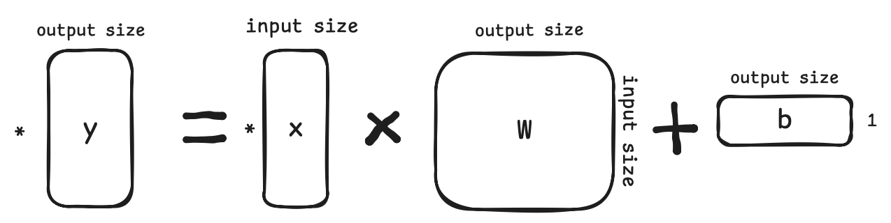

```python
linear = nn.Linear(5,3）
print(linear.weight.shape, linear.bias.shape)
 ```

---

# 举个例子

* torch.matmal, @
* torch.add, + 

* 移步vscode，试一试，shape那些事，以及Tensor Broadcasting


---

# Tensor Broadcasting

试试这段代码

```python
a = torch.randn(2, 2, 4)
print(a)
b = 20
a = a + b
print(a)

c = torch.randn(2,4)
a = a + c
print(c)
print(a)

```

---

# Tensor Broadcasting

并行运算在深度学习时代非常重要

* N个样本，每个样本的shape (2, 4), 模型参数(2, 4)
  * 一个batch的输入通常的shape (2, 2, 4)
  * 如何为这个batch批量执行每个样本和模型参数的计算?
    * 比如: 
      * Tensor 1 (2, 2, 4) * Tensor 2 (2, 4)
      * Tensor 1 (2, 2, 4) @ Tensor 2 (4, 2)


---

# Tensor Broadcasting的原则

* Each tensor must have at least one dimension - no empty tensors.
* Comparing the dimension sizes of the two tensors, going from last to first:
  * Each dimension must be equal, or
  * One of the dimensions must be of size 1, or
  * The dimension does not exist in one of the tensors

来源: [Introduction to PyTorch Tensors](https://pytorch.org/tutorials/beginner/introyt/tensors_deeper_tutorial.html)

---

# 模型结构中一些重要的函数

* nn.functional

* 激活函数(引入非线性)
  * relu, sigmoid
* 池化
  * average pooling, max pooling
    * 1d, 2d, ...

---

# 激活函数(引入非线性)


* 通过引入非线性函数(nonlinear function)可增加模型非线性的能力，在模型中中，也称之为激活函数
  * 线性层: $x=f(x)=xW^\top+b$
  * 激活:   $x=activation(x)$
* activation类型
  * ReLU, Sigmoid, SwiGLU, ...

---

# 激活函数(引入非线性)

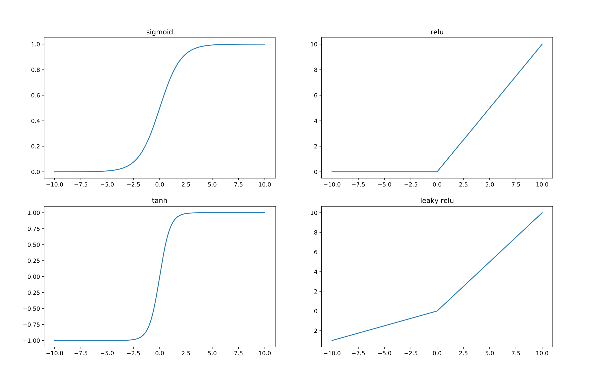


---

# 激活函数(引入非线性)


---

# 池化 (pooling)

池化: “粗暴的”降维方法


---

# 池化 (pooling)

池化: “粗暴的”降维方法

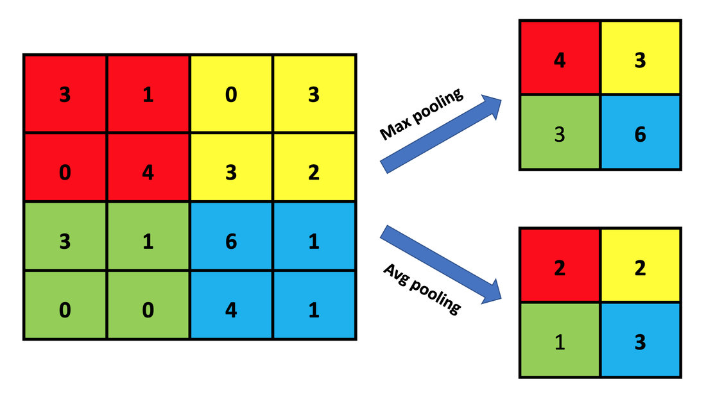

---

## 模型的最终输出
以分类问题举例
* 对于多分类问题而言，假设$\textbf{z}$是模型最终的原始输出，是非归一化(unnormalized)的表示,则用softmax函数赋予所有$z_i$概率含义
  * $\text{softmax}(\textbf{z})_i=\frac{\exp(z_i)}{\sum_j\exp(z_j)}$
  * 其中，$\exp(x)=e^x$

---

# softmax示例及可视化

<p align="center">
  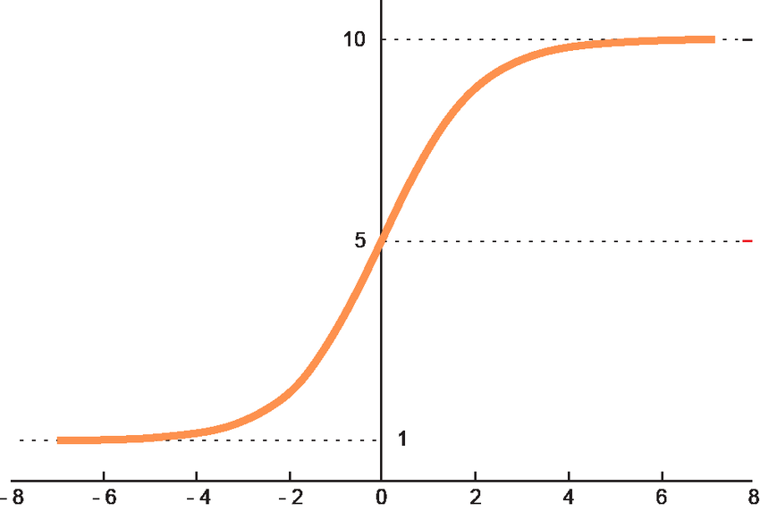

  
</p>


---

# 回顾模型结构: Forward干了些什么事

* 构建模型的推理(inference)过程：计算图

<div style="display:contents;" data-marpit-fragment>

```python
def forward(self, x):
        x = nn.functional.relu(self.conv1(x))
        x = nn.functional.max_pool2d(x, 2, 2)
        x = nn.functional.relu(self.conv2(x))
        x = nn.functional.max_pool2d(x, 2, 2)
        x = x.view(-1, 16*4*4)
        x = nn.functional.relu(self.fc1(x))
        x = nn.functional.relu(self.fc2(x))
        x = self.fc3(x)
        return x
```

</div>

<!-- ---


# PyTorch的动态计算图 -->


---

# 计算图示例

```python
x = torch.ones(5)  # input tensor
y = torch.zeros(3)  # expected output
w = torch.randn(5, 3, requires_grad=True)
b = torch.randn(3, requires_grad=True)
z = torch.matmul(x, w)+b
loss = torch.nn.functional.binary_cross_entropy_with_logits(z, y)
```

<div style="display:contents;" data-marpit-fragment>


</div>

---


# 计算图示例: torchviz展示


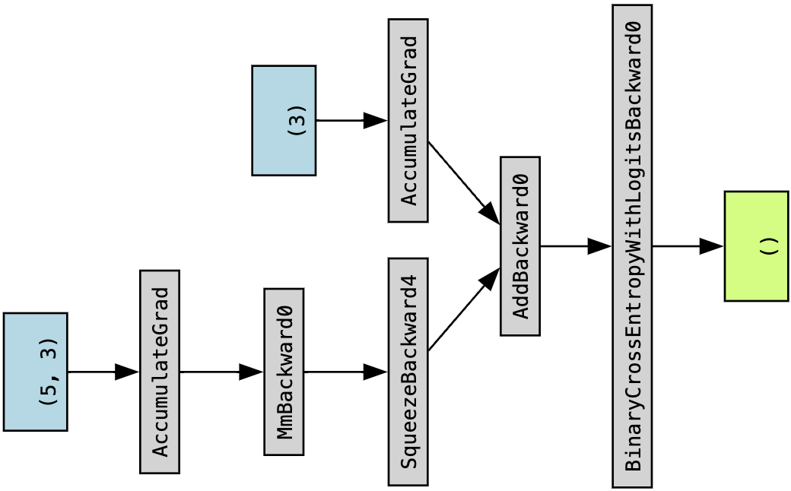


---


## 模型的训练/学习
<!--  -->

* 假设，构建模型$f$，其参数为$\theta$
* 目标: 设计一种可用来度量基于$\theta$的模型预测结果和真实结果差距的度量，差距越小，模型越接近需估计的函数$f^*$
  * $J(\theta)=\frac{1}{n}\sum_{x\in \mathcal{X}}(f^*(x)-f(x;\theta))^2$
* 学习方法：梯度下降，寻找合适的$\theta$ (被称之**训练模型**)
<div style="display:contents;" data-marpit-fragment>


</div>


---

# 模型的训练/学习 

* 目标: $J(\theta)=\frac{1}{n}\sum_{x\in \mathcal{X}}(y-f(x;\theta))^2$

<div style="display:contents;" data-marpit-fragment>

1. 猜个$\theta$, 根据输入$x$，计算$\hat{y}=f(x;\theta)$
2. 评估误差: $y$和$\hat{y}$的误差(loss)
3. 根据误差，更新$\theta$: $\theta=\theta -\lambda\cdot\Delta\theta$


</div>

---


---

# 训练模型(参数)

优化目标: $J(\theta)=\frac{1}{n}\sum_{x\in \mathcal{X}}(f^*(x)-f(x;\theta))^2$

梯度下降法 (Gradient descent): 求偏导
* $f^*(x)$通常以真值(groundtruth)体现，因此$\frac{\partial}{\partial \theta}J(\theta)$重点关注$f(x;\theta)$
  * $f(x)=xW^\top+b$ --> $\frac{\partial}{\partial \theta}f(x)=\frac{\partial}{\partial \theta}(xW^\top+b)$ 
  * 通常深度学习模型$f(x)$为复合函数，需利用链式法则求偏导

* 核心算法: 反向传播(backpropagation)
  * 核心步骤: 针对优化目标$J(\theta)$求其偏导数(partial derivative)


---

# 反向传播(backpropagation)

* 假设深度学习模型为$f(x)=xW^\top+b$的复合函数
  * $y=f_3(f_2(f_1(x)))$
* 优化目标$J(\theta)$的偏导$\frac{\partial}{\partial \theta}J$的核心为$\frac{\partial}{\partial \theta}y=\frac{\partial}{\partial \theta}f_3(f_2(f_1(x)))$
* 链式法则展开:
  * $\frac{\partial J}{\partial \theta_{f_1}} = \frac{\partial J}{\partial y}\cdot \frac{\partial y}{\partial f_3}\cdot \frac{\partial f_3}{\partial f_2}\cdot \frac{\partial f_2}{\partial f_1} \cdot \frac{\partial f_1}{\partial \theta_{f_1}}$

* 偏导的构建
  * 传统手工实现 v.s. autograd


---


# Autograd

* “古代”手工实现
  * forward: 代码实现$f(x)$
  * backward: 手推偏导公式$\frac{\partial}{\partial \theta}f(x)$，照着公式进行代码实现

* autograd
  * forward: 基于forward实现构建计算图
  * backward: 基于计算图实现自动微分(automatic differentiation)

---

# Autograd深入理解

参考阅读

1. [Overview of PyTorch Autograd Engine](https://pytorch.org/blog/overview-of-pytorch-autograd-engine/)

2. [How Computational Graphs are Constructed in PyTorch](https://pytorch.org/blog/computational-graphs-constructed-in-pytorch/)

3. [How Computational Graphs are Executed in PyTorch](https://pytorch.org/blog/how-computational-graphs-are-executed-in-pytorch/)


---

# **LLM智能应用开发**

大语言模型解析 I

基于HF LlaMA实现的讲解

<!-- https://marp.app/ -->

---

# LLM结构的学习路径

* LLM结构解析(开源LlaMA)
* 自定义数据集构造
* 自定义损失函数和模型训练/微调

---

# Transformer经典结构


* Encoder-decoder结构
* 输入部分
  * Input embedding
  * Positional embedding
* Transformer部分
  * Attention
  * Feed forward


---

# LlaMA的模型结构


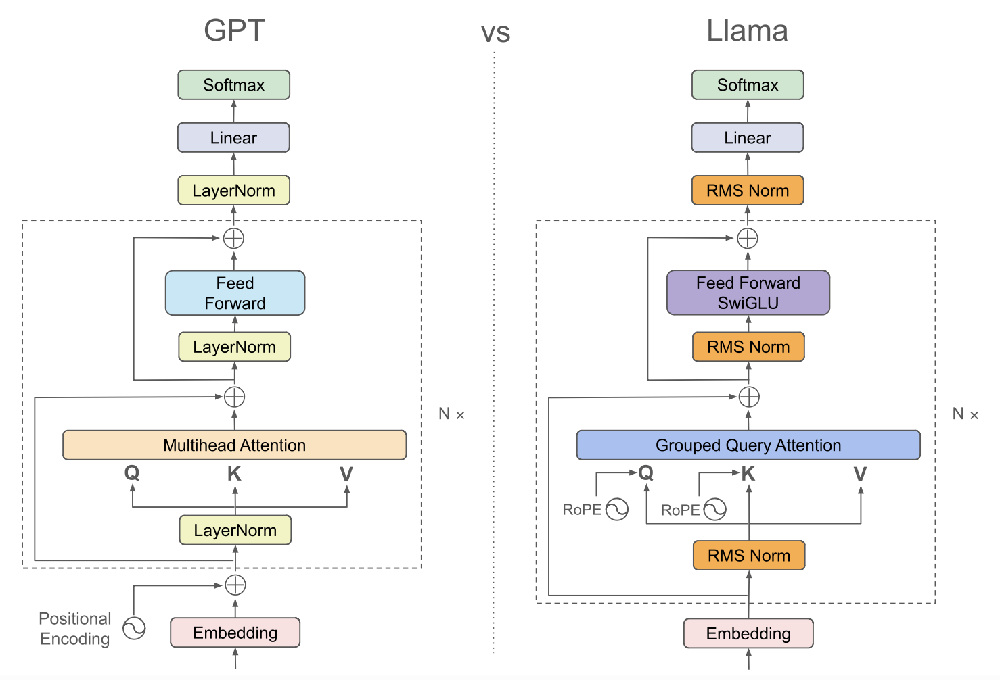

---

# HF LlaMA模型结构

```python
LlamaForCausalLM(
  (model): LlamaModel(
    (embed_tokens): Embedding(128256, 2048)
    (layers): ModuleList(
      (0-15): 16 x LlamaDecoderLayer(
        (self_attn): LlamaAttention
        (mlp): LlamaMLP
        (input_layernorm): LlamaRMSNorm
        (post_attention_layernorm): LlamaRMSNorm
    )
    (norm): LlamaRMSNorm((2048,), eps=1e-05)
    (rotary_emb): LlamaRotaryEmbedding()
  )
  (lm_head): Linear(in_features=2048, out_features=128256, bias=False)
)
```


---

# LlamaDecoderLayer内部结构

```python
(self_attn): LlamaAttention(
  (q_proj): Linear(in_features=2048, out_features=2048, bias=False)
  (k_proj): Linear(in_features=2048, out_features=512, bias=False)
  (v_proj): Linear(in_features=2048, out_features=512, bias=False)
  (o_proj): Linear(in_features=2048, out_features=2048, bias=False)
  (rotary_emb): LlamaRotaryEmbedding()
)
(mlp): LlamaMLP(
  (gate_proj): Linear(in_features=2048, out_features=8192, bias=False)
  (up_proj): Linear(in_features=2048, out_features=8192, bias=False)
  (down_proj): Linear(in_features=8192, out_features=2048, bias=False)
  (act_fn): SiLU()
)
(input_layernorm): LlamaRMSNorm((2048,), eps=1e-05)
(post_attention_layernorm): LlamaRMSNorm((2048,), eps=1e-05)
```

---

# 我们重点关注的LLM


- 目前，流行结构多为Decoder-only
- **输入部分**
  - **Input embedding**
  - **Positional embedding**
- Transformer部分
  - Attention
  - Feed forward 


---

# Input embedding

```python
(embed_tokens): Embedding(128256, 2048)
```

* embedding：将自然语言翻译为index
* 每个index对应一个embedding
  * embedding需训练
* 例如：
  * 用户给LLM的输入: "你好，请介绍下南京大学"
  * LLM经过预训练的embedding: [[0.2234234,-0.28178,...]]

<div style="display:contents;" data-marpit-fragment>
翻译过程：一般由tokenizer实现
</div>

---

# Input embedding原理


"语言是文明的载体，对人类而言是这样，对LLM而言也是这样"


<div style="display:contents;" data-marpit-fragment>


这是南京大学


</div>

---

# Input embedding原理

这也是南京大学


---

# Input embedding原理

<!-- <p align="center">
  

  
</p> -->

这是属于南大的(部分)特征

<p align="center">
  
</p>

---

# Input embedding原理

**Input embedding**：构建表达自然语言**特征**的**表示 (representation)**

<p align="center">
  
</p>

---

# 为LLM构建词汇表

* 自然语言是离散的，LLM词汇表依然延续离散的模式构建
* 如何分词: 'Hello, world!'
  * word-based: | hello | , | world | ! |
  * character-based: h|e|l|l|o|,|w|o|r|l|d|!
  * subword-based tokenization
    * 基本原则：常用词不拆分，稀有词分解为有意义的子词(subword)
    * 来试试[Tiktokenizer](https://tiktokenizer.vercel.app/?model=meta-llama%2FMeta-Llama-3-8B)

---

# Tokenization方式

* Byte-level BPE (GPT2)
* WordPiece (BERT)
* SentencePiece (Multilingual models)

* Tokenizer in LlaMA3
  * BPE model based on [tiktoken](https://github.com/openai/tiktoken)


---

# 来试试LlaMA3的Tokenizer

一般每个LLM会自带tokenizer，用以下方式加载模型对应的tokenizer
```python
from transformers import AutoTokenizer
tokenizer = AutoTokenizer.from_pretrained(model_id)
```

* 使用方法
  * tokenizer(input)
  * tokenizer.tokenize(input)
  * tokenizer.encode(input)
  * tokenizer.decode(input)


---

# 位置编码 (Positional embeddings)

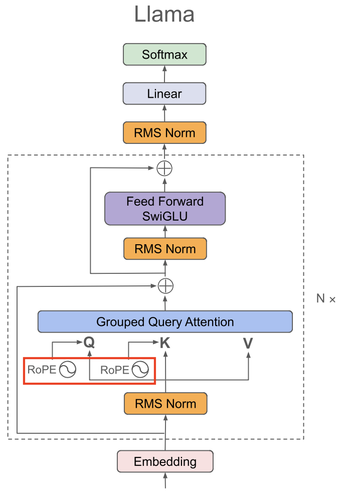

**位置编码：用来标记每个词的位置**

* Sinusoidal PE
  * Attention is all you need时代的位置编码
* Rotary PE(旋转位置编码)
  * 基于论文[RoFormer](https://arxiv.org/abs/2104.09864)

---

# 位置编码的初衷

* Attention模块计算的是每个token的注意力分数
  * 衡量token与token之间的相关性
* 位置编码用来标记每个token的位置
  * 让LLM更好的建模不同位置的token之间的关系

---

# 绝对位置编码

直接在每个token的embedding上线性叠加位置编码: $x_i + p_i$，其中$p_i$为可训练的向量

<div style="display:contents;" data-marpit-fragment>

Sinusoidal PE: Attention is all you need

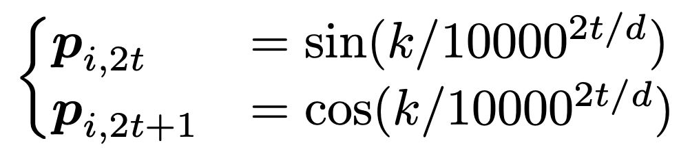

</div>

<div style="display:contents;" data-marpit-fragment>

灵感来源：通过周期性建模位置编码

</div>

---

# 位置编码与序数编码的关联

* 序数表示次序，位置编码的用意也在于此。例如从小就学的序数编码：
  * 十进制: 1 2 3 4 5 6 7 8 9 10, ...
  * 二进制: 0, 1, 10, 11, 100, 101, 110, 111, 1000, 1001, ...
* **但是**：
  * LLM中的token embedding为向量,如何构造型为向量的位置编码？

---

# 序数的周期性

十进制本身是周期性的，二进制也是周期性的

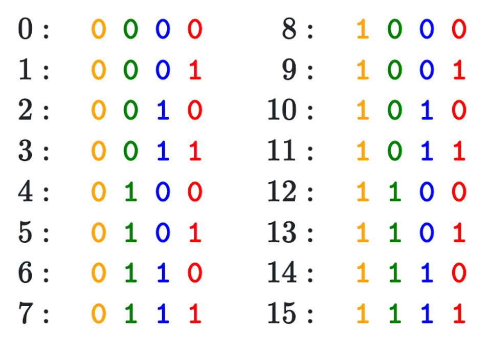


---


# Sinusodial PE

构建n维的位置编码，每一维用不同的周期函数刻画取值
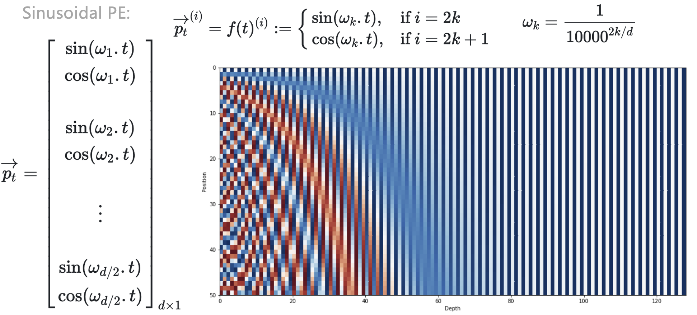


---

# 旋转位置编码（Rotary PE）


<div style="display:contents;" data-marpit-fragment>

“叠加旋转位置编码的方式由加法改乘法”

</div>

<div style="display:contents;" data-marpit-fragment>

假设两个token的embedding为$x_m$和$x_n$，$m$和$n$分别代表两个token的位置，目标找到一个等价的位置编码方式，使得下述等式成立：


</div>

<div style="display:contents;" data-marpit-fragment>

[RoFormer](https://arxiv.org/abs/2104.09864)提出Rotary PE，在embedding维度为2的情况下：
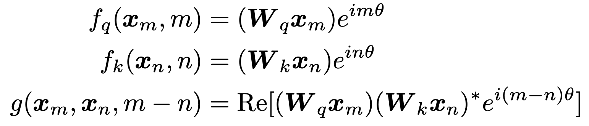

</div>

---

# Rotary PE的2D理解

回忆下欧拉公式：$e^{ix}=cos(x)+isin(x)$

<div style="display:contents;" data-marpit-fragment>


</div>

<div style="display:contents;" data-marpit-fragment>

因此，上述函数$f$和$g$中的指数函数$e^{ix}$具体表示为 

</div>


---

# RoPE实现

RoPE的2D实现
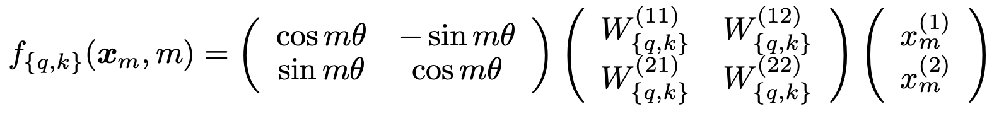

RoPE的n维实现
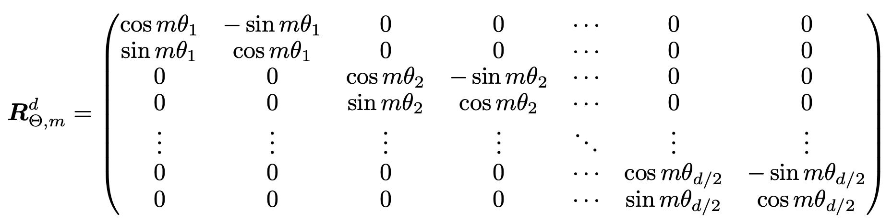

---

# RoPE实现

* 目标：实现RoPE(对应的$R_{\Theta, m}^d$)
  * 准备一堆$\theta_i$，以及对应的cos和sin数值

* 构建RoPE矩阵: $R_{\Theta, m}^d$流程
  * 批量算cos，再批量算sin
  * 涉及torch算子
    * torch.arrange, torch.sin, torch.cos, torch.outer

<div style="display:contents;" data-marpit-fragment>

我们来试试

</div>


---


# Rotary PE的可视化展示


---

# RoPE在LlaMA中的构建

不同于经典Transformers结构，只对输入的token做位置编码的叠加

LlaMA中的RoPE在Transformer的每一层都会对Q和K进行位置编码的叠加


---

# 拓展阅读&参考文档

[Hugging Face](https://huggingface.co/transformers/model_doc/llama.html)
[Accelerating a Hugging Face Llama 2 and Llama 3 models with Transformer Engine](https://docs.nvidia.com/deeplearning/transformer-engine/user-guide/examples/te_llama/tutorial_accelerate_hf_llama_with_te.html)

RoPE部分
[Transformer升级之路：10、RoPE是一种β进制编码. 苏剑林](https://kexue.fm/archives/9675)
[RoFormer: Enhanced Transformer with Rotary Position Embedding](https://arxiv.org/pdf/2104.09864)


---


# Transformer经典结构

<!--  -->


* Encoder-decoder结构
* 输入部分
  * Input embedding
  * Positional embedding
* **Transformer部分**
  * **Attention module**
  * **Feed forward network**

---

# HF LlaMA模型结构

```python
LlamaForCausalLM(
  (model): LlamaModel(
    ...
    (layers): ModuleList(
      (0-15): 16 x LlamaDecoderLayer(
        (self_attn): LlamaAttention
        (mlp): LlamaMLP
        (input_layernorm): LlamaRMSNorm
        (post_attention_layernorm): LlamaRMSNorm
    )
    ...
  )
  (lm_head): Linear(in_features=2048, out_features=128256, bias=False)
)
```


---

# LlamaDecoderLayer内部结构

```python
(self_attn): LlamaAttention(
  (q_proj): Linear(in_features=2048, out_features=2048, bias=False)
  (k_proj): Linear(in_features=2048, out_features=512, bias=False)
  (v_proj): Linear(in_features=2048, out_features=512, bias=False)
  (o_proj): Linear(in_features=2048, out_features=2048, bias=False)
  (rotary_emb): LlamaRotaryEmbedding()
)
(mlp): LlamaMLP(
  (gate_proj): Linear(in_features=2048, out_features=8192, bias=False)
  (up_proj): Linear(in_features=2048, out_features=8192, bias=False)
  (down_proj): Linear(in_features=8192, out_features=2048, bias=False)
  (act_fn): SiLU()
)
(input_layernorm): LlamaRMSNorm((2048,), eps=1e-05)
(post_attention_layernorm): LlamaRMSNorm((2048,), eps=1e-05)
```

---

# LlamaDecoderLayer内部结构

* Normalization模块
  * LlamaRMSNorm
* 两个主要模块
  * LlamaAttention
  * LlamaMLP


---

# Normalization

```python
(input_layernorm): LlamaRMSNorm
```

* Normalization，中文又称“归一化”，“标准化”,... 
* 作用：调整数据的分布(scaling)，亦可称“缩放”
*  数据包括：输入、输出、中间层表示，...

<div style="display:contents;" data-marpit-fragment>

最经典的Normalization

Standard score: $\frac{X-\mu}{\sigma}$, Minmax feature scaling: $\frac{X-X_{\min}}{X_\max-X_{\min}}$

</div>

---

# Normalization示例

<div style="display:contents;" data-marpit-fragment>


一维的输入，归一化后的输出
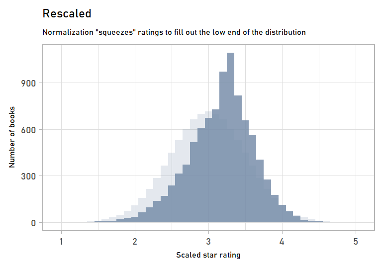

</div>

---

# Normalization在机器学习中的应用

“药效”：加速训练收敛，让输入更“规整”，降低过拟合(overfitting)，增强泛化(generalization)

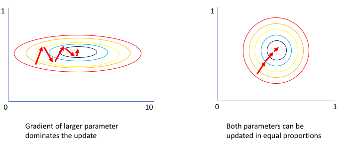


---


# Normalization v.s. Regularization

* 目标不同：
  * Normalization=调整数据
    * 比如: $X'=X-\frac{X_\min}{X_\max-X_\min}$
  * Regularization=调整预测/损失函数
    * 比如: $\text{loss}=\min\sum_{i=1}^N L(f(x_i), y_i)+\lambda R(\theta_f)$


---


# 大语言模型引入Normalization

Normalization：“调整数据分布”

* 数据长什么样子？都是tensor！维度很多！
  * 原始输入: vocab embedding
    * tensor shape: <batch_size, sequence_length, hidden_dim>
  * 深度学习模型中间层表示(hidden states/representations)
      * tensor shape: <batch_size, sequence_length, hidden_dim>

---

# 大语言模型引入Normalization


<div style="display:contents;" data-marpit-fragment>

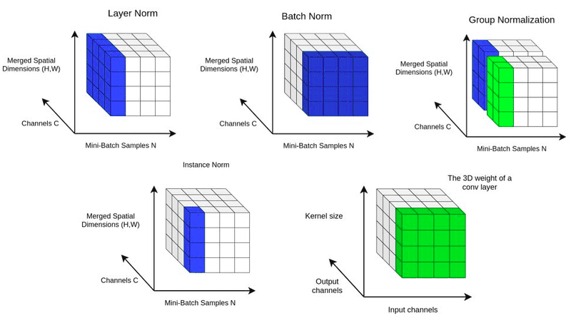

</div>

---

# Normalization的设计思路

* tensor shape: <batch_size, sequence_length, hidden_dim>
* 选择最合适的Normalization维度
  * batch：X=[batch_size,sequence_length, hidden_dim]
  * sequence： X=[sequence_length, hidden_dim]
  * hidden: <bs, seq, hidden> => <N, hidden>, X=[hidden_dim]
    * 又称LayerNrom

<div style="display:contents;" data-marpit-fragment>

当前流行的LayerNorm：[RMSNorm](https://arxiv.org/pdf/1910.07467)

</div>

---

# RMSNorm

* torch 2.4，提供了RMSNorm类的实现[torch.nn.RMSNorm](https://pytorch.org/docs/stable/generated/torch.nn.RMSNorm.html#torch.nn.RMSNorm)
* 原理: "regularizes the summed inputs to a neuron in one layer according to root mean square (RMS)"
  * $y = \text{RMSNorm}(x)=\frac{x}{\sqrt{\text{RMS}[x]+\epsilon}}*\gamma$
  * $\text{RMS}(x)=\sqrt{\frac{\sum_{i=1}^N x_i^2}{N}}$

<div style="display:contents;" data-marpit-fragment>

如何利用torch算子自行实现RMSNorm？

</div>

---

# 手搓RMSNorm

$y = \text{RMSNorm}(x)=\frac{x}{\sqrt{\text{RMS}[x]+\epsilon}}*\gamma$， $\text{RMS}(x)=\sqrt{\frac{\sum_{i=1}^N x_i^2}{N}}$

* 输入和输出的shape: <batch_size, sequence_length, hidden_dim>
* 涉及的计算
  * 平方，求和，开根
  * torch提供: tensor.pow, tensor.mean, torch.rsqrt

<div style="display:contents;" data-marpit-fragment>

我们来试试

</div>

---

# 前馈神经网络(FFN), LlamaMLP

```python
(mlp): LlamaMLP(
  (gate_proj): Linear(in_features=2048, out_features=8192, bias=False)
  (up_proj): Linear(in_features=2048, out_features=8192, bias=False)
  (down_proj): Linear(in_features=8192, out_features=2048, bias=False)
  (act_fn): SiLU()
)
```

* 组件：三个nn.Linear层，一个SiLU激活函数
  * SiLU: torch.nn.functional.silu(x)
  * Linear: torch.nn.Linear(in_features, out_features)


---

# FFN流程

* 输入tensor: <batch_size, sequence_length, hidden_dim>
* 第一步：
  * 通过gate_proj获得gate tensor，经过SiLU激活得到gate tensor
  * 通过up_proj获得up tensor
* 第二步：元素乘(elementwise multiply): gate tensor 和 up tensor
* 第三步: 通过down_proj获得down tensor

<div style="display:contents;" data-marpit-fragment>

摘抄自transformers/src/models/modeling_llama.py
```python
down_proj = self.down_proj(self.act_fn(self.gate_proj(x)) * self.up_proj(x)
```

</div>

---

# Transformer经典结构

<!--  -->


* Encoder-decoder结构
* 输入部分
  * Input embedding
  * Positional embedding
* Transformer部分
  * Feed forward network
  * **Attention module**
  

---

# HF LlaMA模型结构

```python
LlamaForCausalLM(
  (model): LlamaModel(
    ...
    (layers): ModuleList(
      (0-15): 16 x LlamaDecoderLayer(
        (self_attn): LlamaAttention
        (mlp): LlamaMLP
        (input_layernorm): LlamaRMSNorm
        (post_attention_layernorm): LlamaRMSNorm
    )
    ...
  )
  (lm_head): Linear(in_features=2048, out_features=128256, bias=False)
)
```


---

# LlamaDecoderLayer内部结构

Transformer架构的核心: attention(注意力机制)

```python
(self_attn): LlamaAttention(
  (q_proj): Linear(in_features=2048, out_features=2048, bias=False)
  (k_proj): Linear(in_features=2048, out_features=512, bias=False)
  (v_proj): Linear(in_features=2048, out_features=512, bias=False)
  (o_proj): Linear(in_features=2048, out_features=2048, bias=False)
  (rotary_emb): LlamaRotaryEmbedding()
)
```

---

# Attention内部结构

* 静: 结构视角(init function...)
  * 4个Linear层
    * q_proj、k_proj、v_proj、o_proj
* 动: 推理视角(Forward，bp靠Autograd自动求导)
  * $\text{head}=\text{Attention}(Q,K,V)=\text{softmax}(\frac{QK^T}{\sqrt{d_k}})V$
  * $multihead(Q,K,V)=\text{concat}(head_1,...,head_h)W_o$
---

# Attention模块的输入

问题：QKV是输入吗？

* 非也，输入是上一层的hidden states

<div style="display:contents;" data-marpit-fragment>

```python
class LlamaAttention(nn.Module):
...
def forward(hidden_states)
  ...
  query_states = self.q_proj(hidden_states)
  key_states = self.k_proj(hidden_states)
  value_states = self.v_proj(hidden_states)
```

</div>


* 思考：hidden states的shape是怎样的？


---

## 标准Attention的第一步: 获得$Q,K,V$

* 给定hidden states(后续简写为$X$)，通过前向传播(执行forward)得到$Q,K,V$
  * $X$的shape: [batch_size, seq_len, hidden_size]
  * $Q=\text{q\_proj}(X)$: $Q=XW_Q$, 
    * $W_Q$的shape: [hidden_size, hidden_size]
  * $K=\text{k\_proj}(X)$: $Q=XW_K$
    * $W_K$的shape: [hidden_size, hidden_size]
  * $V=\text{v\_proj}(X)$: $Q=XW_V$
    * $W_V$的shape: [hidden_size, hidden_size]


---


## 标准Attention的第一步: 获得$Q,K,V$

* 为方便理解方法，脑补通过tensor.view改变shape
  * [batch_size, seq_len, hidden_size] -> [N, d]
    * N = batch_size * seq_len, d = hidden_size
<div style="display:contents;" data-marpit-fragment>

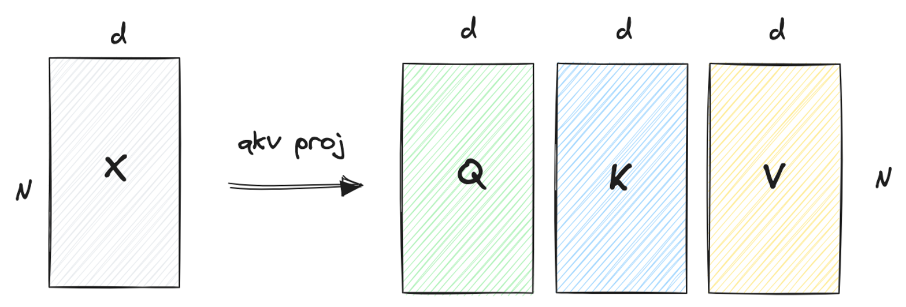

</div>

---

## 标准Attention的第二步: 计算$QK^T$

* 给定$Q,K$，计算$QK^\top$，此处考虑mask

* $P=\text{mask}(\frac{QK^\top}{\sqrt{d_k}}+bias)$

<div style="display:contents;" data-marpit-fragment>

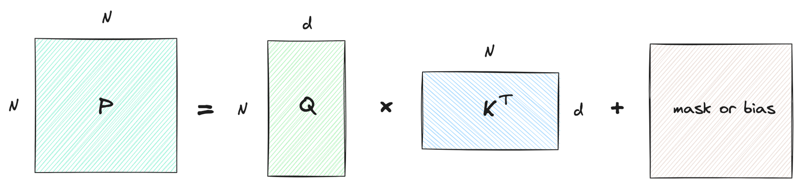

</div>

---

## 标准Attention的第三步: 计算Attention

* 给定$P$，计算$A=\text{softmax}(P)$
  * row-wise softmax: $A_i = \text{softmax}(P_i)=\text{diag}(l)^{-1}S$
  * $l=\text{row\_sum}(S)$, $S=\text{exp}(P-m)$, $m=\text{row\_max}(P)$

<div style="display:contents;" data-marpit-fragment>

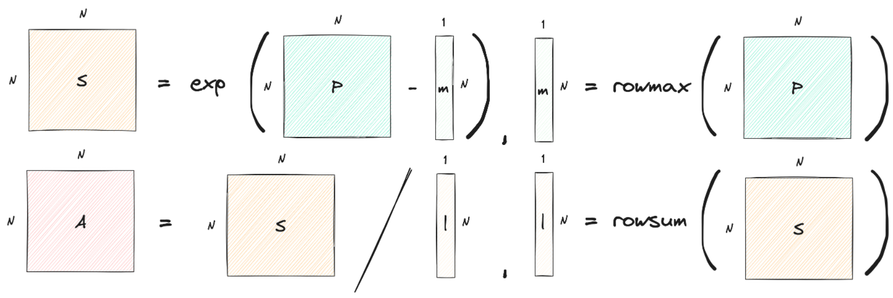

</div>

---

## 标准Attention的第四步: 计算输出$O$

* 给定$A$和$V$，计算$O$
  * $O=AV$
  

<div style="display:contents;" data-marpit-fragment>

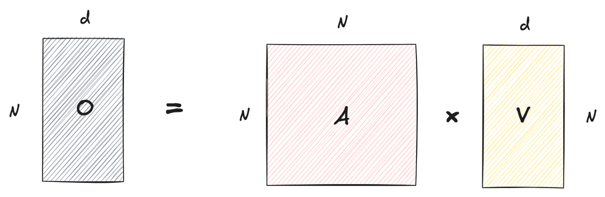

</div>

---

# 标准Attention回顾

* 给定$Q,K,V$ (来自$X$)
  * $P=\text{mask}(\frac{QK^\top}{\sqrt{d_k}}+bias)$
  * $m=\text{row\_max}(P)$
  * $S=\text{exp}(P-m)$
  * $l=\text{row\_sum}(S)$
  * $A=\text{softmax}(P)=diag(l)^{-1}S$
  * $O=AV$

---

# Attention中mask的作用


* 回顾$P=\text{mask}(\frac{QK^\top}{\sqrt{d_k}}+bias)$
* \<PAD\>: 一种表示“padding”的特殊token，用来避免对句子中的某些token的影响
* 为了避免padding对attention的影响，在计算$P$时，我们可以将padding的部分设置为一个很大的数，如$\infty$或$-\infty$


---

# Attention中mask的作用

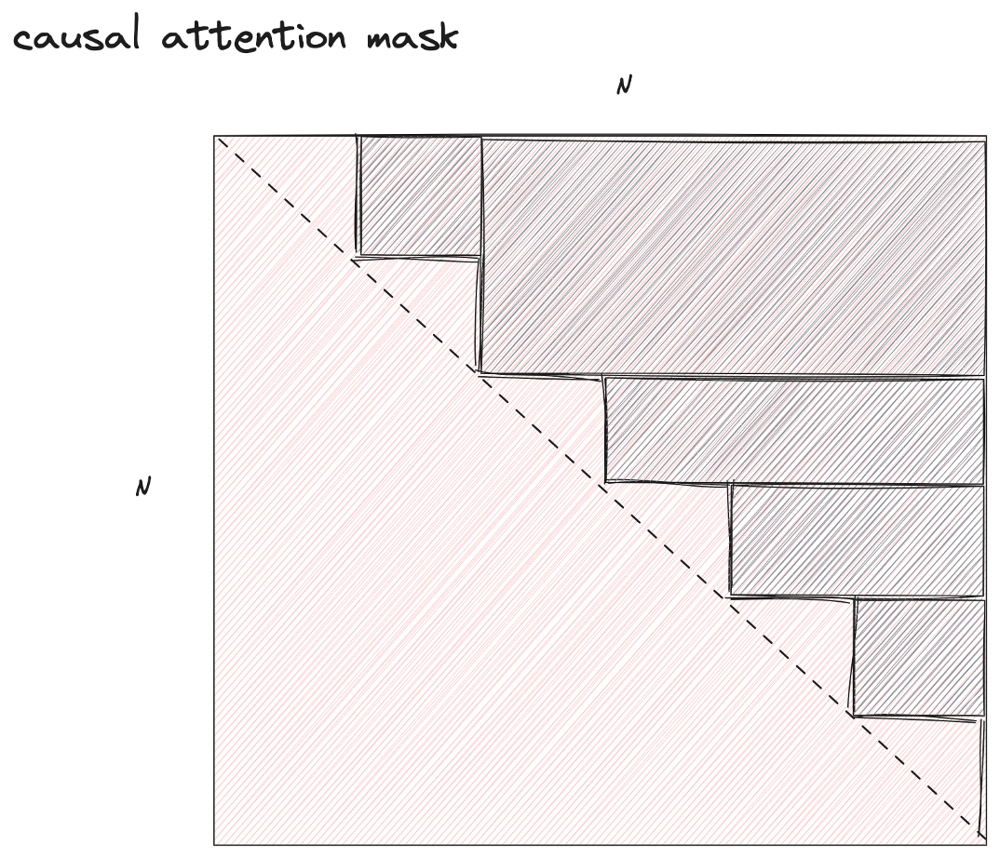

---


# MuliHeadAttention

* 标准Attention只生成一个输出A，考虑多种角度，期望得到不同的A
  * 靠多个头实现，什么头？？
  * $Q,K,V$进行拆分，拆成多个头
  * 拆分$Q,K,V$为多头：[batch_size, seq_len, num_heads, head_dim]
  * 些许改造Attention计算过程

<div style="display:contents;" data-marpit-fragment>

$MultiHead(Q,K,V)=Concat(head_1,head_2,...,head_h)W_O$
其中，$head_i=Attention(Q_i,K_i,V_i)$

</div>

---

# MultiHeadAttention

* 给定$Q,K,V$ (shape [bs, seq, hs]),shape简化为$N\times d$
* 多个heads
  * $Q=[Q_1,Q_2,...,Q_h]$
  * $K=[K_1,K_2,...,K_h]$
  * $V=[V_1,V_2,...,V_h]$
* shape的变换(tensor.view实现): [N, d] -> [N, num_heads, head_dim]
  * 其中, d = hidden_size = num_heads * head_dim
  * 实现中，[bs, seq, hs] -> [bs, seq, nh, hd]
    * 再transpose为[bs, nh, seq, hd]


---

# Attention计算开销

* $QK^\top$的计算过程是$O(N^2)$的复杂度，那么多头的情况下，$QK^\top$的计算复杂度是$O(hN^2)$
* 实际上，可依赖GPU并行执行提升速度
  * 分块的并行计算(sm计算单元)
* 如何加速Attention计算？
  * BlockedAttention
  * FlashAttention

---

## BlockedAttention第一步: 获得$Q,K,V$

* 给定$Q,K,V$ (shape [batch_size, seq_len, hidden_size]),shape简化为$N\times d$


<div style="display:contents;" data-marpit-fragment>

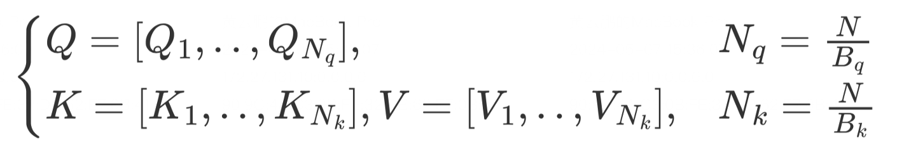

</div>


<div style="display:contents;" data-marpit-fragment>

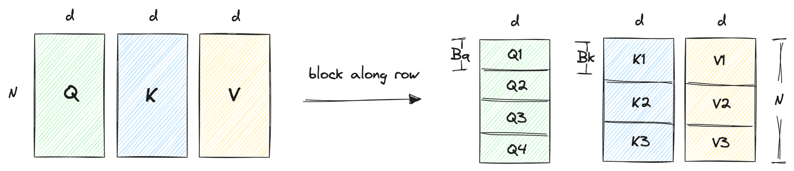

</div>


---


## BlockedAttention第二步: 计算$P_{i}$

* 给定$Q_i$,  $K_{j_1},K_{j_2},...,K_{j_{N_k}}$
  * $Q_i$的shape: $B_q\times d$, $K_{j_1},K_{j_2},...,K_{j_{N_k}}$的shape: $B_k\times d$


<div style="display:contents;" data-marpit-fragment>

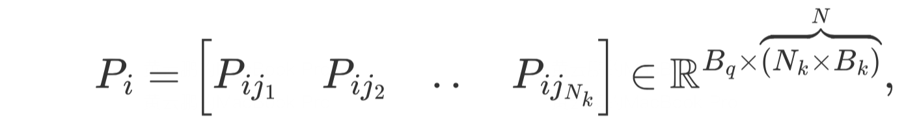

</div>


<div style="display:contents;" data-marpit-fragment>

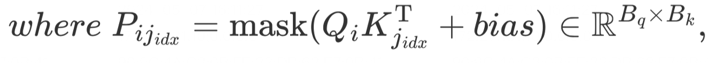
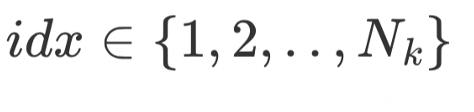

</div>


---

## BlockedAttention第二步: 计算$P_{i}$

* 给定$Q_i$,  $K_{j_1},K_{j_2},...,K_{j_{N_k}}$
  * $Q_i$的shape: $B_q\times d$, $K_{j_1},K_{j_2},...,K_{j_{N_k}}$的shape: $B_k\times d$
<div style="display:contents;" data-marpit-fragment>

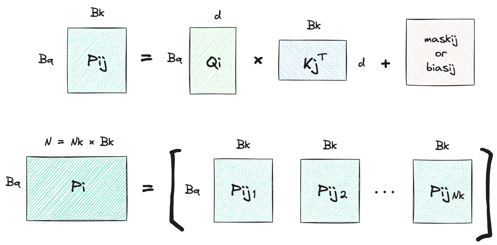

</div>

---

## BlockedAttention第三步: 计算Attention

给定$P_{ij_1}, P_{ij_2}, ..., P_{ij_{N_k}}$，计算$S_i$
<div style="display:contents;" data-marpit-fragment>

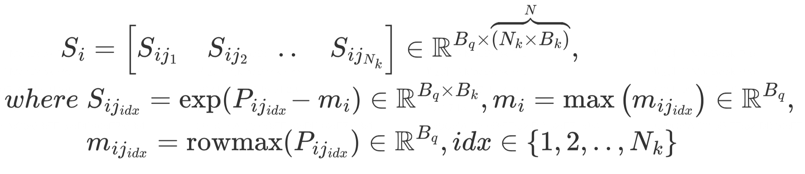
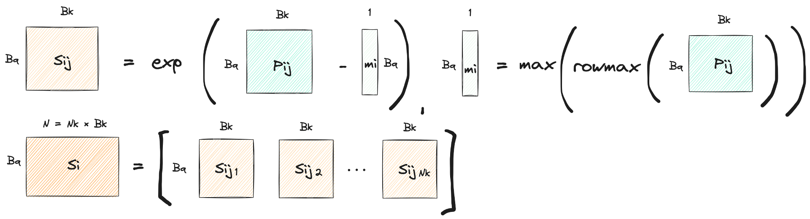

</div>

---

## BlockedAttention第三步: 计算Attention

给定$P_{ij_1}, P_{ij_2}, ..., P_{ij_{N_k}}$，计算$S_i$
<div style="display:contents;" data-marpit-fragment>


</div>


---


## BlockedAttention第三步: 计算Attention

给定$S_{ij_1}, S_{ij_2}, ..., S_{ij_{N_k}}$，计算$A_i$
<div style="display:contents;" data-marpit-fragment>

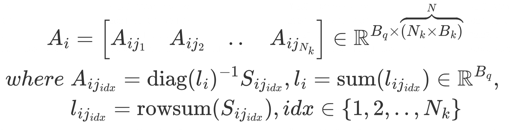
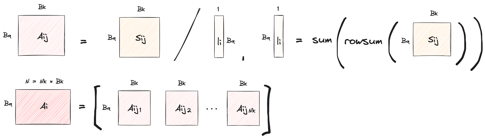

</div>

---

## BlockedAttention第四步: 计算$O=AV$

给定$A_{ij_1}, A_{ij_2}, ..., A_{ij_{N_k}}$，计算$O_i$
<div style="display:contents;" data-marpit-fragment>

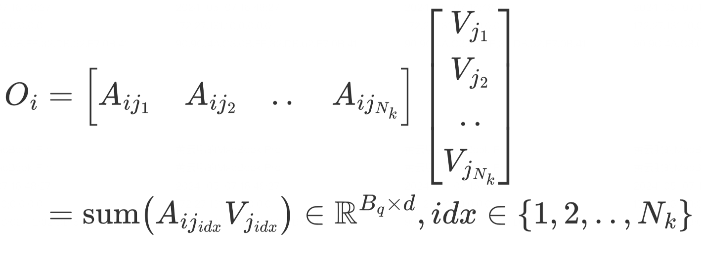
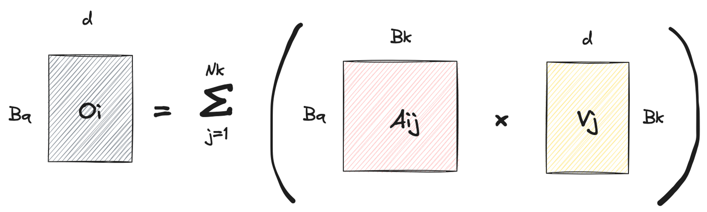

</div>

---

## BlockedAttention回顾

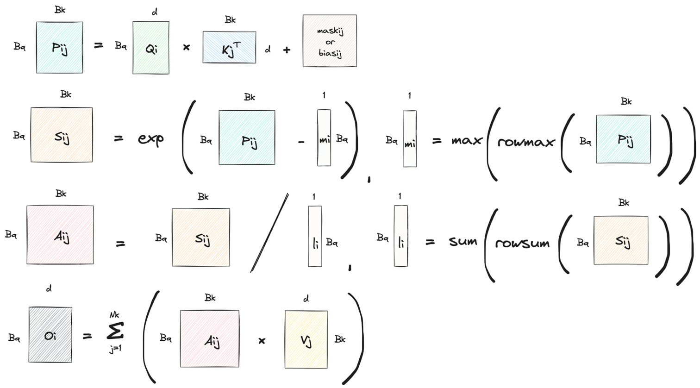


---

# Transformer经典结构

<!--  -->


* Others
  * Transformers结构改动
    * Mixture-of-experts (MoE)
    * Low-rank adaptation (LoRA)
  * 浮点数
    * FP32, FP16, BF16, FP8


---


# Mixer-of-Experts (MoE)

* 从分而治之的思想说起
  * 术业有专攻：将问题拆分为多个子问题，每个子问题有自己的专家
    * 如何备战高考：语文、数学、英语、物理、化学...
* 模型中的“专家”
  * 问题：用户输入
  * 子问题：用户输入涉及什么类型
  * 专家：针对子问题的模型
    * ensemble视角：多个“一般”的模型
  * 选择专家：通过gating model/network选择最适合的专家
---

# Example of mixture of experts

图片来源[Ensemble Methods](https://amzn.to/2XZzrjG)
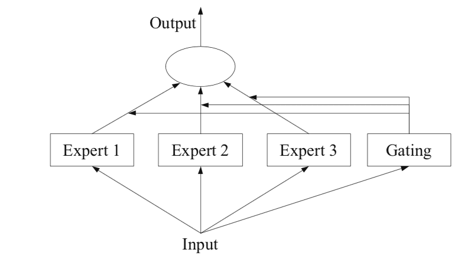


---

# NLP模型中的Mixture of experts


[Outrageously Large Neural Networks: The Sparsely-Gated Mixture-of-Experts Layer](https://arxiv.org/abs/1701.06538)
* 设计了MoE layer
  * 特点：稀疏(sparsely)、快速推理

<div style="display:contents;" data-marpit-fragment>

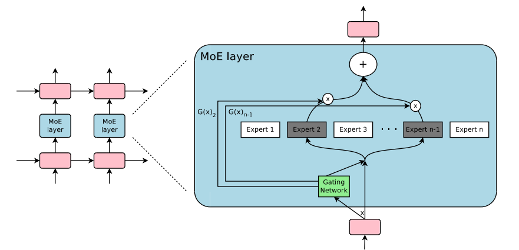

</div>

---

# MoE中的稀疏


---

# MoE中的稀疏

* 模型体积
  * 单expert尺寸为$s$
* 计算开销
  * 单expert的计算开销记为$c$
* 传统模型/单expert：体积$s$，计算开销$c$
* Sparsely MoE(M个expert)，通过Gating network，选择最适合的expert进行推理计算
  * 模型体积：$M$个expert的MoE layer体积$ms$
  * 计算开销：选择一个expert的情况下，计算开销为$c$

---

# MoE中的稀疏

不“怎么”增加模型计算开销的情况下，提升模型的体积


---

# MoE结构示例

* 一种"weighted multiplication"
  * 其中$G(x)$为gating network(可学习)，$E_i(x)$为expert
  * $y=\sum_{i=1}^nG(x)_iE_i(x)$

* $G(x)$通常为$\text{softmax}$，配以可学习的参数$W_g$
  * $G(x)=\text{softmax}(x\cdot W_g)$
* 为了体现稀疏性，一般选Top-k Gating
  * 通常　$k=1,2$
---

# MoE与Transformers

[Switch Transformers](https://arxiv.org/abs/2101.03961)将Transformers中的FFN替换为MoE结构


---

# MoE与Transformers

* [Switch Transformers](https://arxiv.org/abs/2101.03961)
  * T5-based MoEs going from 8 to 2048 experts
* [Mixtral 8x7B](https://huggingface.co/mistralai) 
  *  8 experts


---

# 如何确定MoE中的expert

* 通过训练过程学习参数，确定每个expert
* 以Mixtral 8x7B为例
  * 将FFN layer扩展为8个expert
    * 每个expert为原有尺寸的一个FFN layer
    * 通过Gating network选择最适合的expert


---

# 标准FFN实现

```python
(mlp): LlamaMLP(
  (gate_proj): Linear(in_features=2048, out_features=8192, bias=False)
  (up_proj): Linear(in_features=2048, out_features=8192, bias=False)
  (down_proj): Linear(in_features=8192, out_features=2048, bias=False)
  (act_fn): SiLU()
)
```
* 增加Gating network，forward function中通过Gating network选择最适合的expert，每个expert进行以下计算：
  * self.down_proj(self.act_fn(self.gate_proj(x)) * self.up_proj(x)

---

# MoE的训练

* 通过load balancing训练MoE
* MoE训练之前：初始化每个expert，且并无任何含义
* 不加任何控制的训练：每次选取top-k(=2)的expert进行训练和参数更新，容易使模型选择被训练的快的experts
* load balancing: 在训练过程中，赋予每个expert近乎相同数量的训练样本


---

# Low-rank adaptation (LoRA)

* 一种流行的轻量级LLM微调技术
  * 通过很少的trainable parameters,快速微调LLM
    * [LoRA: Low-Rank Adaptation of Large Language Models](https://arxiv.org/abs/2106.09685)


<div style="display:contents;" data-marpit-fragment>

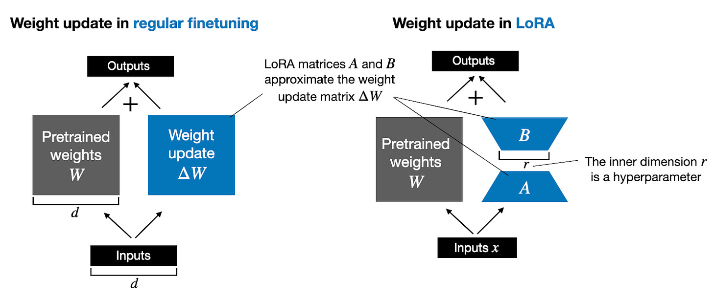

</div>

---

# LoRA基本思路

* 传统的training和finetuning
  * $W_{updated}=W_{old}+\Delta W$
    * $\Delta W$ size: [4096, 4096]
* LoRA
  * $\Delta W \approx AB$, rank $r$=8 (可调)
    * $A$ size: [4096, 8]
    * $B$ size: [8, 4096]
  * $W_{updated}\approx W_{old}+\alpha AB$
    * $\alpha$: scaling factor

---

# LoRA推理

* 传统的training和finetuning后的推理过程
  * $x\cdot W_{updated} = x\cdot (W_{old}+\Delta W)=x\cdot W_{old}+ x\cdot \Delta W$
* LoRA推理
  * $x\cdot W_{updated} \approx x\cdot (W_{old}+AB)=x\cdot W_{old}+ x\cdot \alpha AB$


---

# LoRA实现

```python
import torch.nn as nn

class LoRALayer(nn.Module):
    def __init__(self, in_dim, out_dim, rank, alpha):
        super().__init__()
        std_dev = 1 / torch.sqrt(torch.tensor(rank).float())
        self.A = nn.Parameter(torch.randn(in_dim, rank) * std_dev)
        self.B = nn.Parameter(torch.zeros(rank, out_dim))
        self.alpha = alpha

    def forward(self, x):
        x = self.alpha * (x @ self.A @ self.B)
        return x
```

---


# LoRA实现

```python
class LinearWithLoRA(nn.Module):

    def __init__(self, linear, rank, alpha):
        super().__init__()
        self.linear = linear
        self.lora = LoRALayer(
            linear.in_features, linear.out_features, rank, alpha
        )

    def forward(self, x):
        return self.linear(x) + self.lora(x)
```
移步notebook


---

# 浮点数表示

* 浮点数，又称floating point，是一种有符号的二进制数，考虑其精度(Precision)，通常有：
  * 双精度: FP64
  * 单精度: FP32
  * 半精度: FP16

<div style="display:contents;" data-marpit-fragment>

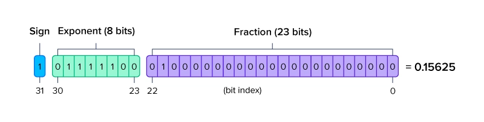

</div>

---

# 浮点数表示

* 以FP32为例:
  * 符号位: 1位 sign
  * exponent部分: 8位 exponent 
  * fraction部分: 23位 fraction
  * $value=(-1)^{\text{sign}}\times2^{E-127}\times(1+\sum_{i=1}^{23}b_{23-i}2^{-i})$

<div style="display:contents;" data-marpit-fragment>


</div>

---

# 浮点数表示

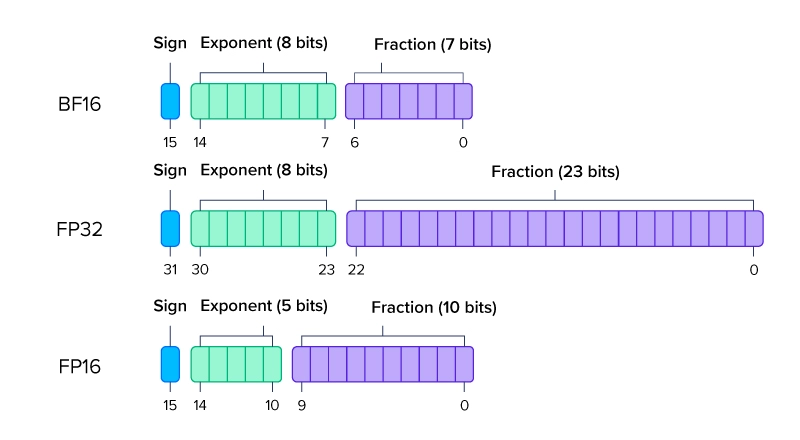

---

# 浮点数表示

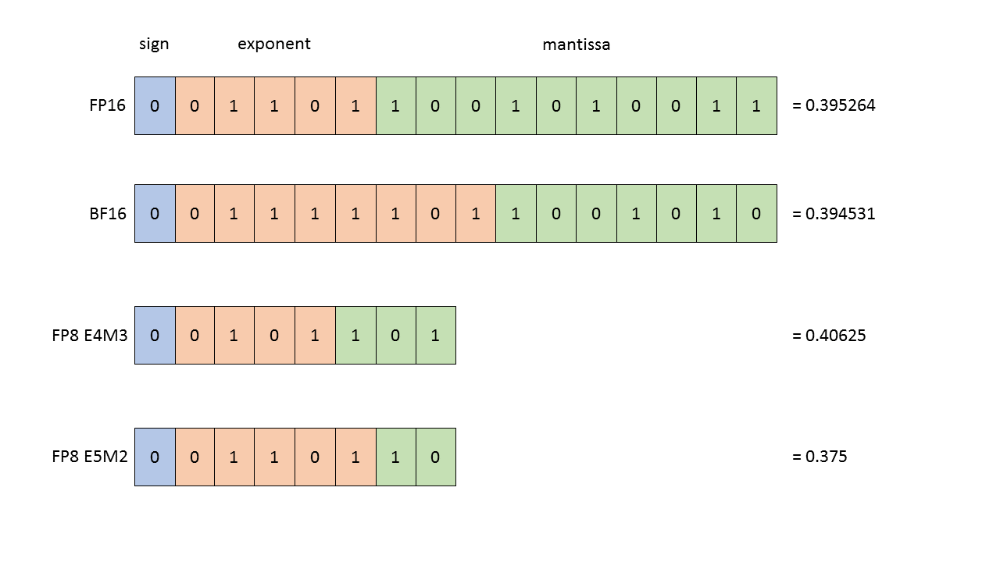


---

# 背景介绍
随着计算能力的提升和数据集规模的扩大，模型的参数数量也呈指数级增长。然而，训练大型语言模型仍存在以下的挑战：

+ 计算资源需求庞大
+ 显存限制
+ 通信瓶颈

面对这些挑战，简单地依赖硬件升级已经无法满足需求。因此，高效的并行化策略成了解决问题的关键。

---

# 如何让LLM“动”起来

<!--  -->

<!--  -->

* 训练
  * 预训练 (pretraining)
    * 继续预训练(Continuous PreTraining, CPT)
  * 指令微调 (INstruction fine-tuning)
    * 监督微调 (Supervised Finetuning, SFT)
    * RLHF (带人类反馈(Human feedback)的强化学习(RL))
* 推理

---

# 数据集

* 预备 ```pip install datasets```
* 人类视角下的数据集 v.s. LLM视角下的数据集
  * 转换工具: tokenizer
<div style="display:contents;" data-marpit-fragment>

```python
from transformers import AutoTokenizer
tokenizer = AutoTokenizer.from_pretrained(model_id)
```

</div>

* 通过tokenizer将原始文本编码(encode)为token序列
<div style="display:contents;" data-marpit-fragment>


```python
encoded_input = tokenizer("Tell me a story about Nanjing University.")
```

</div>

---

# token序列 <---> 文本

* 字典结构
  * input_ids: token id
  * attention_mask
* 操作
  * encode
  * decode
  * padding
  * truncation


---

# 字典结构

基本元素：input_ids 和 attention_mask
```python
encoded_input = tokenizer("Tell me a story about Nanjing University.")
```
通过tokenizer编码后的token序列
```python
{
  'input_ids': [41551, 757, 264, 3446, 922, 33242, 99268, 3907, 13], 
'attention_mask': [1, 1, 1, 1, 1, 1, 1, 1, 1]
}
```


---

# 编码和解码

* 编码(encode)
  * tokenizer(input): 得到{'input_ids','attention_mask'}字典结构
  * tokenizer.tokenize(input): 得到tokens
  * tokenizer.encode(input): 得到tokens的ids
* 解码(decode)
  * tokenizer.decode(input): 得到文本
    * input为ids的List


---

# 如何批处理

* 多段文本组成的batch
<div style="display:contents;" data-marpit-fragment>

```python
batch_sentences = [
    "Tell me a story about Nanjing University.",
    "耿鬼能超进化么？",
    "大语言模型课程怎么考试？",
]
encoded_inputs = tokenizer(batch_sentences)
```

</div>

---

# 如何批处理

输出结果

```python
{'input_ids': 
  [[41551, 757, 264, 3446, 922, 33242, 99268, 3907, 13], 
  [20551, 123, 111188, 27327, 72404, 42399, 33208, 82696, 11571], 
  [27384, 120074, 123123, 123440, 104237, 118660, 11571]], 
'attention_mask': 
  [[1, 1, 1, 1, 1, 1, 1, 1, 1], 
  [1, 1, 1, 1, 1, 1, 1, 1, 1], 
  [1, 1, 1, 1, 1, 1, 1]]
}
```


---

# 批处理内容不一样长

```python
batch_sentences = [
    "Tell me a story about Nanjing University.",
    "耿鬼能超进化么？",
    "大语言模型课程怎么考试？",
]
```

添加padding

```python
encoded_input = tokenizer(batch_sentences, padding=True)
```

---

# Padding

```python
{'input_ids': 
  [[41551, 757, 264, 3446, 922, 33242, 99268, 3907, 13], 
  [20551, 123, 111188, 27327, 72404, 42399, 33208, 82696, 11571], 
  [27384, 120074, 123123, 123440, 104237, 118660, 11571, 128009, 128009]], 
'attention_mask': 
  [[1, 1, 1, 1, 1, 1, 1, 1, 1], 
  [1, 1, 1, 1, 1, 1, 1, 1, 1], 
  [1, 1, 1, 1, 1, 1, 1, 0, 0]]
}
```

---

# Padding


* 指定长度进行padding

<div style="display:contents;" data-marpit-fragment>
  
```python
encoded_input = tokenizer(batch_sentences, padding="max_length", max_length=20, truncation=True)
```

</div>

* 控制padding方向: padding_side
  * tokenizer.padding_side: left or right
<div style="display:contents;" data-marpit-fragment>

```python
tokenizer.padding_side = 'left'
encoded_input = tokenizer(batch_sentences, padding="max_length", max_length=20, truncation=True)
```

</div>

---

# 其他

* 句子太长，LLM无法处理
  * 指定长度进行truncation
    * 调用tokenizer时配置参数```truncation=True```
* 将token序列转化为tensor格式
  * 调用tokenizer时配置参数```return_tensors="pt"```


---

# 加载数据集

```python
from datasets import load_dataset

ds = load_dataset("yahma/alpaca-cleaned")
```

* 数据集有其自身格式，一般地，包含'train', 'validation', 'test'部分
  * 调用```load_dataset()```方法后获得数据集字典
    * 获取训练集```ds['train']```
    * 看看数据集构成...


---

# 加载数据集

* 需实现数据集的预处理方法，并交由Datasets的map方法调用
  * 预处理方法
<div style="display:contents;" data-marpit-fragment>

```python
def tokenize_function(dataset):
  ...
  return ...
  ```

</div>

* 调用预处理方法
<div style="display:contents;" data-marpit-fragment>

```python
ds = load_dataset("yahma/alpaca-cleaned", split='train[:100]')
ds = ds.map(tokenize_function, batched=True)
```
</div>


---

# 微调模型

加载模型
```python
model = transformers.AutoModelForCausalLM.from_pretrained(pretrained_model_name_or_path=model_id)
```
设置训练参数
```python
from transformers import TrainingArguments
training_args = TrainingArguments(output_dir="test_trainer")
```

---

# LLM封装和参数装载(load)

* One basic PyTorch model
* LLM base model
* LoRA adapters

---

#  One basic PyTorch model

```python
import torch

class MyNetwork(torch.nn.Module):
    def __init__(self):
        super(MyNetwork, self).__init__()
        self.conv1 = torch.nn.Conv2d(3, 6, 5)
        self.pool = torch.nn.MaxPool2d(2, 2)
        self.conv2 = torch.nn.Conv2d(6, 16, 5)
        self.fc1 = torch.nn.Linear(16 * 5 * 5, 120)
    def forward(self, x):
        x = self.pool(torch.relu(self.conv1(x)))
        x = self.pool(torch.relu(self.conv2(x)))
        x = x.view(-1, 16 * 5 * 5)
        x = torch.relu(self.fc1(x))
        return x
```

---

# 一个model实例的初始

当一个model被创建
```python
model = MyNetwork()
```
* 伴随而“建”的有什么？
* MyNetwork继承了```torch.nn.Module```
  * 回想```init```函数做了些什么？
    * 定义了每个基础模块
      * 每个模块亦继承了```torch.nn.Module```
      * 通常所说的参数存放在基础模块中


---

# nn.Linear: LLM的核心基本基础模块


nn.Linear的[实现](https://pytorch.org/docs/stable/_modules/torch/nn/modules/linear.html#Linear)

```python
class Linear(Module):
    __constants__ = ["in_features", "out_features"]
    in_features: int
    out_features: int
    weight: Tensor
```

---

# nn.Linear的init方法
```python
def __init__(
        self, in_features: int, out_features: int, bias: bool = True, device=None, dtype=None,) -> None:
        factory_kwargs = {"device": device, "dtype": dtype}
        super().__init__()
        self.in_features = in_features
        self.out_features = out_features
        self.weight = Parameter(
            torch.empty((out_features, in_features), **factory_kwargs)
        )
        if bias:
            self.bias = Parameter(torch.empty(out_features, **factory_kwargs))
        else:
            self.register_parameter("bias", None)
        self.reset_parameters()
```

---

# nn.Linear的reset_parameters方法

```python
def reset_parameters(self) -> None:
        # Setting a=sqrt(5) in kaiming_uniform is the same as initializing with
        # uniform(-1/sqrt(in_features), 1/sqrt(in_features)). For details, see
        # https://github.com/pytorch/pytorch/issues/57109
        init.kaiming_uniform_(self.weight, a=math.sqrt(5))
        if self.bias is not None:
            fan_in, _ = init._calculate_fan_in_and_fan_out(self.weight)
            bound = 1 / math.sqrt(fan_in) if fan_in > 0 else 0
            init.uniform_(self.bias, -bound, bound)
```


---

# nn.Linear的forward方法

```python
def forward(self, input: Tensor) -> Tensor:
        return F.linear(input, self.weight, self.bias)
```

* 其中```F```是```torch.nn.functional```
  * ```from torch.nn import functional as F```


---

# nn.Linear中weight的定义和初始化
weight定义
```python
self.weight = Parameter(
    torch.empty((out_features, in_features), **factory_kwargs)
)
self.reset_parameters()
```
weight初始化，详见[torch.nn.init](https://pytorch.org/docs/stable/nn.init.html#torch.nn.init.kaiming_uniform_)
```python
init.kaiming_uniform_(self.weight, a=math.sqrt(5))
```

---

# model如何存储和装载

* model保存，核心为保存参数
* PyTorch提供的保存方法
  * ```torch.save```
* model里都有什么, 可以用```print(model)```查看
  

<div style="display:contents;" data-marpit-fragment>

```python
MyNetwork(
  (conv1): Conv2d(3, 6, kernel_size=(5, 5), stride=(1, 1))
  (pool): MaxPool2d(kernel_size=2, stride=2, padding=0, dilation=1, ceil_mode=False)
  (conv2): Conv2d(6, 16, kernel_size=(5, 5), stride=(1, 1))
  (fc1): Linear(in_features=400, out_features=120, bias=True)
)
```

</div>

---

# model.state_dict()

* model参数存储在内部的字典结构```model.state_dict()```中
  *  ```print(model.state_dict().keys())```

<div style="display:contents;" data-marpit-fragment>


```python
odict_keys(['conv1.weight', 'conv1.bias', 'conv2.weight', 'conv2.bias', 'fc1.weight', 'fc1.bias'])
```

</div>

<div style="display:contents;" data-marpit-fragment>

可通过```torch.save```存储模型至磁盘
```python
torch.save(model.sate_dict(), "model_weights.pt")
```

</div>

---

# model加载

* ```torch.save```存储的是一个模型的```state_dict```，那么加载的话
  * 创建model
  * 调用

<div style="display:contents;" data-marpit-fragment>


```python
model.load_state_dict(torch.load('model_weights.pt', weights_only=True))
```

</div>

* 存储/装载state_dict针对模型参数，也可直接存储/装载模型结构+模型参数
  * ```torch.save(model, 'model.pt')```
  * ```model = torch.load('model.pt', weights_only=False)```


---

# 基于PyTorch的参数装载过程

* torch.save
* torch.load
* torch.nn.Module.load_state_dict
* torch.nn.Module.state_dict


---


# HuggingFace对model的封装

* tensor的存储结构, [safetensors](https://github.com/huggingface/safetensors)
  * Storing tensors safely (as opposed to pickle) and that is still fast (zero-copy). 
* ```from_pretrained```和```save_pretrained```

<div style="display:contents;" data-marpit-fragment>


```python
import transformers
model_id = '/Users/jingweixu/Downloads/Meta-Llama-3.1-8B-Instruct'
llama = transformers.LlamaForCausalLM.from_pretrained(model_id)
llama.save_pretrained('/Users/jingweixu/Downloads/llama_test', from_pt=True)
```

</div>


---

# safetensors的其他存储/加载方式

```python
import torch
from safetensors import safe_open
from safetensors.torch import save_file

tensors = {
   "weight1": torch.zeros((1024, 1024)),
   "weight2": torch.zeros((1024, 1024))
}
save_file(tensors, "model.safetensors")

tensors = {}
with safe_open("model.safetensors", framework="pt", device="cpu") as f:
   for key in f.keys():
       tensors[key] = f.get_tensor(key)
```


---

# HuggingFace中的LoRA

* PEFT库提供LoRA实现
* LoRA是建立在一个已有的base model之上
* LoRA中的参数是base model的参数的一部分
  * 先加载base model
  * 再加载/创建对应的LoRA adapters

---

# HF加载LoRA的过程

```python
import transformers

model_id = '/Users/jingweixu/Downloads/Meta-Llama-3.1-8B-Instruct'
llama = transformers.LlamaForCausalLM.from_pretrained(model_id)
```

<div style="display:contents;" data-marpit-fragment>


```python
from peft import get_peft_model, LoraConfig, TaskType

peft_config = LoraConfig(task_type=TaskType.CAUSAL_LM, 
    inference_mode=False, r=8, lora_alpha=32, lora_dropout=0.1)

peft_model = get_peft_model(llama, peft_config)

```

</div>

---

# 原始的LlamaForCausalLM结构

```python
LlamaForCausalLM(
  (model): LlamaModel(
    (embed_tokens): Embedding(128256, 4096)
    (layers): ModuleList(
      (0-31): 32 x LlamaDecoderLayer(
        (self_attn): LlamaSdpaAttention(
          (q_proj): Linear(in_features=4096, out_features=4096, bias=False)
          (k_proj): Linear(in_features=4096, out_features=1024, bias=False)
          (v_proj): Linear(in_features=4096, out_features=1024, bias=False)
          (o_proj): Linear(in_features=4096, out_features=4096, bias=False)
          (rotary_emb): LlamaRotaryEmbedding()
        )
        (mlp): LlamaMLP(
          (gate_proj): Linear(in_features=4096, out_features=14336, bias=False)
          (up_proj): Linear(in_features=4096, out_features=14336, bias=False)
          (down_proj): Linear(in_features=14336, out_features=4096, bias=False)
          (act_fn): SiLU()
        )
        (input_layernorm): LlamaRMSNorm((4096,), eps=1e-05)
        (post_attention_layernorm): LlamaRMSNorm((4096,), eps=1e-05)
      )
    )
    (norm): LlamaRMSNorm((4096,), eps=1e-05)
    (rotary_emb): LlamaRotaryEmbedding()
  )
  (lm_head): Linear(in_features=4096, out_features=128256, bias=False)
)
```


---

# PEFT的PeftModelForCausalLM结构

```python
PeftModelForCausalLM(
  (base_model): LoraModel(
    (model): LlamaForCausalLM(
      (model): LlamaModel(
        (embed_tokens): Embedding(128256, 4096)
        (layers): ModuleList(
          (0-31): 32 x LlamaDecoderLayer(
            (self_attn): LlamaSdpaAttention(
              (q_proj): lora.Linear(
                (base_layer): Linear(in_features=4096, out_features=4096, bias=False)
                (lora_dropout): ModuleDict(
                  (default): Dropout(p=0.1, inplace=False)
                )
                (lora_A): ModuleDict(
                  (default): Linear(in_features=4096, out_features=8, bias=False)
                )
                (lora_B): ModuleDict(
                  (default): Linear(in_features=8, out_features=4096, bias=False)
                )
```


---

# 读懂PEFT加载LoRA的过程

* 入口: ```get_peft_model```方法
  * ```peft_model.py```中的方法
  
<div style="display:contents;" data-marpit-fragment>


```python
self.base_model = cls(model, {adapter_name: peft_config}, adapter_name)
``` 
```class BaseTuner(nn.Module, ABC):```中的```inject_adapter```方法和```_create_and_replace```方法（LoRA.model.py中实现）

</div>

* 入口: ```peft_model.py```中的```PeftModel.from_pretrained```方法

---

# LLM推理过程二三事

* LLM二阶段推理
* KV-caching机制

---

#  LLM的输入输出

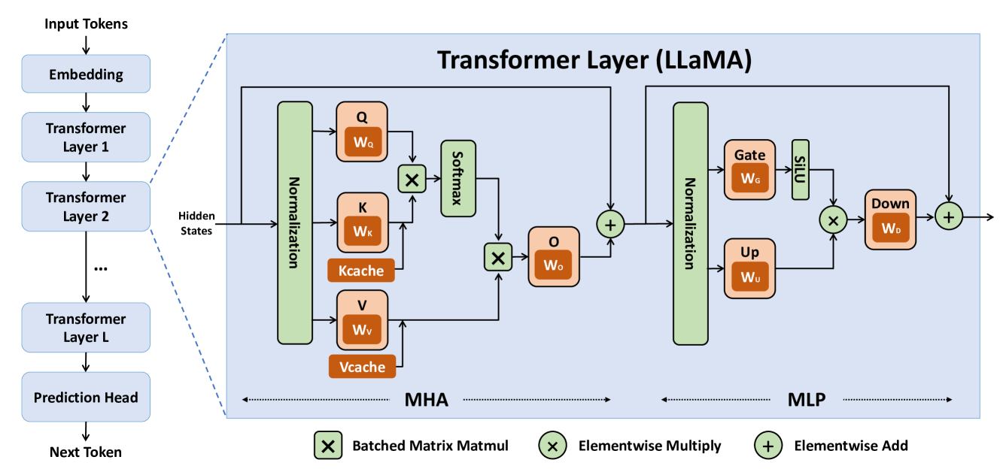

---

#  LLM推理过程中实际涉及的步骤

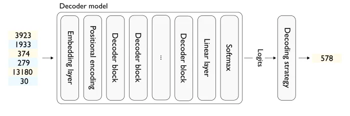

* LLM的一次推理输出logits，并非token
* 要得到token，还需通过Decoding strategy对logits进行解码

---


#  LLM推理过程中实际涉及的步骤

* LlaMAModel获得最后一层DecoderLayer的输出
* LM_head获得logits
* Decoding strategy解码logits得到token

* 常用的Decoding strategy有：
  * Greedy decoding
  * Sampling
  * Beam search

---

# LLM的解码(decoding)策略

* 如果我们把logits(通过softmax转换为token的概率分布)作为输入，通常有如下解码策略：
  * 贪婪解码(Greedy Decoding)：每次直接选择概率最高的token，简单高效，但并非全局最优
  * 采样(Sampling)：按一定的采样策略选择一个单词，增加生成过程的多样性，但可能会导致生成的文本不连贯
  * Beam Search：通过维护一个长度为k的候选序列集，每一步(单token推理)从每个候选序列的概率分布中选择概率最高的k个token，再考虑序列概率，保留最高的k个候选序列

---

# 采样策略

* 一切从随机出发，叠加控制
  * 随机采样
  * Top-k采样
  * Top-p采样(核采样，Nucleus sampling)
  * Top-k+Top-p采样


---

# 采样策略: top-k采样

输入：南京大学计算机学院的课程有
概率分布: {算法:0.4, 操作系统:0.3, 计算机:0.2, 数据:0.05, ...}
* top-k采样，每次从概率最高的k个单词中进行随机采样
* 例如k=2，有可能生成的输出有
  * 南京大学计算机学院的课程有算法
  * 南京大学计算机学院的课程有操作系统
* 贪婪解码本质是一种top-k采样(k=1)

---

# 采样策略: top-p采样

* top-p采样，源自[The Curious Case of Neural Text Degeneration](https://arxiv.org/pdf/1904.09751)
* 核心思路，重构采样集合
  * 给定token分布$P(x\mid x_{x_{1:i-1}})$，top-p集合$V^{(p)}\subset V$，使得$P(x\mid x_{x_{1:i-1}}\geq p)$
  * 和top-k很像，区别在于在什么位置对分布进行截断

---

# HF关于采样策略的实现

* 参考:[top_k_top_p_filtering](https://github.com/huggingface/transformers/blob/c4d4e8bdbd25d9463d41de6398940329c89b7fb6/src/transformers/generation_utils.py#L903) (老版本)
* 参考:
  * src/transformers/generation/logits_process.py
    * TopPLogitsWarper
    * TopKLogitsWarper
  * src/transformers/generation/utils.py
    * _get_logits_processor
      * 先topk，再topp

---

# LLM推理之两大阶段

* 基于LLM自回归生成(autoregressive generation)的特点
  * 逐token生成，生成的token依赖于前面的token
  * 一次只能生成一个token，无法同时生成多个token
* LLM生成过程分为两个阶段
  * Prefill phase
  * Decoding phase

---

# LLM推理第一阶段: Prefill

输入token序列，输出下一个token

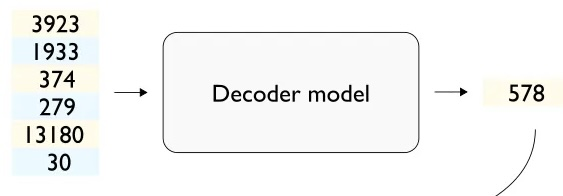

---

# LLM推理第二阶段: Decoding

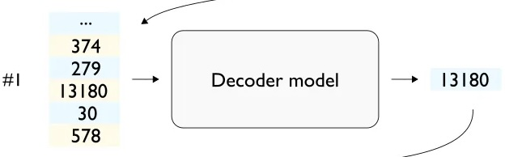
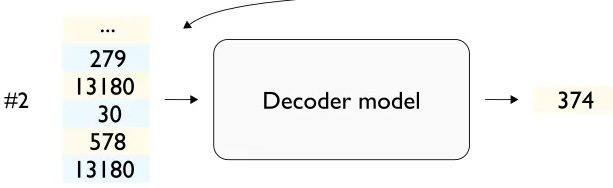

---

# LLM推理第二阶段: Decoding


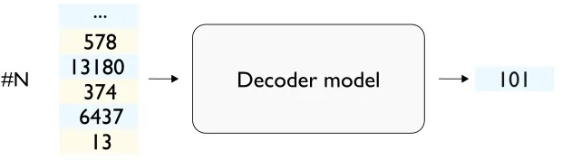


---

# LLM完成推理后，解码

将生成的token序列解码成文本

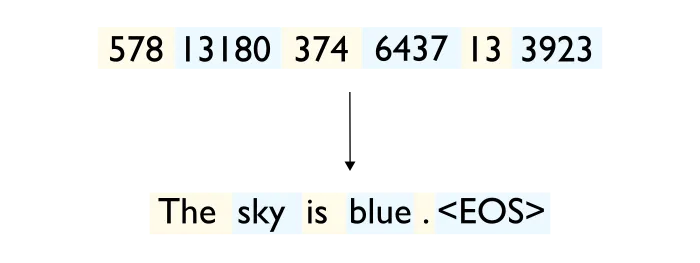

---

# LLM二阶段推理解析

* 将LLM当作函数，输入是token序列，输出是下一个token
* LLM通过自回归(autoregressive generation)不断生成"下一个token"
* 脑补下当LLM接收到输入的token序列后如何进行下一个token的推理

<div style="display:contents;" data-marpit-fragment>


</div>

---

# LLM推理过程会产生一些中间变量

第一个"下一个token"生成: 输入token序列"经过"(调用forward方法)N层Decoder layer后，的到结果
细看其中一层Decoder layer,frward方法会返回若干中间输出，被称之为激活(activation)


---

# Prefill phase

* 第一个"下一个token"生成过程被称之为Prefill阶段
* 为何特殊对待？
  * 计算开销大
* 简单推导一下一次LLM的推理过程的计算开销


---

# 计算开销

* 符号约定
  * b: batch size
  * s: sequence length
  * h: hidden size/dimension
  * nh: number of heads
  * hd: head dimension

---

# 计算开销


* 给定矩阵$A\in R^{1\times n}$和矩阵$B\in R^{n\times 1}$，计算$AB$需要$n$次乘法操作和$n$次加法操作，总计算开销为$2n$ (FLOPs)
  * FLOPs: floating point operations
* 给定矩阵$A\in R^{m\times n}$和矩阵$B\in R^{n\times p}$，计算$AB$中的一个元素需要$n$次乘法操作和$n$次加法操作，一共有$mp$个元素，总计算开销为$2mnp$ 

---

# Self-attn模块

* 第一步计算: $Q=xW_q$, $K=xW_k$, $V=xW_v$
  * 输入x的shape: $(b,s,h)$，weight的shape: $(h,h)$
  * Shape视角下的计算过程: $(b,s,h)(h,h)\rightarrow(b,s,h)$
    * 如果在此进行多头拆分(reshape/view/einops)，shape变为$(b,s,nh,hd)$，其中$h=bh*hd$
  * 计算开销: $3\times 2bsh^2\rightarrow 6bsh^2$

---

# Self-attn模块

* 第二步计算: $x_{\text{out}}=\text{softmax}(\frac{QK^T}{\sqrt{h}})VW_o+x$
  * $QK^T$计算: $(b,nh,s,hd)(b,nh,hd,s)\rightarrow (b,nh,s,s)$
    * 计算开销: $2bs^2h$
  * $\text{softmax}(\frac{QK^T}{\sqrt{h}})V$计算: $(b,nh,s,s)(b,bh,s,hd)\rightarrow(b,nh,s,hd)$
    * 计算开销: $2bs^2h$
* 第三步$W_o$计算: $(b,s,h)(h,h)\rightarrow(b,s,h)$
  * 计算开销: $2bsh^2$
* Self-attn模块总计算开销: $8bsh^2+4bs^2h$
---

# MLP模块

$$x=f_\text{activation}(x_{\text{out}}W_{\text{up}})W_{\text{down}}+x_{\text{out}}$$
* 第一步计算，假设上采样到4倍
  * Shape变化:$(b,s,h)(h,4h)\rightarrow(b,s,4h)$
  * 计算开销: $8bsh^2$
* 第二步计算，假设下采样回1倍
  * Shape变化:$(b,s,4h)(4h,h)\rightarrow(b,s,h)$
  * 计算开销: $8bsh^2$
* MLP模块总计算开销: $16bsh^2$


---

# Decoder layer模块计算开销

* Self-attn模块计算开销: $8bsh^2+4bs^2h$
* MLP模块计算开销: $16bsh^2$
* Decoder layer模块计算开销: $24bsh^2+4bs^2h$

* 以上为一次推理的计算开销，开销为sequence的平方级别

---

# Decoding phase

* 当第一个"下一个token"生成完毕后，LLM开始"自回归推理"生成
* 第二个"下一个token"
  * 输入x的shape: $(b,s+1,h)$，继续以上推理过程
* 第三个"下一个token"
  * 输入x的shape: $(b,s+2,h)$，继续以上推理过程
* 第n个"下一个token"
  * 输入x的shape: $(b,s+n-1,h)$，继续以上推理过程
* 自回归推理过程的计算开销
* 每次自回归推理过程，都需要平方级别的开销？
  * 且包含了计算开销和内存开销


---

# 回顾Self-attn中$QK^T$的计算过程

* 第一个"下一个token"
  * $QK^T$计算: $(b,nh,s,hd)(b,nh,hd,s)\rightarrow (b,nh,s,s)$
* 第二个"下一个token"
  * $QK^T$计算: $(b,nh,s+1,hd)(b,nh,hd,s+1)\rightarrow (b,nh,s+1,s+1)$
* 考虑自回归特性，$(s,s)$和$(s+1,s+1)$为下三角阵
  * $(s+1,s+1)$的前$s$行就是$(s,s)$
* 考虑复用$(s,s)$？

---

# LLM自回归过程中的复用

* 要复用什么，还得从需求出发
* 需求: 生成"下一个token" 
* Decoder layers之后的lm_head计算
  * shape视角: $(b,s,h)(h,V)\rightarrow (b,s,V)$
* 生成第二个"下一个token"
  * shape视角: $(b,s+1,h)(h,V)\rightarrow (b,s+1,V)$
  * 第二个"下一个token"的logits在$(b,s+1,V)$中第二个维度index $s+1$处，该logits只受$(b,s+1,h)$中第二个维度index $s+1$处的值影响

---

# LLM自回归过程中的复用

* 真正要复用的是用于计算$(b,s+1,h)$中第二维度index $s+1$的数值
  * shape的视角: $(b,s+1,h)\rightarrow (b,1,V)$
* 整个self-attn计算过程中，只有$QK^T$中的$K$和$\text{softmax}(\frac{QK^T}{\sqrt(h)})V$中的$V$需要复用
  * 为K和V构建缓存: 即KVCache


---

# **LLM开发**

LLM推理的应用
检索增强生成(RAG)

<!-- https://marp.app/ -->

---

# LLM的能力

* 通过推理(inference)，可以由LLM实现：
  * 理解和生成文本
    * 基于输入

* 输入从何而来？
  * 用户手动输入
  * 以及掌握的知识


---

# 把LLM想象成选了本课程的学生

* 当$\mathrm{x}=[1,2,3,4]$时，$softmax(\mathrm{x})$的结果是多少？
  * 需要掌握的知识：$softmax$函数的定义
* 请问基于本科生学籍管理办法，满足毕业要求需要修满多少学分？
  * 需要掌握的知识：学籍管理办法的规定
  * 需要掌握的知识：毕业要求的定义
  * 需要掌握的知识：学分的定义
  * 需要掌握的知识：学分的计算方法
* 信息来源：某《本科生学籍管理规定》中的内容


---


# 传统的大模型文本生成方式

* 预训练模型生成：直接使用预训练的大语言模型，根据输入的提示生成文本
  * 依赖模型内部知识：模型基于训练数据中的模式和知识进行生成

* 存在的缺点:
  * 幻觉问题：模型可能生成不准确或虚构的信息
  * 上下文长度限制：模型能处理的输入长度有限，无法涵盖大量的背景信息
  * 知识更新滞后：模型的知识截至训练时间，无法包含最新的信息

---

# "一个形象的比喻"

* 预训练好的大语言模型(pretrained LLM): 丰富的基础语言能力，但缺乏专业知识
  * “熟读唐诗300首的孩子，只能balabala的说”
* 专业的知识微调模型(fine-tuned LLM): 基于预训练模型的基础能力，加入了专业知识，可以回答专业问题
  * “熟读唐诗300首的孩子，经过了作诗的特训，可以出口成章”
* 一个指令微调后的模型+搜索引擎：可通过“搜索”查询相关的外部知识，从而回答专业问题
  * “熟读唐诗300首的孩子，经过了作诗的特训，可以**搜索到相关的作诗作品当作作诗的参照**”

---

# 微调的代价

用专业的知识微调LLM，从而赋予其回答专业问题的能力。

然而：
* 成本高昂：微调需要大量的数据和计算资源
* 不易维护：每次知识更新都需要重新微调模型
* 过拟合风险：可能导致模型在特定领域过拟合，降低泛化能力

<div style="display:contents;" data-marpit-fragment>

如果能为LLM引入一个搜索引擎，可自动按照用户输入的意图检索相关的信息，从而实现/提升回答专业问题的能力，那就完美

</div>

---

# 为LLM引入 RAG 技术

**什么是 RAG?**

* RAG（Retrieval-Augmented Generation）：检索增强生成，是一种结合了检索和生成的模型架构
* 核心思想：在生成文本时，先从外部知识库中检索相关信息，再结合这些信息进行生成

---

# RAG 的优势

* 减少幻觉：通过检索真实的资料，降低生成错误信息的概率
* 突破上下文限制：外部知识库可以包含大量信息，不受模型上下文长度限制
* 动态更新知识：知识库可以随时更新，模型能够利用最新的信息

---

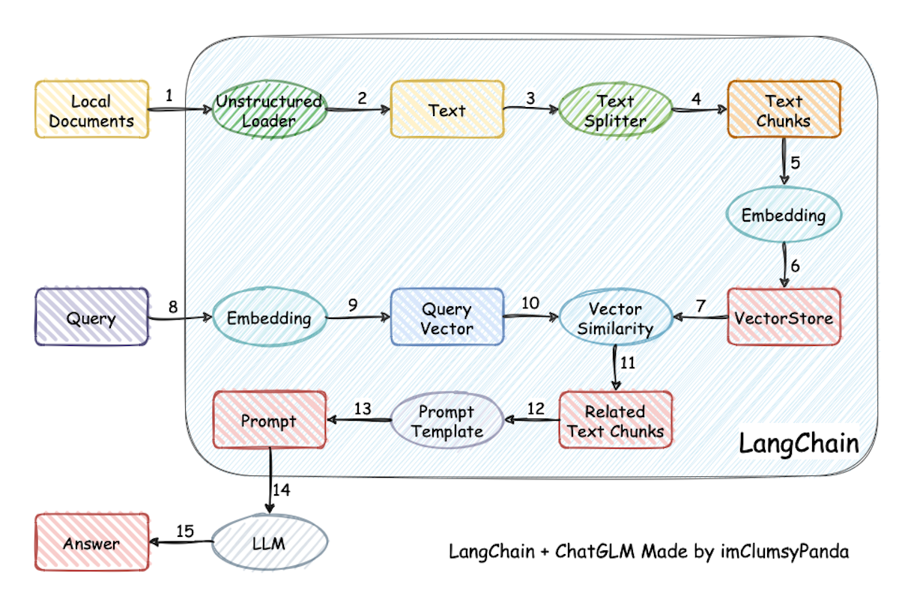

---

# RAG的主要组成部分

检索增强生成(RAG)的主要组成部分包括:

* **索引构建**: 为“知识”数据构建索引/知识库，以便快速检索
  * 知识库构建通常为Offline，存储形式一般为向量化数据库
* **检索和生成**: 基于用户输入的问题，从索引中检索相关的知识，并结合知识让LLM进行文本生成
  * 检索
  * 生成


---


# 知识库构建

* **数据预处理**：对文档进行清洗、分句等处理
* **向量化表示**：将文本转换为向量，以便于检索
  * 通常基于向量化数据库进行存储(如[Faiss](https://github.com/facebookresearch/faiss), [Milvus](https://github.com/milvus-io/milvus))
* **索引构建**：建立高效的检索索引结构

* 知识库存储大量专业领域知识，既便于快速查找，又可以动态更新，只需对新文档进行同样的数据处理即可

---

# 索引构建


---

# 检索

* **原理**：将问题和文档表示为高维向量，通过计算向量之间的相似度（如余弦相似度）来检索相关文档
* **流程**：
  1. **向量化表示**：使用预训练模型将问题转换为向量
  2. **检索**：通过快速搜索算法找到与问题向量最相似的文档向量

---

# 生成

* 接收检索到的文档和原始输入，填充 prompt 模板，作为新的输入
* 将新的 prompt 输入给模型，从而生成基于专业知识的回答
* 针对生成结果的优化，可能涉及重排（Rerank）、重写（Rewrite）等技术：
  * **重写**：对用户的输入问题进行改写，使其更加清晰及符合上下文
  * **重排**：对检索出的结果根据相关性进行排序，使最相关的文档排在最前面，提高输入的质量


---


# 使用Haystack实现RAG流程
[**Haystack**](https://haystack.deepset.ai/)：一个用于构建基于LLM的应用程序的框架，包括：
- Document：Haystack的核心数据类型
- component：组件单元，用于实现一个功能，例如：清理文件、切分文档、生成嵌入、初步检索、重排序等等
- pipeline：流水线，将组件串联起来，自动依次调用组件
- document store：存储文档的向量数据库

```bash
pip install haystack-ai 
```

---

# Document
向量数据库的基本存储单元
```python
@dataclass
class Document(metaclass=_BackwardCompatible):
	# 文档的ID
	id: str = field(default="")
	
	# 文档的内容
	content: Optional[str] = field(default=None)
	
	# 检索和重排序时文档的分数
	score: Optional[float] = field(default=None)
```	

---

```python
	# 文档的embedding，一个向量
	embedding: Optional[List[float]] = field(default=None)
	
	# 文档的稀疏embedding，一个index-value的稀疏向量
	sparse_embedding: Optional[SparseEmbedding] = field(default=None) 
	
	# 文档存在表格时，其pandas dataframe
	dataframe: Optional[DataFrame] = field(default=None) 
	# 文档的二进制数据
	blob: Optional[ByteStream] = field(default=None)
	# 文档的元数据，例如文档名，文档作者，文档时间等
	meta: Dict[str, Any] = field(default_factory=dict)

@dataclass
class SparseEmbedding:
	indices: List[int]
	values: List[float]
```

---

# Component
需要标明该组件单元的**输入**、**输出**和**处理代码**
```python
from haystack import Document, component
@component
class DocumentCleaner:
        # 输出在注解处标明
	@component.output_types(documents=List[Document]) 
        # 输入在方法参数处标明
	def run(self, documents: List[Document]): 
		# 处理代码在run()方法里
		cleaned_docs = clean(documents) # 清理文档内容...
                # 返回值必须是一个字典，key是和输出注解同名
                # 的字符串，value是清理好的文档列表
		return {"documents": cleaned_docs} 
```

---

# Pipeline
- 将定义好的组件单元(component)添加到流水线中
- 将组件单元连接起来，一般情况下都是有向无环图
- 组件单元的输入即可以来自内部的前一个组件的输出，也可以来自外部传入的数据

---

# Pipeline

```python
class Pipeline:
	# 启动流水线
	def run(
		self, 
                # 外部传入的数据，通过字典指定要给哪个组件传入哪个输入
		data: Dict[str, Any], 
        # 流水线的最终输出，通过字典说明哪个组件的哪个输出
	) -> Dict[str, Any]: 
	  
	# 将组件instance加入流水线，并命名为name
	def add_component(self, name: str, instance: Component) -> None:

	# 将两个组件的输入和输出连接起来
	def connect(self, sender: str, receiver: str)
```

---

# Converter
将一个文件转换成Haystack的核心数据类型：**Document**
```python
from haystack.components.converters import TextFileToDocument

converter = TextFileToDocument()
docs = converter.run(sources=["./files/hello_world.txt"])["documents"]

print(f"id: {docs[0].id}")
print(f"content: {docs[0].content}")
print(f"score: {docs[0].score}")
print(f"embedding: {docs[0].embedding}")
print(f"sparse_embedding: {docs[0].sparse_embedding}")
print(f"meta: {docs[0].meta}")
```

---

# Converter

* **TextFileToDocument**：一个component组件，输入是知识库文件路径列表list\[Path\]，输出是一个文档列表list\[Document\]
* 输出结果：（没有embedding处理流程和检索流程，所以没有embedding和score）

<div style="display:contents;" data-marpit-fragment>

```bash
id: d172a9449a4ebf5abebefcd66fb6d9292d2de8c4c60973b593819d05dcc54c7d
content: hello, world!
score: None
embedding: None
sparse_embedding: None
meta: {"file_path": "./files/hello_world.txt"}
```
</div>

---

# Splitter
文档切分是RAG的第一个核心点，目前主流有两种方式：直接切分和语法切分
在介绍具体切分方法之前，需要回答：什么样的文档块是好的？
* **文档块长度需要适中**，这个长度不好拿捏
	* 长文档块的缺点：
		1. 输入上下文增大，降低回答质量
		2. 信息量过多，检索准确度降低
		3. 信息量过多，正确的参考信息被太多无关信息淹没，大模型找不到对应的内容(影响attention计算的精确度)

---

# Spiltter

* 短文档块的缺点：
	1. 信息量过少，大模型找不到参考信息
	2. 文档数量提升，降低检索速度
	3. 更多的语义碎片，丢失语义连贯性和长文本中的实体依赖关系，俗称“说话说一半”
* **文档块的内容要全面**：但往往全面的文档块会很长，所以更重要的是如何在保证文档块长度适中的情况下，把“说话说一半”提升到“说话说四分之三”*
* **文档块的长度要平均**：尽量保证所有文档块的长度都差不多长。因为在计算相似度分数时，嵌入模型会更倾向于给短文档块打更高的分数


---

# DocumentSplitter
* **split_by**：常用的基本单位有page、passage、sentence、line、word，这里我们以词(word)为基本单位进行切分。哪个基本单位好呢？
	* word看起来很好，因为它可以保证所有的文档块都一样长，足够平均；但在头尾处会出现严重的不连贯现象
	* page和passage则是的文档块长度分布不均，以及超长文档块的出现
	* 所以一般而言sentence或line是个不错的选择

---

# DocumentSplitter

* **split_length**：切分的基本长度
* **split_overlap**：为了减少“说话说一半”的情况出现，让文档块之间相互重叠。假如2 3是连贯内容，重叠就可以使得它们连起来；不重叠则会被切断

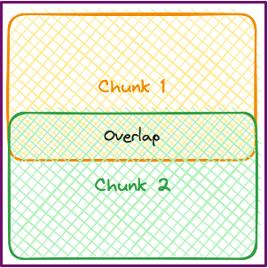

---

```python
from haystack.components.preprocessors import DocumentSplitter
from haystack import Document

numbers = "0 1 2 3 4 5 6 7 8 9"
document = Document(content=numbers)
splitter = DocumentSplitter(split_by="word", split_length=3, split_overlap=1)
docs = splitter.run(documents=[document])["documents"]

print(f"document: {document.content}")
for index,doc in enumerate(docs):
	print(f"document_{index}: {doc.content}")
```

```bash
document:   0 1 2 3 4 5 6 7 8 9
document_0: 0 1 2 
document_1: 2 3 4 
document_2: 4 5 6 
document_3: 6 7 8 
document_4: 8 9
```

---

# NLTKDocumentSplitter
## 奇怪的输入
```python
from haystack.components.preprocessors import NLTKDocumentSplitter, DocumentSplitter
from haystack import Document

text = """The dog was called Wellington. It belonged to Mrs. Shears who was our friend. 
She lived on the opposite side of the road, two houses to the left."""
document = Document(content=text)
```

<!-- ---

## 简单以句子为单位切分
```python
simple_splitter = DocumentSplitter(split_by="sentence", split_length=1, split_overlap=0)
simple_docs = simple_splitter.run(documents=[document])["documents"]
print("\nsimple:")
for index, doc in enumerate(simple_docs):
    print(f"document_{index}: {doc.content}")
``` -->

---

# 简单以句子为单位切分

```python
simple_splitter = DocumentSplitter(split_by="sentence", split_length=1, split_overlap=0)
simple_docs = simple_splitter.run(documents=[document])["documents"]
print("\nsimple:")
for index, doc in enumerate(simple_docs):
    print(f"document_{index}: {doc.content}")
```
输出
```bash
simple:
document_0: The dog was called Wellington.
document_1:  It belonged to Mrs.
document_2:  Shears who was our friend.
document_3:  She lived on the opposite side of the road, two houses to the left.
```

---

# 简单以句子为单位切分

```bash
simple:
document_0: The dog was called Wellington.
document_1:  It belonged to Mrs.
document_2:  Shears who was our friend.
document_3:  She lived on the opposite side of the road, two houses to the left.
```
* 无法区分 Mrs. Shears的点号和句号，所以我们需要nltk来对单词和符号进行tag标注

---

## NLTKDocumentSplitter

```python
nltk_splitter = NLTKDocumentSplitter(split_by="sentence", split_length=1, split_overlap=0)
nltk_docs = nltk_splitter.run(documents=[document])["documents"]
print("\nnltk:")
for index, doc in enumerate(nltk_docs):
    print(f"document_{index}: {doc.content}")
```
 输出
```
nltk:
document_0: The dog was called Wellington. 
document_1: It belonged to Mrs. Shears who was our friend. 
document_2: She lived on the opposite side of the road, two houses to the left.
```
---

# Retriever
#### BM25Retriever原理
* BM25是搜索引擎领域计算查询与文档相关性的排名函数
* 它是一种**基于词袋的检索函数**：通过统计查询和文档的单词匹配数量来计算二者相似度分数

<div style="display:contents;" data-marpit-fragment>

$$
\text{score}(D, Q) = \sum_{i=1}^{n} \text{IDF}(q_i) \cdot \frac{f(q_i, D) \cdot (k_1 + 1)}{f(q_i, D) + k_1 \cdot \left(1 - b + b \cdot \frac{|D|}{\text{avgdl}}\right)}
$$

</div>

---

#### BM25Retriever原理

$$
\text{score}(D, Q) = \sum_{i=1}^{n} \text{IDF}(q_i) \cdot \frac{f(q_i, D) \cdot (k_1 + 1)}{f(q_i, D) + k_1 \cdot \left(1 - b + b \cdot \frac{|D|}{\text{avgdl}}\right)}
$$
- 其中：
	- 查询$Q$包含关键字$q_1,…,q_n$
	- $f(q_i,D)$是$q_i$在文档$D$中的词频
	- $|D|$是文档长度
	- $avgdl$是平均文档长度 ; $IDF(q_i )$是$q_i$的逆向文档频率权重 ; $k_1$和$b$是超参数


---

### 例子
#### 处理文档
```python
from haystack import Document
from haystack.components.retrievers.in_memory import InMemoryBM25Retriever
from haystack.document_stores.in_memory import InMemoryDocumentStore

document_store = InMemoryDocumentStore()
documents = [
	Document(content="There are over 7,000 languages spoken around the world today."),
	Document(content="Elephants have been observed to behave in a way that indicates 
          a high level of self-awareness, such as recognizing themselves in mirrors."),
	Document(content="In certain parts of the world, like the Maldives, Puerto Rico, 
        and San Diego, you can witness the phenomenon of bioluminescent waves.")
]
document_store.write_documents(documents=documents)
```

---


#### 处理查询
```python
retriever = InMemoryBM25Retriever(document_store=document_store)
docs = retriever.run(query="How many languages are spoken around the world today?")["documents"]
for doc in docs:
	print(f"content: {doc.content}")
	print(f"score: {doc.score}")
```
输出
```
content: There are over 7,000 languages spoken around the world today.
score: 7.815769833242408
content: In certain parts of the world, like the Maldives, Puerto Rico, and San Diego, 
you can witness the phenomenon of bioluminescent waves.
score: 4.314753296196667
content: Elephants have been observed to behave in a way that indicates a high level 
of self-awareness, such as recognizing themselves in mirrors.
score: 3.652595952218814
```

---


#### 优缺点

* **速度快**：基于统计的分数计算公式很简单，可以快速处理大规模文本数据
* **存储开销小**：除文本外无需存储额外数据。如果下游大模型通过API调用，rag不需要显卡也能跑起来，而且很快
* **太依赖关键字**：query质量不高就搜不到，无法捕获文本的上下文语义信息。比如，在搜索引擎中，如果不输入关键字那必然搜不到我们想要的内容

---

## BERT
最近几年，一种基于BERT架构衍生出来的多种语义检索技术被更多地用到了RAG中，他是一种encoder-only的transformer架构：
- **Tokenizer**：words -> tokens
- **Embedding**：tokens -> vectors
- **Encoder Stack**：vectors -> vectors
简言之，它可以将文本转换成若干token vector


---

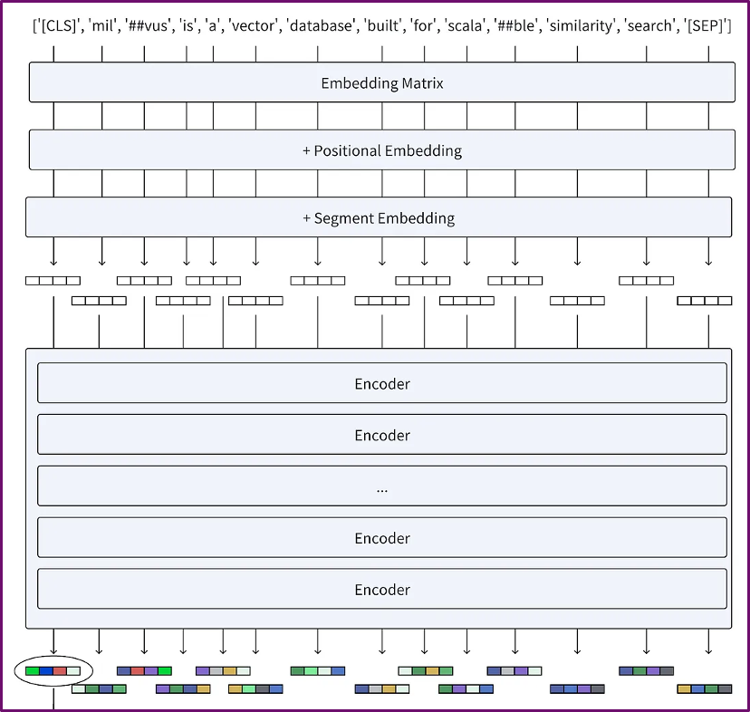


---

## DenseEmbeddingRetriever: 文本嵌入模型
密集嵌入检索器基于双编码器(Bi-Encoder)架构，在BERT上面外加一层池化层(Pooling)，得到单一的句向量，存储到document.embedding中。
- sentence ->**BERT-Encoder** -> token vectors
- token vectors -> **Pooling Layer** -> sentence vector
- score(SentenceA, SentenceB) = cosine_similarity(vectorA,vectorB)

---

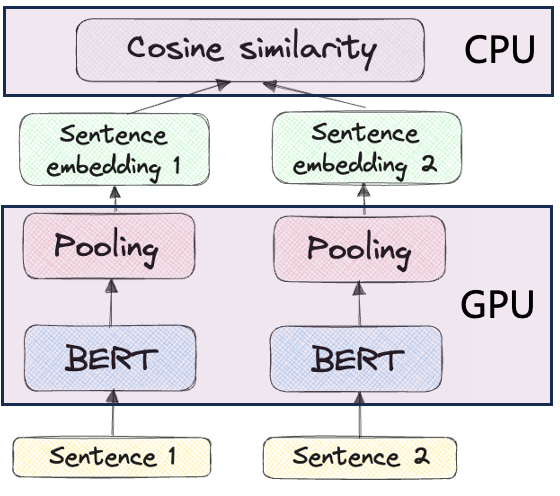

---
## DenseEmbeddingRetriever: 相似度计算
* 密集向量会交给一个经过训练的嵌入模型生成，它可以将**相似的句子**映射到高维空间中**距离相近、方向相似的向量**，常用的相似度分数计算公式有两种：
* **余弦相似度**：常用的相似度计算公式，计算两个向量之间的夹角的余弦值。两个向量的方向越一致相似度越高
  $$\text{Cosine Similarity} = \frac{\mathbf{A} \cdot \mathbf{B}}{\|\mathbf{A}\| \|\mathbf{B}\|} = \frac{\sum_{i=1}^n A_i B_i}{\sqrt{\sum_{i=1}^n A_i^2} \cdot \sqrt{\sum_{i=1}^n B_i^2}}$$

---
## DenseEmbeddingRetriever: 相似度计算
- **欧式似度**：直接计算两个向量之间的欧几里得距离，然后取个倒数得到相似度分数。也可以用其他距离：曼哈顿距离、汉明距离等
	$$\text{Euclidean Similarity} = \frac{1}{1+\sqrt{\sum_{i=1}^n (A_i - B_i)^2}}$$

---

# 例子
* **模型**: sentence-transformers/all-MiniLM-L6-v2, 22.7M params
* **相似度分数**：余弦相似度

---

```python
from haystack import Document, Pipeline
from haystack.document_stores.in_memory import InMemoryDocumentStore
from haystack.components.embedders import (
    SentenceTransformersTextEmbedder,
    SentenceTransformersDocumentEmbedder,
)
from haystack.components.retrievers import InMemoryEmbeddingRetriever

document_store = InMemoryDocumentStore(embedding_similarity_function="cosine")

documents = [
    Document(content="There are over 7,000 languages spoken around the world today."),
    Document(content="Elephants have been observed to behave in a way that indicates 
    a high level of self-awareness, such as recognizing themselves in mirrors."),
    Document(content="In certain parts of the world, like the Maldives, Puerto Rico, 
    and San Diego, you can witness the phenomenon of bioluminescent waves."),
]
```

---

```python
document_embedder = SentenceTransformersDocumentEmbedder(
    model="sentence-transformers/all-MiniLM-L6-v2"
)
document_embedder.warm_up()
documents_with_embeddings = document_embedder.run(documents)["documents"]
document_store.write_documents(documents_with_embeddings)
for doc in documents_with_embeddings:
    print(f"content: {doc.content}")
    print(f"score: {doc.score}")
    print(f"embedding: {doc.embedding}\n")
```

---

#### 输出
```
content: There are over 7,000 languages spoken around the world today.
score: None
embedding: [0.03276507928967476, ..., 0.022160163149237633]

content: Elephants have been observed to behave in a way that indicates 
a high level of self-awareness, such as recognizing themselves in mirrors.
score: None
embedding: [0.01985647901892662, ..., 0.007489172276109457]

content: In certain parts of the world, like the Maldives, Puerto Rico, 
and San Diego, you can witness the phenomenon of bioluminescent waves.
score: None
embedding: [0.08535218983888626, ..., 0.013049677945673466]
```

---

#### 处理查询
```python
query_pipeline = Pipeline()
query_pipeline.add_component(
    "text_embedder",
    SentenceTransformersTextEmbedder(model="sentence-transformers/all-MiniLM-L6-v2"),
)
query_pipeline.add_component(
    "retriever", InMemoryEmbeddingRetriever(document_store=document_store)
)
query_pipeline.connect("text_embedder.embedding", "retriever.query_embedding")

query = "How many languages are there?"
result = query_pipeline.run({"text_embedder": {"text": query}})
result_documents = result["retriever"]["documents"]
for doc in result_documents:
    print(f"content: {doc.content}")
    print(f"score: {doc.score}\n")
```
---

#### 输出
```
content: There are over 7,000 languages spoken around the world today.
score: 0.7557791921810213

content: Elephants have been observed to behave in a way that indicates 
a high level of self-awareness, such as recognizing themselves in mirrors.
score: 0.04221229572888512

content: In certain parts of the world, like the Maldives, Puerto Rico,
 and San Diego, you can witness the phenomenon of bioluminescent waves.
score: -0.001667837080811814
```

---

### 优缺点
- **速度快**：可以提前在GPU上计算并存储文档块的dense embedding，计算相似度就会很快
- **存储开销小**：每个文档块只需要额外存储一个高维向量(通常768或1024维)
- **捕获句子的语义信息**：只要是相似的句子，关键字不匹配也可以检索到
- **丢失词元信息**：BERT产生的众多词元向量全部被映射到单一句向量，丢失了很多文本中的细节。快速地粗读文本，速度虽快但忽略了细节，只了解了个大概

---

## SimilarityReranker: 相似度计算模型
- similarity reranker基于交叉编码器(cross-encoder)架构
- 直接将两个句子串联起来，交给BERT，使得两个句子的词元向量可以在BERT内部相互交叉(cross)地进行交互，最终经过softmax得到一个相似度分数

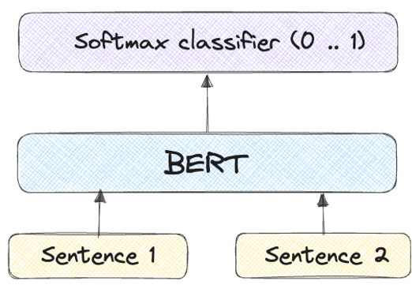


---

## SimilarityReranker: 相似度计算模型

* **cross vs. colbert**: 词元向量的交互从**相似度计算阶段**(colbert)，提前到**BERT模型内部**(cross)

<div style="display:contents;" data-marpit-fragment>

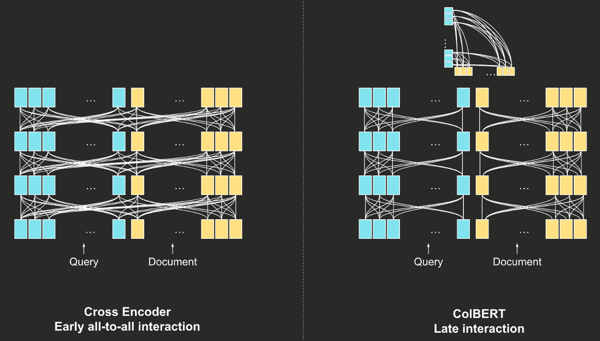

</div>

---

### 例子
```python
from haystack import Document
from haystack.components.rankers import TransformersSimilarityRanker

documents = [
    Document(content="There are over 7,000 languages spoken around the world today."),
    Document(content="Elephants have been observed to behave in a way that indicates 
    a high level of self-awareness, such as recognizing themselves in mirrors."),
    Document(content="In certain parts of the world, like the Maldives, Puerto Rico, 
    and San Diego, you can witness the phenomenon of bioluminescent waves."),
]
ranker = TransformersSimilarityRanker(model="cross-encoder/ms-marco-MiniLM-L-6-v2")
ranker.warm_up()
query = "How many languages are there?"
ranked_documents = ranker.run(query=query, documents=documents)["documents"]
for doc in ranked_documents:
    print(f"content: {doc.content}")
    print(f"score: {doc.score}\n")
```

---


#### 输出
```
content: There are over 7,000 languages spoken around the world today.
score: 0.9998884201049805

content: Elephants have been observed to behave in a way that indicates 
a high level of self-awareness, such as recognizing themselves in mirrors.
score: 1.4616251974075567e-05

content: In certain parts of the world, like the Maldives, Puerto Rico, 
and San Diego, you can witness the phenomenon of bioluminescent waves.
score: 1.4220857337932102e-05
```

---

### 优缺点
- **充分利用词元信息**：相似度直接在模型内部完成计算。同时看两个文本，交叉理解两个文本的单词的含义，训练好的模型可以得到很好的相似度计算结果
- **在线计算**：所有的计算都要在GPU上在线完成，无法提前存储一些信息，实现之前的离线计算，因此会很慢


---

# Simple RAG
挑一种文档划分方法，再挑一个检索器，一个简单的RAG就可以完成了

```python
from prompt_toolkit import prompt
from haystack import Pipeline
from haystack.utils import Secret
from haystack.document_stores.in_memory import InMemoryDocumentStore
from haystack.components.fetchers import LinkContentFetcher
from haystack.components.converters import HTMLToDocument
from haystack.components.preprocessors import DocumentSplitter
from haystack.components.writers import DocumentWriter
from haystack.components.retrievers.in_memory import InMemoryEmbeddingRetriever
from haystack.components.generators import OpenAIGenerator
from haystack.components.builders.prompt_builder import PromptBuilder
from haystack.components.embedders import (
    SentenceTransformersTextEmbedder, SentenceTransformersDocumentEmbedder,)
```

---

### 处理文档
- 使用sentence-transformers/all-MiniLM-L6-v2嵌入模型进行检索
- 以3行为单位进行切分，并且有1行的overlap
- 将南京大学的wiki网页作为知识库：[https://en.wikipedia.org/wiki/Nanjing_University](https://en.wikipedia.org/wiki/Nanjing_University)

---
### 处理文档

```python
document_store = InMemoryDocumentStore()
fetcher = LinkContentFetcher()
converter = HTMLToDocument()
splitter = DocumentSplitter(split_by="sentence", split_length=3, split_overlap=1)
document_embedder = SentenceTransformersDocumentEmbedder(
    model="sentence-transformers/all-MiniLM-L6-v2"
)
writer = DocumentWriter(document_store = document_store)

indexing_pipeline = Pipeline()
indexing_pipeline.add_component("fetcher", fetcher)
indexing_pipeline.add_component("converter", converter)
indexing_pipeline.add_component("splitter", splitter)
indexing_pipeline.add_component("document_embedder", document_embedder)
indexing_pipeline.add_component("writer", writer)

indexing_pipeline.connect("fetcher.streams", "converter.sources")
indexing_pipeline.connect("converter.documents", "splitter.documents")
indexing_pipeline.connect("splitter.documents", "document_embedder.documents")
indexing_pipeline.connect("document_embedder.documents", "writer.documents")

indexing_pipeline.run(data={"fetcher": {"urls": ["https://en.wikipedia.org/wiki/Nanjing_University"]}})
```


---


### 处理查询
```python
prompt_template = """
Given these documents, answer the question.
Documents:

    {{ doc.content }}

Question: {{question}}
Answer:
"""

api_key = "xxx"
model = "gpt-4o-mini"
api_base_url = None
query_embedder = SentenceTransformersTextEmbedder(model="sentence-transformers/all-MiniLM-L6-v2")
retriever = InMemoryEmbeddingRetriever(document_store=document_store)
prompt_builder = PromptBuilder(template=prompt_template)
llm = OpenAIGenerator(
    api_key=Secret.from_token(api_key),
    model=model,
    api_base_url=api_base_url
)
```

---
### 处理查询

```python
rag_pipeline = Pipeline()
rag_pipeline.add_component("query_embedder", query_embedder)
rag_pipeline.add_component("retriever", retriever)
rag_pipeline.add_component("prompt_builder", prompt_builder)
rag_pipeline.add_component("llm", llm)
rag_pipeline.connect("query_embedder.embedding", "retriever.query_embedding")
rag_pipeline.connect("retriever.documents", "prompt_builder.documents")
rag_pipeline.connect("prompt_builder.prompt", "llm.prompt")

while(True):
    question = prompt("> ")
    results = rag_pipeline.run(
        {
            "query_embedder": {"text": question},
            "prompt_builder": {"question": question},
        }
    )
    reply = results["llm"]["replies"][0]
    print(reply)
```

---

### 测试
**What is the motto of Nanjing University？**
  > The motto of Nanjing University is "诚朴雄伟励学敦行," which translates to "Sincerity with Aspiration, Perseverance and Integrity" in English. The first half of this motto was the motto during the National Central University time, and the last half was quoted from the classic literature work Book of Rites.
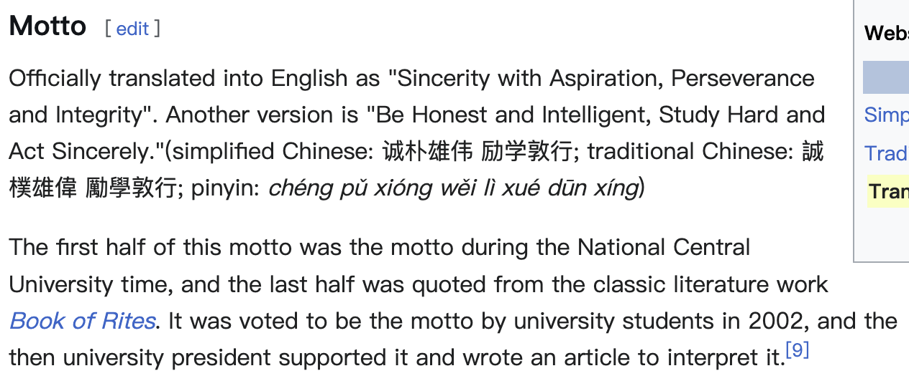

---

**What is the song of Nanjing University？**
> The song of Nanjing University is the university song, which was created in 1916. It is the first school song in the modern history of Nanjing University. The lyrics were written by Jiang Qian, and the melody was composed by Li Shutong. The song was recovered in 2002.
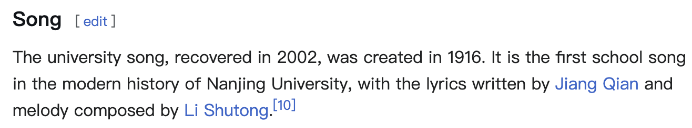

---

#### 问一些大模型不知道的问题
>question: Who is the modern China's first PhD in Chinese Language and Literature?

---

##### Chatgpt answer
- 一会说1986年的郭齐勇，一会说1983年的陈平原
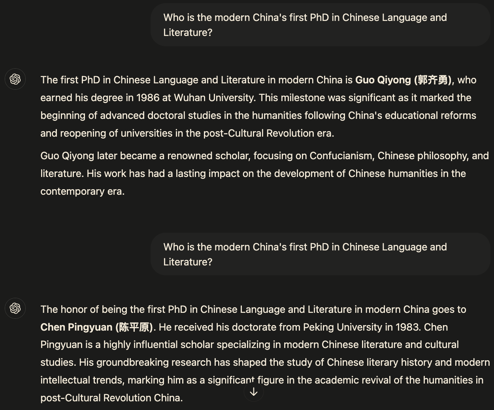

---

##### RAG answer
>The modern China's first PhD in Chinese Language and Literature is Mo Lifeng (莫砺锋), as mentioned in the documents.


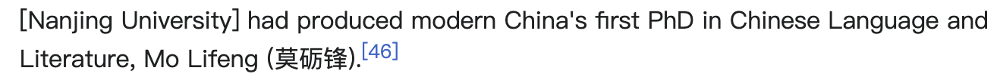

---

# Advanced RAG: 检索结果合并
- 不同的检索器有不同的侧重点，会得到不同的相似度分数分布，如何综合考虑？例如一本书我既想略读整体(dense embedding)，也想跳着读重点部分(sparse embedding)
- **权重合并(Weight Merge)**
  $$\alpha \cdot \text{scale}(s_1) + (1 - \alpha) \cdot \text{scale}(s_2)$$
	- 两种检索机制的分数的值域、分布不一致，通过放缩补偿
	- 通过**加权和**计算综合分数

---

# Advanced RAG: 检索结果合并
- **RRF(倒排融合)**
  $$RRFscore(d \in D) = \sum_{r \in R} \frac{1}{k + r(d)}$$
	- 只考虑文档在排序中的位置，忽略分数分布
	- $r(d)$是文档d在一种检索机制下的排序
	- $k$是超参

---

### 例子
#### import
```python
from haystack import Document, Pipeline
from haystack.document_stores.in_memory import InMemoryDocumentStore
from haystack.components.embedders import (
    SentenceTransformersTextEmbedder,
    SentenceTransformersDocumentEmbedder,
)
from haystack.components.retrievers.in_memory import InMemoryBM25Retriever
from haystack.components.retrievers import InMemoryEmbeddingRetriever
from haystack.components.joiners.document_joiner import DocumentJoiner
```


---

#### 文档处理
```python
document_store = InMemoryDocumentStore(embedding_similarity_function="cosine")

query = "What are effective strategies to improve English speaking skills?"
documents = [
    Document(content="Practicing with native speakers enhances English 
                      speaking proficiency."),
    Document(content="Regular participation in debates and discussions 
                      refine public speaking skills in English."),
    Document(content="Studying the history of the English language does
                      not directly improve speaking skills."),
]

document_embedder = SentenceTransformersDocumentEmbedder(
    model="sentence-transformers/all-MiniLM-L6-v2"
)
document_embedder.warm_up()
documents_with_embeddings = document_embedder.run(documents)["documents"]
document_store.write_documents(documents_with_embeddings)
```

---

#### bm25检索
```python
bm25_retriever = InMemoryBM25Retriever(document_store=document_store，scale_score=True)
bm25_docs = bm25_retriever.run(query=query)["documents"]
print("bm25:")
for doc in bm25_docs:
    print(f"content: {doc.content}")
    print(f"score: {doc.score}\n")
```
#### 输出
```
content: Studying the history of the English language does not directly improve 
speaking skills.
score: 0.5593245377361279
content: Regular participation in debates and discussions refine public speaking 
skills in English.
score: 0.545159185512614
content: Practicing with native speakers enhances English speaking proficiency.
score: 0.5387709786621966
```

---

#### dense embedding检索
```python
query_pipeline = Pipeline()
query_pipeline.add_component(
    "text_embedder",
    SentenceTransformersTextEmbedder(model="sentence-transformers/all-MiniLM-L6-v2"),
)
query_pipeline.add_component(
    "dense_retriever", InMemoryEmbeddingRetriever(document_store=document_store，scale_score=True)
)
query_pipeline.connect("text_embedder.embedding", "dense_retriever.query_embedding")
dense_docs = query_pipeline.run({"text_embedder": {"text": query}})["dense_retriever"]["documents"]
print("dense:")
for doc in dense_docs:
    print(f"content: {doc.content}")
    print(f"score: {doc.score}\n")
```

---

#### 输出
```
content: Practicing with native speakers enhances English speaking proficiency.
score: 0.8296398226909952

content: Regular participation in debates and discussions refine public speaking 
skills in English.
score: 0.8017774366152697

content: Studying the history of the English language does not directly improve 
speaking skills.
score: 0.7334273104138469
```

---

#### 权重合并
```python
joiner = DocumentJoiner(join_mode="merge", weights=[0.3, 0.7])
merge_docs = joiner.run(documents=[bm25_docs, dense_docs])["documents"]
for doc in merge_docs:
    print(f"content: {doc.content}")
    print(f"score: {doc.score}\n")
```
#### 输出
```
content: Practicing with native speakers enhances English speaking proficiency.
score: 0.7423791694823556
content: Regular participation in debates and discussions refine public speaking 
skills in English.
score: 0.724791961284473
content: Studying the history of the English language does not directly improve 
speaking skills.
score: 0.6811964786105311
```
---

#### RRF合并
```python
joiner = DocumentJoiner(join_mode="reciprocal_rank_fusion")
rrf_docs = joiner.run(documents=[bm25_docs,dense_docs])["documents"]
print("rrf:")
for doc in rrf_docs:
    print(f"content: {doc.content}")
    print(f"score: {doc.score}\n")
```
#### 输出
```
content: Studying the history of the English language does not directly improve speaking skills.
score: 0.9841269841269842
content: Practicing with native speakers enhances English 
speaking proficiency.
score: 0.9841269841269842
content: Regular participation in debates and discussions refine public speaking 
skills in English.
score: 0.9838709677419354
```

---

**RRF计算**：haystack使用k=61，并且进行了额外的放缩处理，$|R|$是排序列表的数量
$$
RRFscore(d \in D) = \frac{k}{|R|} \cdot \sum_{r \in R} \frac{1}{k + r(d)}
$$
- **Studying...**：bm25的排序为1，dense的排序为3，因此：$61/2\times (1/(61+1)+1/(61+3))=0.9841269841269842$
- **Practicing...**：bm25的排序为3，dense的排序为1，因此：$61/2\times (1/(61+3)+1/(61+1))=0.9841269841269842$
- **Regular...**：bm25的排序为3，dense的排序为1，因此：$61/2\times (1/(61+2)+1/(61+2))=0.9838709677419354$

---

## 重排序机制
- 有些检索器速度快但效果不好(dense,sparse,bm25)，有些检索器速度慢但效果好(colbert,cross)
- 可以先用速度快的检索器先网罗一批候选文档，再用效果好的检索器重新排序。先快速粗读所有文档，找出一批看起来不错的文档，再精读候选文档，找出质量好的

---

### 例子
#### import
```python
from haystack import Document
from haystack.document_stores.in_memory import InMemoryDocumentStore
from haystack.components.retrievers.in_memory import InMemoryBM25Retriever
from haystack.components.rankers import TransformersSimilarityRanker
```

---

#### 文档处理
```python

query = "What are effective strategies to improve English speaking skills?"
documents = [
    Document(
        content="Practicing with native speakers enhances English speaking proficiency."
    ),
    Document(
        content="Daily vocabulary expansion is crucial for improving oral communication skills."
    ),
    Document(
        content="Engaging in language exchange programs can significantly boost speaking abilities."
    ),
    Document(
        content="Regular participation in debates and discussions refine public speaking skills in English."
    ),
    Document(
        content="Studying the history of the English language does not directly improve speaking skills."
    ),
]
document_store = InMemoryDocumentStore()
document_store.write_documents(documents)
```

---

### bm25初步检索
```python
bm25_retriever = InMemoryBM25Retriever(document_store=document_store)
bm25_docs = bm25_retriever.run(query=query, top_k=4)["documents"]
print("bm25:")
for doc in bm25_docs:
    print(f"content: {doc.content}")
    print(f"score: {doc.score}\n")
```

---

#### 输出
```
bm25:
content: Studying the history of the English language does not directly improve speaking skills.
score: 3.1117211646172698

content: Regular participation in debates and discussions refine public speaking skills in English.
score: 2.443788686074245

content: Practicing with native speakers enhances English speaking proficiency.
score: 2.2622329312889553

content: Daily vocabulary expansion is crucial for improving oral communication skills.
score: 2.0359854825047066
```

---

#### 重排序
```python
reranker = TransformersSimilarityRanker(model="cross-encoder/ms-marco-MiniLM-L-6-v2")
reranker.warm_up()
reranked_docs = reranker.run(query=query, documents=bm25_docs, top_k=3)["documents"]
print("reranker:")
for doc in reranked_docs:
    print(f"content: {doc.content}")
    print(f"score: {doc.score}\n")
```

---

#### 输出
```
reranker:
content: Practicing with native speakers enhances English speaking proficiency.
score: 0.769904375076294

content: Studying the history of the English language does not directly improve 
speaking skills.
score: 0.5486361384391785

content: Daily vocabulary expansion is crucial for improving oral communication 
skills.
score: 0.3509156107902527
```

---

## 上下文丰富
小文档块的检索准确度更高，但丢失了更多上下文信息，因此可以在检索后丰富上下文来补偿
### 上下文窗口扩展(Sentence window retrieval)
- 以小文档块为单位进行检索可以保证检索准确度，和相邻若干文档块合并形成大文档块可以保证信息量
- 翻阅书本时，突然扫到了重点，会下意识联系上下文看一看，看有没有额外的相关信息可以参考

---

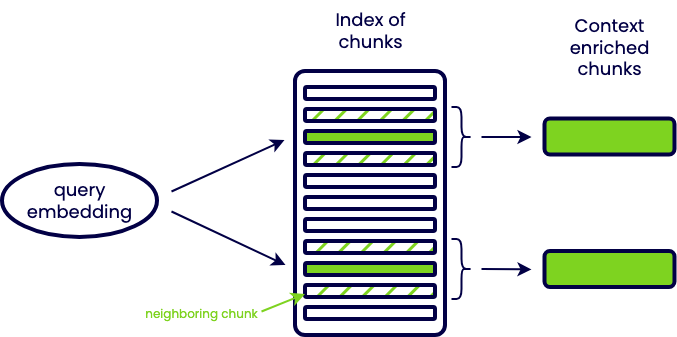

---

### 自动合并检索(Auto-merging retrieval)
- 任何时候都进行上下文扩展并不合理，当检索命中的小文档块数量在大文档块中的占比达到一定阈值时(例如50%)，才进行合并
- 翻阅书本时，发现重点都聚集在某一章节，那这一章节可能都很重要

---

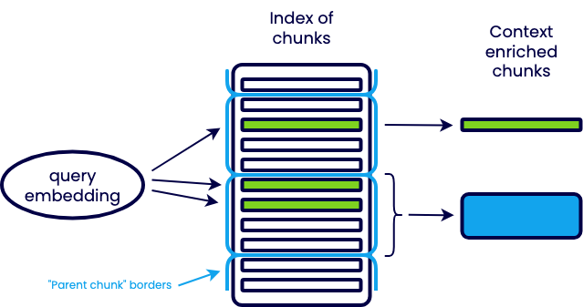


---

# **LLM开发**

LLM进阶
Megatron中的并行化技术介绍

---

# Megatron

Megatron 作为 NVIDIA 提出的高性能大规模模型训练框架，巧妙地结合了多种并行化技术：

+ 张量并行（Tensor Parallelism）
+ 数据并行（Data Parallelism）
+ 流水线并行（Pipeline Parallelism）
+ 序列并行（Sequence Parallelism）

通过这些并行化策略的组合，Megatron 成功地应对了训练大型大语言模型的诸多挑战，为研究和应用带来了新的可能性。

---

# Overall: TP + DP

+ 张量并行（Tensor Parallelism）：将模型中的大型权重张量沿特定维度切分，在不同 GPU 上分别计算，最后汇总；
+ 数据并行（Data Parallelism）：将数据集划分成多个子集，每个子集交给一个模型副本进行计算，最后同步参数。


---

# TP in Megatron

在 Transformer Layer 中，最重要的计算就是 MLP 和 Attention

为了实现张量并行，需要分别对这两个模块作并行化处理


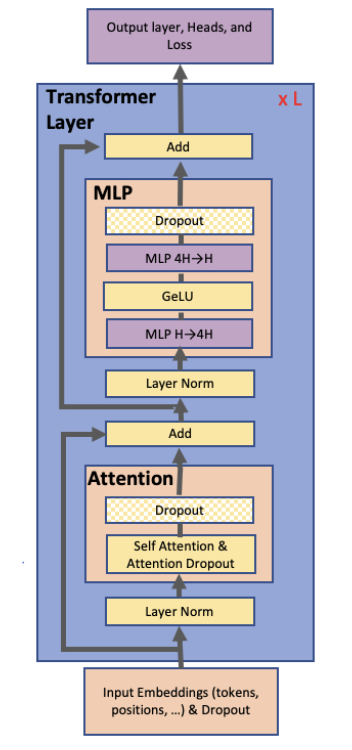

---

# TP on MLP

MLP 通过两步矩阵计算，将 $hidden\_state$ 先升维再降维:

+ $[\dots, 𝐻]∗[𝐻, 4𝐻]=[\dots, 4𝐻]$
+ $[\dots, 4𝐻]∗[4𝐻, 𝐻]=[\dots, 𝐻]$

需要作并行化处理的正是权重矩阵 $𝐴:[𝐻, 4𝐻]$, $𝐵:[4𝐻, 𝐻]$

---

# TP on MLP

+ 对矩阵 $𝐴$ 及后续 $𝐺𝑒𝐿𝑈$ 作切分：
  将 $𝐴$ 沿着列方向切分为 $𝐴=[𝐴_1,𝐴_2]$，于是有：$[𝑌_1,𝑌_2 ]=[𝐺𝑒𝐿𝑈(𝑋𝐴_1 ), 𝐺𝑒𝐿𝑈(𝑋𝐴_2 )]$

+ 对矩阵 $𝐵$ 作切分：
  由于前一步的切分导致中间结果 $𝑌$ 也被沿着列方向切开，因此在这一步中需要将 $𝐵$ 沿行方向切开，即 $𝐵=[𝐵_1;𝐵_2]$，于是有：$YB=[𝑌_1,𝑌_2 ][𝐵_1;𝐵_2]=[𝑌_1 𝐵_1+𝑌_2 𝐵_2]$


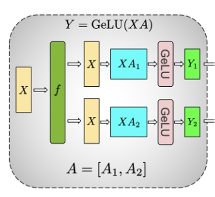

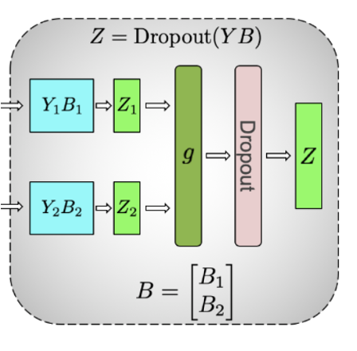

---

# TP on MLP

+ 需要在输入时复制 $𝑋$ ，并在输出前合并 $𝑌𝐵$ 的计算结果
+ 分别引入了两个共轭的操作 $𝑓$ 和 $𝑔$；
  + $𝑓$ 在前向传播时复制 $𝑋$，在反向传播时通过 `all-reduce` 合并计算结果；
  + $𝑔$ 与之相反。

* Nvidia NCCL Collective Operations


---

# All-reduce


---

# Broadcast

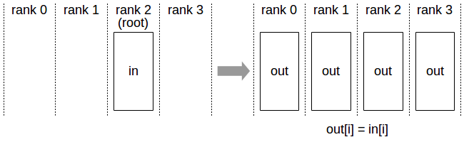

---
# TP on Attention

对 Self-Attention 部分的并行化设计利用了 Multihead Attention 本身的并行性，从列方向切分权重矩阵，并保持了与每个头的对应:

+ 在每个头中，仍然保持了原本的计算逻辑，即：$O=𝐷𝑟𝑜𝑝𝑜𝑢𝑡(𝑆𝑜𝑓𝑡𝑚𝑎𝑥(\frac{𝑄𝐾^𝑇}{\sqrt{𝑑}}))𝑉$ 
+ 并行化后的中间结果为 $𝑌=[𝑌_1, 𝑌_2 ]$；

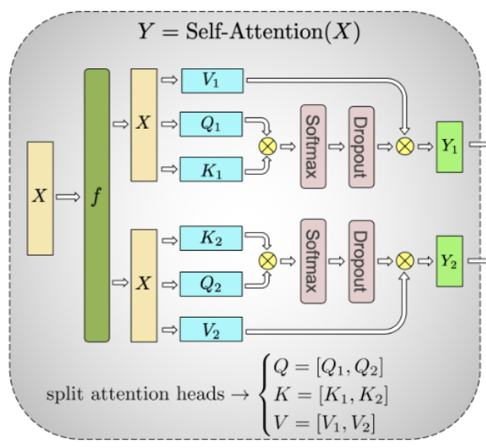

---

# TP on Attention

Dropout 的部分和之前 MLP 部分基本一致，将权重矩阵 $𝐵$ 沿行方向切开，因此同样需要在 Dropout 之前将 $𝑌_1 𝐵_1,𝑌_2 𝐵_2$ 合并；

总体来看，对 Attention 部分的并行化操作仍然需要在首尾分别添加 $𝑓$, $𝑔$ 。


---

# Default pipeline in GPipe

流水线并行（Pipeline Parallelism）：[GPipe](https://arxiv.org/pdf/1811.06965)将模型划分为多个连续的阶段，每个阶段包含若干的层，再把这些阶段分配到不同的 GPU 上，使得各个 GPU 能在时间上错开地处理不同的数据。

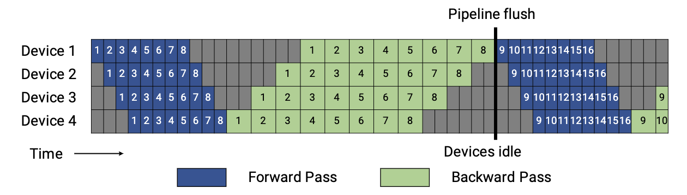

---

# Default pipeline in GPipe

* 存在问题
  * Bubble time size：流水线会在一个批次全部计算完成后统一更新权重，灰色区域就是 GPU 需要等待的时间，比例约为 $\frac{𝑝 − 1}{𝑚}$
  * Memory：反向传播完成前需保存所有微批次在前向中的激活值


---

# 1F1B in PipeDream-Flush

[PipeDream-Flush](https://arxiv.org/pdf/2006.09503) 把一个迭代分成三个阶段:

* 预热前向传播阶段：每个 worker 会做前向计算，并且向其下游发送激活，一直到最后一个 stage 被激发。该调度将执行中的微批次数量限制在流水线深度之内，而不是一个批次中的微批次数量；
* 稳定 1F1B 阶段：进入稳定状态之后，每个 worker 都进行1F1B 操作。
* 冷却反向传播阶段：此阶段会把执行中的的微批次执行完毕，只执行反向计算和向反向计算下游发送梯度。
  
---

# 1F1B in PipeDream-Flush

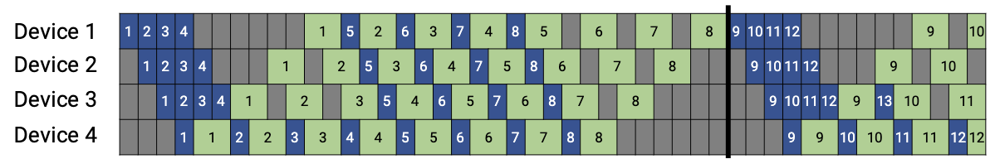

---

# 1F1B in PipeDream-Flush

尽管 PipeDream-Flush 与 GPipe 的 bubble time size 相同，但是由于 PipeDream-Flush 限制了执行中的微批次数量，因此相较于 GPipe，更加节省显存：

* Bubble time size: $\frac{𝑝 − 1}{𝑚}$；
* PipeDream-Flush 中最大执行微批次数量 $𝑝$；
* GPipe 中最大执行微批次数量 $𝑚$；


---

# PP in Megatron

在 PipeDream-Flush 的基础上，Megatron 进一步将每个微批次划分为多个阶段，使得每个 GPU 上保存多个不同的连续阶段，例如：

+ 原本 GPU1 上保存 layer 1-4；GPU2 上保存 layer 5-8；等等；
+ 现在 GPU1 上保存 layer 1,2,9,10；GPU2 上保存 layer 3,4,11,12；等等。
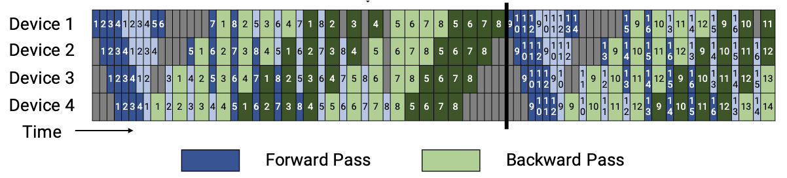

---

# PP in Megatron

+ 通过划分更细粒度的阶段，将 bubble time size 降低到了 $\frac{1}{𝑣} \times \frac{𝑝 − 1}{𝑚}$；
+ 需要付出更多的通信代价。
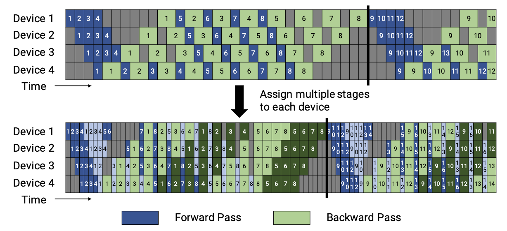

---

# Communication Optimizations

+ 以 MLP 部分的 TP 为例：在 $𝑔$ 之前的 $𝑍_1,𝑍_2$ 分布在两个 GPU 上，经过 $𝑔$ 合并之后，每个 GPU 上的输出 $𝑍$ 是相同的，由此导致相邻的两个流水线阶段发送和接收的数据是重复的；
+ 因此，可以将输出 $𝑍$ 划分为多个相同大小的部分，每个 GPU 只将自己保存的部分发送给对应的 GPU，再在下一个阶段中合并，得到完整的数据。


---

# Communication Optimizations

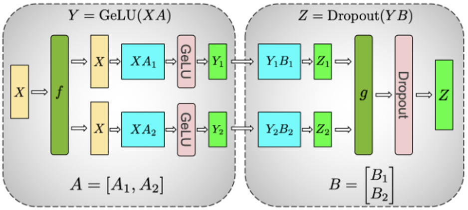
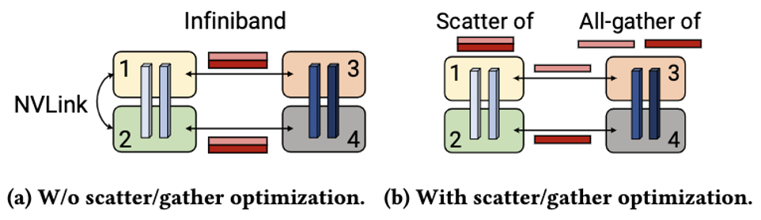
<!--  -->


---

# Activations Memory Problem

随着大模型参数量的不断增大，模型训练过程中激活值占用的显存也显著增加，已成为优化训练性能时不可忽视的关键因素。

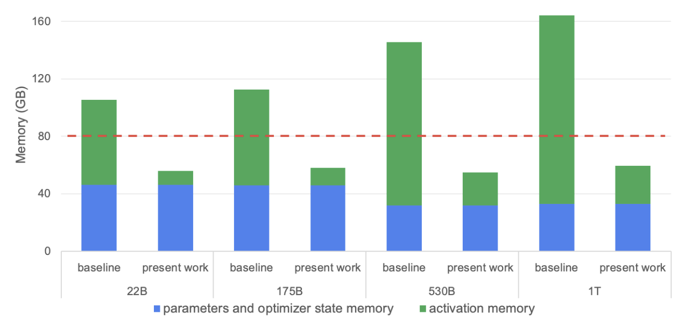

---

# Related Work

相关工作提出了一些方法来解决激活值占用过多显存的问题，包括：

+ Offload：将模型划分为多个模块，计算时在显卡和主机之间卸载、加载；
  + 缺点：计算效率很低；
+ TP + PP：一定程度上缓解了问题，但是仍有部分激活值未能并行化切分；
+ Sequence Parallelism：将长序列输入划分并在多个 GPU 上并行处理，虽然可以缓解激活值占用显存的问题，但会导致模型的其他参数需要复制到所有模型副本中，因此不适用于大型模型的训练。

---

# Analysis

+ Transformer Layer 中最重要的部分是 MLP 和 Attention，还包括两层 LayerNorm；

+ MLP Block：
  + 两个线性层 $[ℎ, 4ℎ]$, $[4ℎ, ℎ]$  分别需要存储输入大小为 $2𝑠𝑏ℎ$, $8𝑠𝑏ℎ$；
  + GeLU 需要需要存储输入大小为 $8𝑠𝑏ℎ$；
  + Dropout 需要存储 mask 大小为 $𝑠𝑏ℎ$；
+ 总计需要存储 $19𝑠𝑏ℎ$ 。


---

# Analysis

+ Attention Block：包括 Self-Attention，一层线性层和 Dropout；
+ Self-Attention：
  + $𝑄,𝐾,𝑉$：只需存储共同输入大小 $2𝑠𝑏ℎ$；
  + $𝑄𝐾^𝑇$：需要存储 $𝑄,𝐾$ 共 $4𝑠𝑏ℎ$；
  + Softmax：需要存储输出大小为 $2𝑎𝑠^2 𝑏$；
  + Softmax Dropout：需要存储 mask 大小为 $𝑎𝑠^2 𝑏$；

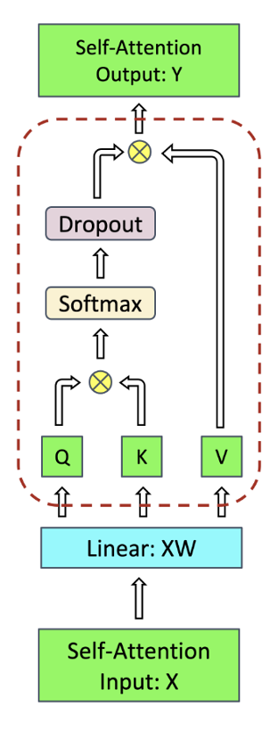

---

# Analysis

+ Self-Attention：
  + Attention Over Values：需要存储 Dropout 输出和 $𝑉$ 总共大小 $2𝑎𝑠^2 𝑏+2𝑠𝑏ℎ$；
  + 线性层：需要存储输入大小为 $2𝑠𝑏ℎ$；
  + Dropout：需要存储 mask 大小为 $𝑠𝑏ℎ$；
+ 总计需要存储 $11𝑠𝑏ℎ+5𝑎𝑠^2 𝑏$。


---

# Analysis

+ LayerNorm：每个 LayerNorm 需要存储输入大小 $2𝑠𝑏ℎ$，因此 Transformer Layer 中需要存储 $4𝑠𝑏ℎ$；

综合 MLP，Attention 和 LayerNorm，总计需要存储 $𝑠𝑏ℎ(34+5 𝑎𝑠/ℎ)$。


---

# With TP

+ 在对 Attention 和 MLP 进行 t 路张量并行后，部分激活值（每个 Block 内部）被并行化切分，此时需要存储激活值：$s𝑏ℎ(10+24/𝑡+5 𝑎𝑠/ℎ𝑡)$
+ 未被并行化的激活值：Attention，MLP，Dropout 和 LayerNorm 的输入。
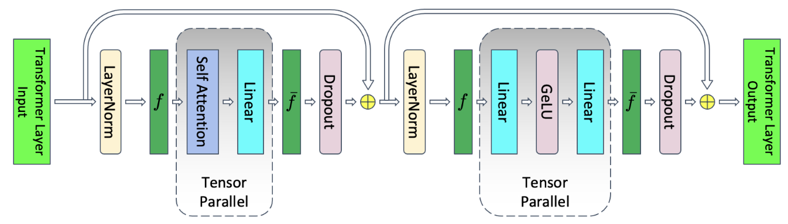

---

# TP + SP

+ 基于 LayerNorm 和 Dropout 是与序列顺序无关的，因此对这两部分采用序列并行，从 $𝑠𝑒𝑞𝑢𝑒𝑛𝑐𝑒$ 维度切分，从而减少了激活值占用的显存；
+ 由此带来新的共轭通信操作 $𝑔$, $\bar{𝑔}$：


---

# TP + SP

$𝑔$ 在前向传播时作 `all-gather`，反向传播时作 `reduce-scatter`； $\bar{𝑔}$ 与之相反。


---

# all-gather


---

# reduce-scatter


---

# TP + SP 

+ 通过结合序列并行（SP），Megatron 成功并行化所有激活值，此时要存储的激活值大小为：$𝑠𝑏ℎ(\frac{10}{𝑡}+\frac{24}{𝑡}+\frac{5 𝑎𝑠}{ℎ𝑡})=  \frac{𝑠𝑏ℎ}{𝑡} (34+\frac{5 𝑎𝑠}{ℎ})$
+ 相较于初始的激活值大小 $s𝑏ℎ(34+\frac{5 𝑎𝑠}{ℎ})$，经过 TP + SP 的并行化优化，需要存储的激活值大小减少到了 $\frac{1}{𝑡}$ 。


---

# Summary of TP + SP

通过将序列并行（SP）和张量并行（TP）相结合，Megatron 成功地减少了大型模型训练中激活值所占用的显存；该方法可以与选择性激活重计算（Selective Activation Recomputation）等技术结合，进一步降低显存需求。实验结果表明，Megatron 能够将显存占用减少超过 5 倍，并将由于重计算带来的计算开销降低 90% 。

---

# Conclusion

Megatron 采用了多种并行策略：

+ 张量并行（TP）+ 数据并行（DP）
+ 流水线并行（PP）
+ 序列并行（SP）+ 张量并行（TP）
  
在对 Transformer 结构进行细微修改的基础上，结合针对服务器架构的优化，Megatron 在提升 GPU 利用率、降低显存占用和提高训练效率方面取得了显著成果。